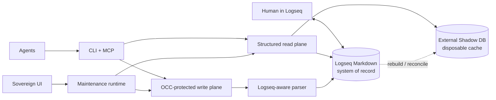

# Matryca Plumber

[](https://github.com/MarcoPorcellato/matryca-plumber/actions/workflows/ci.yml)
[](https://pypi.org/project/matryca-plumber/)
[](https://pypi.org/project/matryca-plumber/)
[](https://github.com/MarcoPorcellato/matryca-plumber/releases)
[](https://github.com/MarcoPorcellato/matryca-plumber/blob/main/pyproject.toml#L10)
[](https://github.com/MarcoPorcellato/matryca-plumber/actions/workflows/ci.yml)
[](https://github.com/MarcoPorcellato/matryca-plumber/blob/main/pyproject.toml#L138)

[](https://github.com/astral-sh/ruff)
[](CONTRIBUTING.md)
[](LICENSE)
[](#what-it-provides)
[](#what-it-provides)
[](#what-it-provides)
[](https://github.com/logseq/logseq)
[](SECURITY.md)
[](CONTRIBUTING.md)
[](CODE_OF_CONDUCT.md)
[](https://github.com/MarcoPorcellato/matryca-plumber/discussions)
[](https://github.com/sponsors/MarcoPorcellato)


> I gave an AI agent access to my notes. It corrupted them.<br>
> I built Matryca Plumber so that never happens again.

> **v2.0.0 is stable and available now.** Matryca Plumber's default-on external
> Shadow DB, Strict Read Only protection, Markdown authority, and fail-closed
> fallback contract are now published on [GitHub Releases](https://github.com/MarcoPorcellato/matryca-plumber/releases/tag/v2.0.0)
> and [PyPI](https://pypi.org/project/matryca-plumber/2.0.0/). Read the
> [release record](docs/releases/v2.0.0-GITHUB.md) and [changelog](CHANGELOG.md)
> for the exact scope and upgrade notes.

**Local-first agentic memory and maintenance for Logseq OG.** Matryca Plumber gives
humans and agents one safe, structured interface to a Markdown knowledge graph—without
turning an opaque database or a model provider into the owner of that knowledge.

<p align="center">
  <a href="#quick-start">Quick start</a> ·
  <a href="#why-matryca-plumber">Why Matryca</a> ·
  <a href="#a-different-model-of-agentic-memory">Memory model</a> ·
  <a href="#how-it-works">Architecture</a> ·
  <a href="docs/knowledge/architecture/shadow-db.md">Shadow DB</a> ·
  <a href="docs/releases/v2.0.0-GITHUB.md">v2.0.0 release</a> ·
  <a href="llms.txt">Agent guide</a> ·
  <a href="#documentation">Documentation</a>
</p>


## Quick start

Requires Python 3.12 or newer and a Logseq OG graph.

```bash
# Run the UI without installing anything permanently
uvx matryca-plumber status
```

Open [http://127.0.0.1:8500](http://127.0.0.1:8500), select a cloned Logseq graph,
review the pre-flight checks, and start the engine when ready.

```bash
# Optional: install the command and its background service
uv tool install matryca-plumber
matryca service install
```

Start with a clone of your graph, especially before enabling writes or applying an
import. See the [operator contract](docs/knowledge/architecture/shadow-db.md),
[security policy](SECURITY.md), and [support guide](SUPPORT.md).

To install the stable release explicitly:

```bash
uv tool install matryca-plumber==2.0.0
```

## What v2.0.0 changes

The stable v2 release makes the Shadow read path a practical default while keeping
ownership and mutation boundaries explicit:

- **External Shadow DB by default:** healthy FTS5 and subtree reads use a disposable
  cache outside the Logseq graph; set `MATRYCA_SHADOW_DB_ENABLED=false` to opt out.
- **Strict Read Only remains useful:** `MATRYCA_READ_ONLY=true` blocks graph-local
  mutation while validated external Shadow maintenance remains available.
- **Markdown remains authoritative:** Shadow never replaces Logseq Markdown, OCC, or
  the parser-aware write plane. Unavailable, stale, or unhealthy Shadow state falls
  back to Markdown-backed BM25 reads.
- **Stable parser baseline:** the release uses `logseq-matryca-parser` 1.7.1.

Biological memory, native Logseq DB Safe-Sync writes, content-aware Tana merge, and
proactive adaptive runtime remain future work; they are not silently included in the
v2.0.0 contract.

## Why Matryca Plumber

Most agent memory systems ask you to trust an internal store. Matryca Plumber starts
from the opposite premise: **your human-readable Logseq Markdown remains the system of
record**.

| Principle | What it means in practice |
| --- | --- |
| **Human-owned memory** | Pages and blocks stay readable, editable, portable Markdown. |
| **Safe agent access** | CLI and MCP expose structured graph operations instead of ad hoc file edits. |
| **Conflict-aware writes** | Optimistic concurrency control and page locks reject stale updates rather than silently overwrite human work. |
| **Fast, disposable reads** | The Shadow DB accelerates search and subtree reads, but can be rebuilt and never becomes authoritative. |
| **Useful Read Only mode** | Agents can benefit from an external Shadow cache while graph-local mutation remains blocked. |
| **Local-first operation** | The graph stays on disk; local inference works without a cloud API key. |

This makes Matryca Plumber more than a vector store or chat-history database. It is a
controlled memory plane where humans keep custody of knowledge and agents receive the
structure, speed, and safety they need to work with it.

## A different model of agentic memory

[Mem0](https://github.com/mem0ai/mem0) and many other service-centric memory layers
solve an important problem: they extract, store, and retrieve scoped memories so an
application can personalize an agent across sessions. Matryca Plumber solves a
different problem: **how humans and agents can safely maintain the same durable body of
knowledge**.

| Question | Service-centric memory, such as Mem0 | Matryca Plumber |
| --- | --- | --- |
| What is the primary memory object? | An extracted fact, event, or memory record | A human-readable Logseq page or addressable block |
| Where does truth live? | In the memory layer's configured stores | In the user's Markdown graph |
| How does a human participate? | Primarily through the application, API, or management surface | Directly in the same pages and blocks used by agents |
| How is context retrieved? | Memory search and ranking over the service's stores | Structured graph reads, BM25, and an optional derived Shadow DB |
| How is knowledge changed? | Memory extraction and add/update/delete operations | Parser-aware block mutation guarded by OCC and write policy |
| What is the design goal? | Persistent, scoped recall for an application or agent | A shared cognitive workspace owned by the human |

### Why block granularity matters

Logseq's outliner gives Matryca Plumber a natural unit of memory that is both
machine-addressable and human-readable. A block can have a durable `id::` UUID,
properties, children, links, and a precise place in the graph.

When an agent already knows that anchor, Matryca can:

- retrieve only the block and its descendants instead of placing the entire page in
  the model's context;
- narrow the result again to one heading, or bound a Shadow query by depth, node
  count, and output bytes;
- append beneath a specific parent or edit only the permitted property lines inside
  that block's span;
- preserve the surrounding page and reject a stale write through dry-run, page locks,
  and OCC.

This reduces prompt tokens and irrelevant context, makes retrieval more focused, and
shrinks the area in which an agent can make a mistaken edit. A Markdown fallback may
still read the page locally to locate the block, and an atomic commit persists the
page file, but the model does not need to ingest or regenerate the whole document.

Page-centric Markdown integrations often lack this boundary and must provide a much
larger document to the model for a small read or update. Not every agent-memory system
is page-centric—Mem0 also stores granular extracted memories. Matryca's distinction is
that its granular unit remains the same canonical block the human reads and edits,
not a separate derived memory record. See the
[targeted subtree contract](docs/openspec/agent-dx.md#3-targeted-subtree-reads-read-subtree)
for the exact read surface.

The decisive distinction is not merely local versus cloud, or Markdown versus a
database. It is **which representation remains authoritative**. Matryca Plumber uses a
database where it is valuable—for fast derived reads—without moving ownership away
from the documents a human can inspect, edit, link, version, and keep independently of
any agent.

This is an architectural comparison, not a claim that one category replaces every
other. Mem0 supports both hosted and self-hosted deployments and is optimized for a
different integration boundary. For the longer argument and the design philosophy
behind Matryca Plumber, read
[The Agentic Memory Dilemma: Mem0 vs. Matryca Plumber and the Future of Human-AI Collaboration](https://www.marcoporcellato.it/agentic-memory-mem0-vs-matryca-plumber/).

## What it provides

- **Agent-native CLI and MCP** for pages, blocks, search, context, ingestion, and
  guarded mutation.
- **Derived Shadow DB** with SQLite FTS5 and subtree reads, external cache isolation,
  health checks, fallback, and quarantine behavior.
- **Background maintenance** for semantic indexing, link hygiene, entity
  consolidation, and other explicitly enabled operations.
- **Logseq-aware writes** through the parser and one shared OCC-protected mutation
  plane.
- **Sovereign UI** for setup, trust controls, health, and runtime telemetry.
- **Tana to Logseq OG migration**, streamed and dry-run by default.

For the complete and current behavior, use the
[documentation paths](#documentation) rather than this overview.

## Choose how much gardening you want

Matryca separates the permission to write from the kind of maintenance it may
perform. **Strict Read Only** is the hard boundary: while it is enabled, every
graph-writing control is unavailable. Reads still work, and **Shadow DB
Acceleration** may independently maintain its disposable cache outside the Logseq
graph.

When writes are allowed, the traffic-light levels let you choose how actively
Matryca Plumber tends the graph:

| Level | Features you can activate | What may change |
| --- | --- | --- |
| 🟢 **Safe Mode** | Semantic Routing; Context Compression; Entity Consolidation; Property Hygiene; MARPA Framework | Routing caches and compressed context do not touch the graph. The other controls may add `alias::`, inferred properties, classification metadata, or validation side-sections—never rewrite original bullet prose. |
| 🟡 **Augmented Mode** | Heal Dangling Links; Backpropagate Links | Adds isolated seed pages or backlink-context sections while preserving original bullets. |
| 🔴 **Surgeon Mode** | Inline Semantic Corrections; Auto-Split Dense Blocks | May edit original bullet text or restructure dense subtrees. Enable explicitly and test on a cloned graph first. |

This means Matryca can remain a fast, read-only memory layer, or become an
opt-in knowledge gardener that consolidates entities, improves properties, repairs
missing link targets, and strengthens connections between notes. Start with Strict
Read Only, then enable only the smallest gardening level that matches your needs.

See the [architecture trust levels](docs/ARCHITECTURE.md#trust--safety-levels) and
[Shadow DB operator contract](docs/knowledge/architecture/shadow-db.md) for the exact
boundaries.

## How it works



The read and write paths have deliberately different authority:

- Reads may use the Shadow DB when it is enabled, healthy, and fresh; otherwise they
  fall back to Markdown-backed indexes.
- Writes always pass through the shared mutation plane and parser. Shadow maintenance
  cannot roll back an authoritative Markdown write.
- Strict Read Only blocks graph-local mutation while permitting validated external
  derived-cache writes.

Current defaults and exact fallback semantics live in the
[canonical Shadow DB operator contract](docs/knowledge/architecture/shadow-db.md).

## Common workflows

### Give an agent structured graph access

```bash
uvx matryca-plumber --json read page "My Project"
uvx matryca-plumber context load "My Project"
```

Agent hosts should start with [`llms.txt`](llms.txt). MCP is disabled until explicitly
trusted and enabled by the operator.

### Import a Tana workspace

```bash
export LOGSEQ_GRAPH_PATH=/path/to/a/cloned/logseq/graph

# Inspect first; no graph writes by default
matryca import tana --file ~/Downloads/workspace.json

# Apply only after reviewing the dry-run report
matryca import tana --file ~/Downloads/workspace.json --apply
```

See the [Tana import contract](docs/openspec/tana-import.md) for mapping, idempotency,
and large-export behavior.

### Run the local services

| Command | Result |
| --- | --- |
| `matryca plumber status` | Open the UI and local API; the daemon remains under operator control. |
| `matryca plumber start` | Start the background maintenance daemon. |
| `matryca plumber stop` | Stop the daemon. |

## Documentation

| If you want to… | Start here |
| --- | --- |
| Install, configure, and operate v2 | [Shadow DB runtime and operator contract](docs/knowledge/architecture/shadow-db.md) |
| Understand the system | [Architecture](docs/ARCHITECTURE.md) |
| Integrate an agent | [`llms.txt`](llms.txt) and [agent onboarding](docs/openspec/agent-onboarding.md) |
| Review features and contracts | [OpenSpec index](docs/openspec/README.md) |
| Contribute | [First contribution](docs/FIRST_CONTRIBUTION.md) and [contributor guide](CONTRIBUTING.md) |
| Follow releases | [Changelog](CHANGELOG.md) and [release process](docs/RELEASE_PROCESS.md) |
| Review the stable v2.0.0 outcome | [Release record](docs/releases/v2.0.0-GITHUB.md) and [readiness decision](docs/quality/issue-bodies/v2-rc-stable-readiness.md) |
| Navigate the documentation system | [Knowledge index](docs/knowledge/index.md) |
| Review the 34-PR excellence milestone | [Repository excellence milestone](docs/quality/REPOSITORY_EXCELLENCE_MILESTONE_2026-08-08.md) |
| Follow the current repository reconciliation | [GitHub and repository reconciliation](docs/quality/GITHUB_REPOSITORY_RECONCILIATION_2026-08-18.md) |

## Project and community

- [Issues](https://github.com/MarcoPorcellato/matryca-plumber/issues) — bugs and
  trackable feature work
- [Discussions](https://github.com/MarcoPorcellato/matryca-plumber/discussions) —
  design proposals and questions
- [Contributing](CONTRIBUTING.md) — development setup and quality gates
- [Code of Conduct](CODE_OF_CONDUCT.md) — community expectations
- [Security](SECURITY.md) — private vulnerability reporting
- [Sponsor](https://github.com/sponsors/MarcoPorcellato) — support continued work

Matryca Plumber is developed by [Marco Porcellato](https://github.com/MarcoPorcellato)
and [Matryca.ai](https://matryca.ai). Product naming and identity are defined in the
[branding guide](docs/BRANDING.md).

## License

Apache-2.0 — see [LICENSE](LICENSE).
