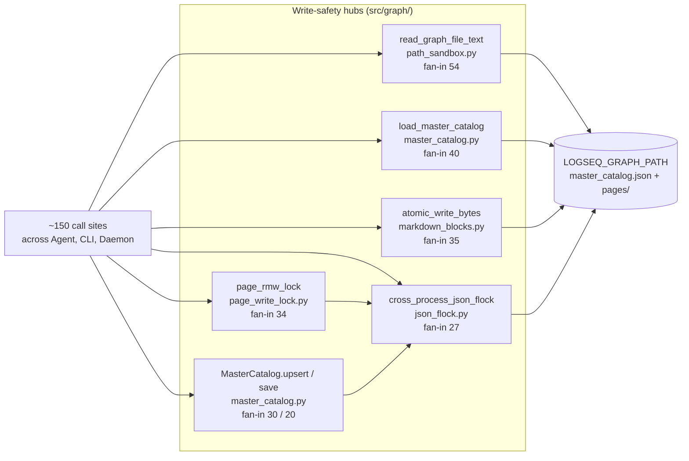
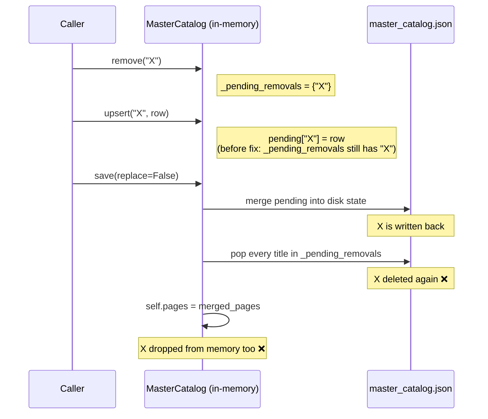
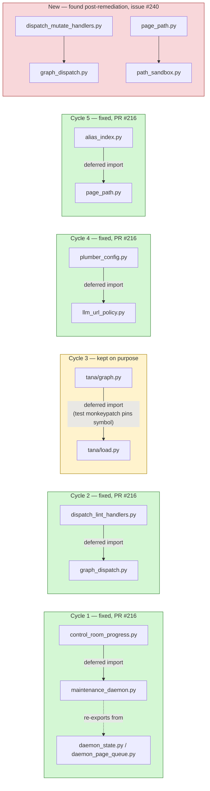

# Deep Code Audit — matryca-plumber

**Date:** 2026-07-16 · **Tooling:** local code audit, ruff static analysis, targeted manual review, TRIZ methodology.

> Note: the Serena MCP server was not connected in this session; symbol-level analysis was performed with the code audit MCP and native tools. The code-audit index was 1 commit behind HEAD at audit time (cosmetic drift only — the lagging commit is a docs/release chore).

## Executive summary

The codebase is in **very good shape**: ruff's default rule set reports zero violations on `src/`, broad exception handlers are deliberate and annotated with rationale, concurrency around the JSON catalog uses cross-process flocks plus in-process locks with mtime-based merge, and path access is centralized through a sandbox (`assert_path_within_graph`, fan-in 54 for `read_graph_file_text`). The findings below are therefore mostly **subtle correctness bugs, architectural contradictions, and scalability cliffs** — the kind that survive a clean linter run.

**Top 3 actions:** fix the `remove→upsert→save` resurrection-deletion bug in `MasterCatalog` (F1); stop treating a corrupt catalog as "empty" during merge (F2); handle `on_moved` events in the file watcher (F4).

---

## 1. Architecture map (code audit)

Functional areas by symbol count / cohesion: Graph (576 / 70%), Agent (475 / 71%), Tests (750 / 70%), CLI (94 / 75%), Tana importers (89 / 77%), Semantic (68 / 83%), Daemon (56 / 82%). Cohesion is healthy (≥70% everywhere); the two largest production clusters (Graph, Agent) are also the least cohesive — consistent with the oversized files listed in §4.

**Hub symbols (highest fan-in — highest regression risk when edited):**

| Symbol | File | Fan-in |
|---|---|---|
| `read_graph_file_text` | `src/graph/path_sandbox.py` | 54 |
| `load_master_catalog` | `src/graph/master_catalog.py` | 40 |
| `atomic_write_bytes` | `src/graph/markdown_blocks.py` | 35 |
| `page_rmw_lock` | `src/graph/page_write_lock.py` | 34 |
| `MasterCatalog.upsert` / `save` | `src/graph/master_catalog.py` | 30 / 20 |
| `cross_process_json_flock` | `src/graph/json_flock.py` | 27 |

Any change to these must go through impact analysis first (per CLAUDE.md policy); they concentrate the write-safety of the whole system.

## 2. Correctness findings (bugs)

### F1 — HIGH: `MasterCatalog.remove()` then `upsert()` of the same title is lost on `save()`
`src/graph/master_catalog.py:157-164` — `save(replace=False)` first merges `pending` (which contains the re-added entry) into disk state, **then** pops every title in `_pending_removals`. A `remove("X")` followed by `upsert("X", …)` therefore deletes X from disk even though the in-memory catalog holds it. Worse, line 178 then sets `self.pages = merged_pages`, silently dropping the entry from memory too.
**Fix:** in `upsert()`, discard the title from `_pending_removals` under the lock; or apply removals *before* merging pending rows in `save()`.

**After the fix** (PR #211): `upsert()` discards the title from `_pending_removals` under the lock, so the `remove()`→`upsert()` sequence never reaches `save()` with a stale removal — X survives.

### F2 — HIGH: corrupt catalog silently treated as empty during merge
`src/graph/master_catalog.py:264-274` — `_load_catalog_pages_unlocked` returns `{}` on `BoundedJsonError` or non-dict payload. Under `save(replace=False)` this means a transiently corrupt/truncated `master_catalog.json` is merged as if the disk were empty: rows written by other processes since this process's load are permanently dropped, with no log line and no quarantine (the `_quarantine_corrupt_catalog` path exists but is not used here).
**Fix:** distinguish "file absent" (→ `{}`) from "file unreadable" (→ abort the merge-save, log, quarantine; or fall back to `replace=False` retry after quarantine).

### F3 — MEDIUM: `prune_missing_pages()` does not record removals
`src/graph/master_catalog.py:240-257` — pruned titles are deleted only from `self.pages`, not added to `_pending_removals`. Correctness currently depends on every caller invoking `save(replace=True)` afterwards; a caller using the default `save()` resurrects all pruned rows from disk. Implicit temporal coupling with no guard.
**Fix:** add pruned titles to `_pending_removals`, or have `prune_missing_pages` return a flag/perform the replace-save itself.

### F4 — MEDIUM: file watcher ignores `moved` events
`src/daemon/file_watcher.py` — the handler implements `on_created/on_modified/on_deleted` only. Editors and sync tools (iCloud, Syncthing, some Logseq plugins, `git checkout`) commonly update files via write-to-temp + rename, which watchdog reports as a *moved* event. Those updates never reach `_on_debounced`: the page silently goes stale in the semantic index until the next full scan.
**Fix:** implement `on_moved`, treating `dest_path` as created/modified and `src_path` as deleted (both subject to the same sandbox + `.md` filters).

### F5 — MEDIUM: unbounded `threading.Timer` fan-out under change bursts
`src/daemon/file_watcher.py:80-98` — one `Timer` thread per touched file. A bulk operation (git branch switch, sync-client re-download, mass tag rewrite by the daemon itself) on a few thousand pages spawns a few thousand OS threads within the debounce window. macOS will take it, but memory and scheduler pressure spike, and the debounced callbacks then stampede the flock/RMW locks.
**Fix (TRIZ §6, Principle 1 – Segmentation):** replace per-file timers with a single scheduler thread draining a `dict[path → deadline]` (monotonic heap), i.e. one thread, N deadlines. Also yields a natural place for a global "burst mode" that coalesces into one full-rescan when the pending set exceeds a threshold (Principle 16 – Partial/excessive action).

### F6 — LOW: `except BaseException` in transport retry
`src/agent/llm_client.py:120` — correctness is preserved (non-retryable exceptions re-raise, and `KeyboardInterrupt` is not in the retryable set), but catching `BaseException` still momentarily swallows `SystemExit`/`KeyboardInterrupt` into the classifier path. `except Exception` plus the explicit httpx/OpenAI types is sufficient and self-documenting.

### F7 — LOW: `get_case_insensitive` is O(n) under the instance lock
`src/graph/master_catalog.py:193-203` — linear casefold scan of all pages while holding `_lock`, on a hub type called from hot paths. With ~10k pages this serializes readers behind a full-dict scan.
**Fix:** maintain a lazily built `casefold → title` side map, invalidated on upsert/remove (Principle 10 – Preliminary action).

## 3. Structural / architectural findings

### F8 — 5 circular file imports (code audit `check`)
1. `agent/control_room_progress.py ↔ agent/maintenance_daemon.py`
2. `agent/dispatch_lint_handlers.py ↔ agent/graph_dispatch.py`
3. `agent/importers/tana/graph.py ↔ tana/load.py`
4. `agent/plumber_config.py ↔ utils/llm_url_policy.py`
5. `graph/alias_index.py ↔ graph/page_path.py`

All are currently defused with function-local (deferred) imports — no runtime crash — but each is a dependency-direction smell: `utils/` importing from `agent/` (cycle 4) inverts the layering, and cycle 1 shows the progress-reporting module reaching back into the daemon for both a type (`DaemonState`) and a metric function. Note the metric function also appears as `compute_phase2_progress_metrics` in `daemon_page_queue.py` (see F10). **Fix:** extract the shared pieces (the `DaemonState` protocol, the metrics function, the URL-policy validator) into leaf modules both sides import.

> **Re-check (2026-07-16, post-remediation):** cycles 1, 2, 4, 5 are gone after PR #216 (cycle 3 kept deliberately, see §9). A fresh structural check found 2 cycles **not in this original list**, pre-existing and out of scope for F8: `agent/dispatch_mutate_handlers.py ↔ agent/graph_dispatch.py` and `graph/page_path.py ↔ graph/path_sandbox.py`. Tracked as a follow-up in [#240](https://github.com/MarcoPorcellato/matryca-plumber/issues/240) rather than silently left undocumented.

### F9 — Oversized god-modules
`maintenance_daemon.py` (1,274 LOC), `ui_server.py` (1,161), `llm_client.py` (1,119), plus six more files over 600 LOC. Combined with 104 ruff complexity findings (C901/PLR0912/PLR0915) concentrated in `property_line_edit.py` (7), `link_verification.py` (6), `semantic_clustering.py` (5), `bootstrap_harvest.py` (5), `maintenance_daemon.py` (5), these are the highest-defect-density candidates. The daemon modularization started in 1.13.0 (per changelog) should continue: `llm_client.py` cleanly splits into transport/retry, JSON-salvage, and prompt-assembly layers that already exist as distinct regions of the file.

### F10 — Possible duplicate/dead symbols (verify before removing)
Graph query for public functions with no CALLS/IMPORTS edges surfaced ~30 candidates. Most are **false positives** — the `handle_*` dispatch handlers are referenced through registry tables by name. But these deserve verification: `stop_daemon` (`daemon_process_lock.py`), `lookup_file_state` / `lock_backoff_active` / `record_page_lock_backoff` (`daemon_state.py`), `append_semantic_index` (`daemon_semantic_write.py`), `repl` (`importers/tana/link.py`), and the apparent duplication of `compute_phase2_progress_metrics` between `daemon_page_queue.py` and `maintenance_daemon.py`.

### F11 — Security posture (positive, with one gap)
UI server: token auth with LAN-explicit-token requirement, per-IP rate limits split authenticated/anonymous, loopback defaults — good. Path sandbox is centralized and heavily used. No `eval`/`exec`/`shell=True`, no mutable default args, zero bare excepts in `src/`. **Gap:** the code-audit taint layer is not built (`analyze --pdg` never run), so source→sink flows (e.g., LLM output → file writes) have never been machine-checked. Recommend running the PDG-enabled index once per release. Verified: `verify_ui_token` uses `secrets.compare_digest` (`src/cli/ui_auth.py:61`) — constant-time comparison confirmed.

## 4. Static analysis summary

- **ruff (default rules) on `src/`: 0 findings.** Exceptionally clean.
- **ruff C901/PLR0912/PLR0915: 104 findings** — see F9 for the per-file concentration.
- Broad `except Exception`: 34, all `noqa`-annotated with rationale (daemon-resilience pattern) — accepted, not a defect, except the `BaseException` variant (F6).
- TODO/FIXME/HACK: only 9 across 34k LOC of `src/` — low debt signal.
- `time.sleep`: 17 uses — synchronous backoff inside the daemon thread is acceptable for this architecture but couples retry latency to cycle latency (see TRIZ C3).

## 5. Test suite

402 test files; pytest gate `--cov-fail-under=70` enforced in `pyproject.toml`. Full run (no-cov) executed during this audit — **result recorded in §7 below.**

## 6. TRIZ analysis — resolving the design contradictions

**C1. "Never crash the daemon" vs. "never hide a failure."**
34 broad exception handlers embody the first requirement; F2 shows the cost of the second. TRIZ Principle 22 (*Blessing in disguise*) + 11 (*Beforehand cushioning*): don't just log-and-continue — convert every swallowed exception into a *durable artifact* (quarantine file, dead-letter queue entry, health-status flag surfaced in the control room UI). The daemon keeps running **and** the failure becomes visible and re-processable. The quarantine mechanism already exists for corrupt catalogs and per-file LLM cycles; generalize it into a single `dead_letter(path|payload, reason)` utility so every `except Exception` handler has a one-line way to comply.

**C2. "Merge-on-save for concurrent writers" vs. "deletions must stick" (root cause of F1/F3).**
The last-mtime-wins merge is a CRDT-flavored design, but deletions are modeled outside it (a side set), which is why they interact badly with re-inserts. Principle 13 (*The other way round*): model deletion *inside* the merge domain — a tombstone row (`deleted_at` mtime) that participates in the same mtime comparison as upserts. Remove-then-upsert then resolves naturally (the newer upsert mtime beats the tombstone), and F1/F3 disappear as a class rather than as two patches.

**C3. "React instantly to file changes" vs. "don't stampede under bulk changes" (F5).**
Principle 37 (*Thermal expansion* → parameter-responsive behavior): make the debounce adaptive — small pending set ⇒ per-file responsiveness; pending set above a threshold ⇒ collapse into one batched rescan. Combined with the single-scheduler redesign this removes both the thread cliff and the lock stampede.

**C4. "One shared mutable catalog" vs. "many independent processes."**
Every hub in §1 exists to defend one global JSON file. Principle 1 (*Segmentation*) long-term: shard the catalog (per-namespace or hashed shards), so flock contention and merge blast radius shrink proportionally. This is the v2-scale move; F1–F3 fixes are worth doing first regardless.

**C5. "utils must stay generic" vs. "policy lives near config" (F8 cycle 4).**
Principle 24 (*Intermediary*): a leaf `policy/` module owning `validate_llm_proxy_url` breaks the `agent ↔ utils` inversion without moving config.

## 7. Test run result

Full suite (`pytest -q -o addopts=""`, coverage gate disabled for speed): **987 passed, 2 skipped, 0 failures in 2m00s.** Baseline is green — all findings above are latent, not currently exploding, which is exactly the right time to fix them.

## 8. Prioritized recommendations

| # | Action | Finding | Effort | Risk reduction |
|---|--------|---------|--------|----------------|
| 1 | Fix removal/upsert ordering in `MasterCatalog.save` (or adopt tombstones, TRIZ C2) | F1, F3 | S–M | Data loss |
| 2 | Treat unreadable catalog as abort+quarantine, not empty | F2 | S | Data loss |
| 3 | Handle `on_moved` in file watcher | F4 | S | Stale index |
| 4 | Single-scheduler debounce + burst coalescing | F5 | M | Thread/lock storm |
| 5 | Generalize dead-letter/quarantine for swallowed exceptions | C1 | M | Silent failures |
| 6 | Break the 5 import cycles via leaf-module extraction | F8 | M | Maintainability |
| 7 | Continue splitting the 3 god-modules; burn down the 104 complexity findings starting with `property_line_edit.py` | F9 | L | Defect density |
| 8 | Run PDG-enabled code-audit index per release; review taint findings | F11 | S | Security blind spot |
| 9 | Narrow `BaseException` → `Exception` in transport retry; casefold side-map in catalog | F6, F7 | S | Hygiene/perf |
| 10 | Verify/remove the F10 dead-symbol candidates | F10 | S | Dead code |

*Report generated incrementally during the audit; sections 1–6 were written as each analysis phase completed, §7 after the background test run finished.*

## 9. Remediation status (as of 2026-07-16)

| Finding | Status | Where |
|---|---|---|
| F1, F3 | Fixed | PR [#211](https://github.com/MarcoPorcellato/matryca-plumber/pull/211), merged |
| F2 | Fixed | PR [#211](https://github.com/MarcoPorcellato/matryca-plumber/pull/211), merged |
| F4, F5 | Fixed | PR [#211](https://github.com/MarcoPorcellato/matryca-plumber/pull/211), merged |
| F6, F7 | Fixed | PR [#211](https://github.com/MarcoPorcellato/matryca-plumber/pull/211), merged |
| F8 | Fixed (4 of 5 cycles) | PR [#216](https://github.com/MarcoPorcellato/matryca-plumber/pull/216), merged. The `tana/graph.py` ↔ `tana/load.py` cycle is intentionally kept — a test monkeypatches `load_mod.load_tana_nodes_by_id`, which requires the function to stay an attribute of the `load` module. |
| F9 | Tracked, not split | Issues [#212](https://github.com/MarcoPorcellato/matryca-plumber/issues/212) (`maintenance_daemon.py`), [#213](https://github.com/MarcoPorcellato/matryca-plumber/issues/213) (`ui_server.py`), [#214](https://github.com/MarcoPorcellato/matryca-plumber/issues/214) (`llm_client.py`) — split deferred by design choice |
| F10 | Verified, no action needed | Issue [#217](https://github.com/MarcoPorcellato/matryca-plumber/issues/217), closed. All named candidates are false positives from the no-outgoing-edge heuristic (registry dispatch, backward-compat aliasing, regex closures, re-exports). |
| F11 | Tracked, not wired | Issue [#219](https://github.com/MarcoPorcellato/matryca-plumber/issues/219) — PDG-enabled CI gate recommended, not yet implemented |
