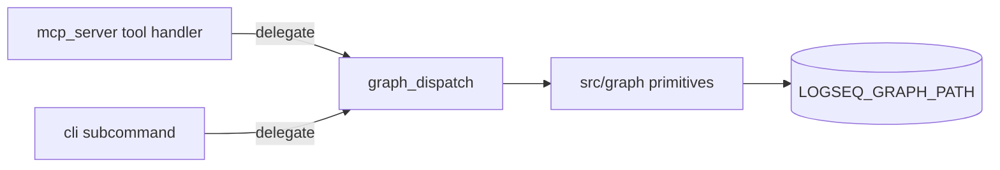

# Clean Code & Clean Architecture — Matryca Plumber

**Version:** documents **v1.12.0+** maintainer contracts  
**Audience:** contributors patching `src/`  
**Companion:** [`PROMPT_ARCHITECTURE.md`](PROMPT_ARCHITECTURE.md) (prompt tiers) · [`ARCHITECTURE.md`](ARCHITECTURE.md) (system contract) · [`CONTRIBUTING.md`](../CONTRIBUTING.md)

This document applies **Robert C. Martin's** *Clean Architecture* (dependency rule, boundaries, use cases) and *Clean Code* (SRP, meaningful names, tests as specification) to the **entire** Matryca Plumber codebase — not only the LLM prompt surface.

**Adoption model:** **incremental v1**. Full hexagonal splits (`domain/ports.py`, `MarkdownRepository` SHA-256 CAS) belong to v2 ([#17](https://github.com/MarcoPorcellato/matryca-plumber/issues/17), Epic [#20](https://github.com/MarcoPorcellato/matryca-plumber/issues/20)). Uncle Bob here is a **quality contract**, not a mandate to rewrite the monolith in one PR.

---

## Concentric boundaries (Clean Architecture)

```text
        ┌─────────────────────────────────────────────────────────┐
        │  Frameworks & drivers (FastMCP, FastAPI, React UI)       │
        ├─────────────────────────────────────────────────────────┤
        │  Interface adapters (graph_dispatch, mcp_server, cli)    │
        ├─────────────────────────────────────────────────────────┤
        │  Application use cases (maintenance_daemon, modules)    │
        ├─────────────────────────────────────────────────────────┤
        │  Domain (src/graph/, safety validators, env_parse)     │
        ├─────────────────────────────────────────────────────────┤
        │  Entities (Logseq blocks, PageWrittenEvent, lint models)│
        └─────────────────────────────────────────────────────────┘
                              ▲
                    dependencies point inward
```

| Ring | Primary paths | Examples |
|------|---------------|----------|
| **Entities** | Pydantic models, parser nodes | `OutlineNode`, `PageWrittenEvent`, `PlumberLintConfig` |
| **Domain** | `src/graph/` | `markdown_blocks`, `post_write`, `safety/validators`, `generational_cache` |
| **Use cases** | `src/agent/` orchestration | `maintenance_daemon`, `plumber_modules/`, `graph_dispatch` (orchestration hub) |
| **Adapters** | Thin surfaces | `@mcp.tool()` handlers, `ui_server.py` routes, CLI subcommands |
| **Frameworks** | External runtimes | FastMCP stdio, FastAPI, OpenAI-compatible LLM APIs |

### Dependency Rule (enforced where practical)

| Rule | Enforcement |
|------|-------------|
| `src/graph/` must not import `agent` or `daemon` | [`tests/test_graph_layer_boundary.py`](../tests/test_graph_layer_boundary.py) |
| `src/graph/` must not import `rag` | Tier F CI extension ([# Tier F backlog](../good_first_issues_blueprints.md)) |
| Domain `*/prompts.py` imports only `prompts/core.py` | [`tests/test_daemon_prompts.py`](../tests/test_daemon_prompts.py) |
| Config reads use `utils/env_parse` or injected `PlumberLintConfig` | Partial — [#57](https://github.com/MarcoPorcellato/matryca-plumber/issues/57), Tier F slices |

### v1 by design (do not "fix" without an epic)

| Pattern | Why it exists | v2 tracking |
|---------|---------------|-------------|
| OCC `st_mtime_ns` + `page_rmw_lock` | Lost-update prevention + torn-write serialization | Content-hash CAS → [#17](https://github.com/MarcoPorcellato/matryca-plumber/issues/17) |
| JSON ledgers at graph root | No central DB (Phase 4) | Shadow DB → [#24](https://github.com/MarcoPorcellato/matryca-plumber/issues/24) |
| `graph_dispatch` mega-module | Single headless mutation plane for MCP/CLI/daemon | **Handler registry complete** ([#59](https://github.com/MarcoPorcellato/matryca-plumber/issues/59) closed) — see [Graph dispatch module map](#graph-dispatch-module-map-issue-59) |
| `maintenance_daemon` SRP | ~~3,300 lines~~ → **~1,280** orchestrator + six `daemon_*` modules ([#58](https://github.com/MarcoPorcellato/matryca-plumber/issues/58) **closed**) | See [Maintenance daemon module map](#maintenance-daemon-module-map-issue-58) |

### v2 preparation phases

See [`roadmaps/ROADMAP_V2_PREPARATION.md`](roadmaps/ROADMAP_V2_PREPARATION.md) and [`v2_preparation_blueprints.md`](../v2_preparation_blueprints.md). Phases 0–4 map to GitHub milestone **`v2.0.0 — Shadow DB & Safe-Sync Architecture`** and Epic [#20](https://github.com/MarcoPorcellato/matryca-plumber/issues/20).

Audit triage: [`quality/CLEAN_ARCH_AUDIT_TRIAGE_2026-06.md`](quality/CLEAN_ARCH_AUDIT_TRIAGE_2026-06.md) · [`quality/CLAUDE_ARCH_AUDIT_TRIAGE_2026-06-24.md`](quality/CLAUDE_ARCH_AUDIT_TRIAGE_2026-06-24.md).

---

## Maintenance daemon module map (issue #58)

**Status:** closed (v1.9.x audit #32). **Goal:** single-responsibility slices without behavior change; preserve import paths for CLI, TUI, and `tests/test_maintenance_daemon.py`.

### Before / after

| Metric | Before (#58 opened) | After (#58 closed) |
|--------|---------------------|---------------------|
| `maintenance_daemon.py` | ~3,300 lines | **~1,280 lines** (−61%) |
| Cyclomatic hotspots | `_process_llm_cycle_file` CC≈41, `run_cycle` CC≈34 | Logic distributed across focused modules |
| Test contract | `from src.agent.maintenance_daemon import …` | Unchanged — orchestrator re-exports |

### Module responsibilities

| Module | Lines (approx.) | Single reason to change |
|--------|-----------------|-------------------------|
| [`daemon_state.py`](../src/agent/daemon_state.py) | 513 | `.matryca_daemon_state.json` load/save, ledger heal, lock-backoff records |
| [`daemon_process_lock.py`](../src/agent/daemon_process_lock.py) | 315 | PID file, `flock` / lock sidecar, graceful `stop_daemon` |
| [`daemon_semantic_write.py`](../src/agent/daemon_semantic_write.py) | 697 | Semantic index OCC writes, lint corrections, structural warnings, dual-embed hook |
| [`daemon_page_queue.py`](../src/agent/daemon_page_queue.py) | 216 | `list_pending_files`, Phase-2 queue rules, journal settle semantics, scan metrics |
| [`daemon_llm_cycle.py`](../src/agent/daemon_llm_cycle.py) | 554 | Per-file LLM turn (`process_llm_cycle_file`), fast-track, journey / link-verify tail |
| [`daemon_llm_client.py`](../src/agent/daemon_llm_client.py) | 228 | `LLMClient` protocol + daemon `InstructorLLMClient.index_page` adapter |
| [`maintenance_daemon.py`](../src/agent/maintenance_daemon.py) | 1,274 | Bootstrap pipeline, `run_cycle` flywheel, cluster grouping, telemetry, entrypoints |

### Dependency direction

```text
maintenance_daemon (orchestrator)
    ├── daemon_process_lock ──► daemon_state
    ├── daemon_page_queue ────► daemon_state, daemon_semantic_write (title helpers)
    ├── daemon_llm_cycle ─────► daemon_llm_client, daemon_semantic_write, daemon_state
    ├── daemon_llm_client ────► llm_client (base), daemon_semantic_write
    └── daemon_semantic_write ► src/graph/* (OCC writes)
```

**Rule:** new per-file cycle logic belongs in `daemon_llm_cycle.py` or `daemon_page_queue.py`, not back in the orchestrator. New disk-write semantics belong in `daemon_semantic_write.py` or `src/graph/`.

### Backward compatibility

- `maintenance_daemon.__all__` re-exports symbols moved to slice modules (e.g. `load_daemon_state`, `InstructorLLMClient`, `list_pending_files`).
- Tests that monkeypatch implementation details should target the **defining module** (e.g. `src.agent.daemon_llm_cycle.merge_page_links_into_registry`) when the symbol no longer lives in `maintenance_daemon`.
- Base structured-output client remains in [`llm_client.py`](../src/agent/llm_client.py); the daemon subclass in `daemon_llm_client.py` adds semantic `index_page` only.

### Verification

```bash
uv run ruff check src tests
uv run mypy src tests
uv run pytest tests/test_maintenance_daemon.py -q
make check
```

---

## Graph dispatch module map (issue #59)

**Status:** closed — read/search/mutate/refactor/lint paths extracted; `graph_dispatch.py` retains headless write runtime + thin routers.

### Before / after

| Metric | Before | After |
|--------|--------|-------|
| `graph_dispatch.py` routing | ~500+ lines of `if` chains | **~25 lines** — five thin delegates |
| `graph_dispatch.py` (total) | ~1,280 lines monolith | **~565 lines** write runtime + routers |
| Mega-tool handlers | Monolithic | `dispatch_*_handlers.py` (one function per target/method/action) |
| Write runtime | Inline with routers | `_headless_*` helpers stay in `graph_dispatch.py` (shared with `memory_tools`) |
| Subtree reads | Direct `graph_tool_helpers` | `GraphReadPort.read_subtree_markdown` via `MarkdownGraphRepository` |

### Module responsibilities

| Module | Single reason to change |
|--------|-------------------------|
| [`dispatch_read_handlers.py`](../src/agent/dispatch_read_handlers.py) | `read_graph_data` handler per `ReadGraphTarget` |
| [`dispatch_search_handlers.py`](../src/agent/dispatch_search_handlers.py) | `search_graph` handler per `SearchGraphMethod` |
| [`dispatch_mutate_handlers.py`](../src/agent/dispatch_mutate_handlers.py) | `mutate_graph` handler per `MutateGraphAction` |
| [`dispatch_refactor_handlers.py`](../src/agent/dispatch_refactor_handlers.py) | `refactor_blocks` handler per `RefactorBlocksAction` |
| [`dispatch_lint_handlers.py`](../src/agent/dispatch_lint_handlers.py) | `run_linter` handler per `RunLinterName` |
| [`markdown_graph_repository.py`](../src/agent/markdown_graph_repository.py) | Markdown-backed `GraphReadPort` adapter |
| [`graph/ports/read.py`](../src/graph/ports/read.py) | `GraphReadPort` protocol — **no `agent` imports** |
| [`graph_dispatch.py`](../src/agent/graph_dispatch.py) | Headless write runtime (`_headless_append_child`, outline writes) + public `dispatch_*` entrypoints |

### Dependency direction

```text
graph_dispatch.dispatch_read
    └── dispatch_read_handlers
            ├── graph_tool_helpers (page/xray/block_ast)
            └── markdown_graph_repository ──► GraphReadPort (subtree, spatial)
                    └── graph_tool_helpers + matryca_hooks

graph_dispatch.dispatch_search
    └── dispatch_search_handlers
            ├── rag/local_query (bm25)
            ├── semantic/search (semantic)
            └── graph/* (regex, unlinked, journal, alias resolve)

graph_dispatch.dispatch_mutate / dispatch_refactor / dispatch_lint
    └── dispatch_*_handlers (per action/method/linter)
            └── graph/* + quality_gate (behavior unchanged)
```

**Rule:** new mega-tool targets belong in the matching `dispatch_*_handlers.py` module. Shadow-DB reads (v2 Phase 3) implement `GraphReadPort` without changing handler signatures.

### Verification

```bash
uv run pytest tests/test_graph_dispatch_*.py tests/test_graph_repository.py -q
make check
```

---

## SOLID applied to Matryca

| Principle | Matryca application |
|-----------|---------------------|
| **S**ingle Responsibility | One cognitive module per file under `plumber_modules/`; one `prompts.py` per Tier-1 domain; graph primitives in `src/graph/` not in MCP handlers |
| **O**pen/Closed | Env-gated lint modules; extend via new `run_*` modules rather than growing `if` chains in the daemon |
| **L**iskov Substitution | Adapter shims (`daemon/ast_cache.py` re-exporting `graph/ast_cache.py`) preserve call-site contracts during layer moves |
| **I**nterface Segregation | `HarvestLLM` / `InsightsLLM` protocols in `graph/cognitive_llm.py` — callers depend on narrow async contracts |
| **D**ependency Inversion | `InstructorLLMClient` receives `SystemPromptBuilder` callables; `load_plumber_lint_config_from_environ(env)` for testable config; shared `env_parse` helpers |

---

## Clean Code practices

| Principle | Implementation in this repo |
|-----------|----------------------------|
| **Meaningful names** | `compile_tier1a_prompt`, `reject_id_line_deletion`, `atomic_write_bytes_if_unchanged` — avoid `data`, `tmp`, `handle` |
| **Small functions** | Extract when a function does I/O **and** business rules **and** logging; keep OCC snapshot → read → validate → write as explicit steps |
| **SRP** | MCP `@mcp.tool()` and CLI entrypoints delegate to `graph_dispatch` / `graph/*`; no inline system prompt strings in `llm_client.py` |
| **Tests as specification** | pytest + `tmp_path` graphs; prompt SHA-256 snapshots; boundary import tests — not 10k-line golden files |
| **Boy Scout Rule** | Leave touched code better within PR scope (e.g. migrate one `os.environ` block to `env_parse` when editing a module) |
| **Error handling** | Prefer `logger.exception` on `OSError` over `contextlib.suppress(Exception)` on shutdown/save paths (Tier C–E pattern) |
| **No magic strings** | Use `StrEnum` / `Literal` for stable wire values — e.g. [#141](https://github.com/MarcoPorcellato/matryca-plumber/issues/141) `RoutingHint` |

### Anti-patterns (reject in review)

| Anti-pattern | Preferred fix |
|--------------|---------------|
| New `os.environ.get` in `src/graph/` | `env_parse.env_bool` / `env_int` / `env_float` or inject `PlumberLintConfig` |
| `# type: ignore` in `src/` | Refactor types ([#60](https://github.com/MarcoPorcellato/matryca-plumber/issues/60)) |
| `Path.read_text()` under graph/agent/rag | `read_graph_file_text()` — `make sandbox-read-check` |
| Ad-hoc `domain/ports.py` in v1 | Track under [#17](https://github.com/MarcoPorcellato/matryca-plumber/issues/17) / [#20](https://github.com/MarcoPorcellato/matryca-plumber/issues/20) |
| Global `Result[T, E]` refactor | Deferred — mixed dict/`ok` and exceptions documented in [`ARCHITECTURE.md`](ARCHITECTURE.md) |

---

## Fat modules, thin edges



**Contributor checklist before opening a PR:**

1. Does new behavior live in `src/graph/` or `plumber_modules/` rather than in an MCP handler?
2. If touching `src/graph/`, run `uv run pytest tests/test_graph_layer_boundary.py -q`.
3. If adding `MATRYCA_*` env vars, update [`.env.example`](../.env.example) and `tests/test_env_example_coverage.py`.
4. If changing operator-visible behavior, update [`CHANGELOG.md`](../CHANGELOG.md) under `[Unreleased]`.
5. Run **`make check`** — non-negotiable merge bar.

---

## Prompt stack (cross-reference)

Tier-1 / L0 / Tier-2 instruction boundaries are documented in [`PROMPT_ARCHITECTURE.md`](PROMPT_ARCHITECTURE.md). This file does not duplicate that spec.

| Tier | Module | Clean Architecture role |
|------|--------|-------------------------|
| **L0** | `graph/safety/validators.py` | Domain hard gate before disk |
| **Tier-1** | `agent/prompts/core.py` + `*/prompts.py` | Domain compilers |
| **Tier-2** | `docs/openspec/agent/` → `SYSTEM_PROMPT.md` | Assembled runtime law |

---

## Good first issues (Clean Code — Tier F)

Scoped DRY and boundary-test slices for external contributors. Maintainer blueprints: [`good_first_issues_blueprints.md`](../good_first_issues_blueprints.md) § Tier F.

| Theme | Parent tracking |
|-------|-----------------|
| `env_parse` adoption in graph modules | [#57](https://github.com/MarcoPorcellato/matryca-plumber/issues/57) |
| Graph layer boundary CI | [#134](https://github.com/MarcoPorcellato/matryca-plumber/issues/134) (shipped inversion; extend tests) |
| `RoutingHint` enum | [#141](https://github.com/MarcoPorcellato/matryca-plumber/issues/141) |

---

## Verification

```bash
make agents-check
uv run pytest tests/test_graph_layer_boundary.py tests/test_env_parse.py -q --no-cov
make check
```

When editing `src/`, follow [`.cursor/rules/12-clean-code-architecture.mdc`](../.cursor/rules/12-clean-code-architecture.mdc) (maintainer rule index: [`AGENTS.md`](../AGENTS.md)).
