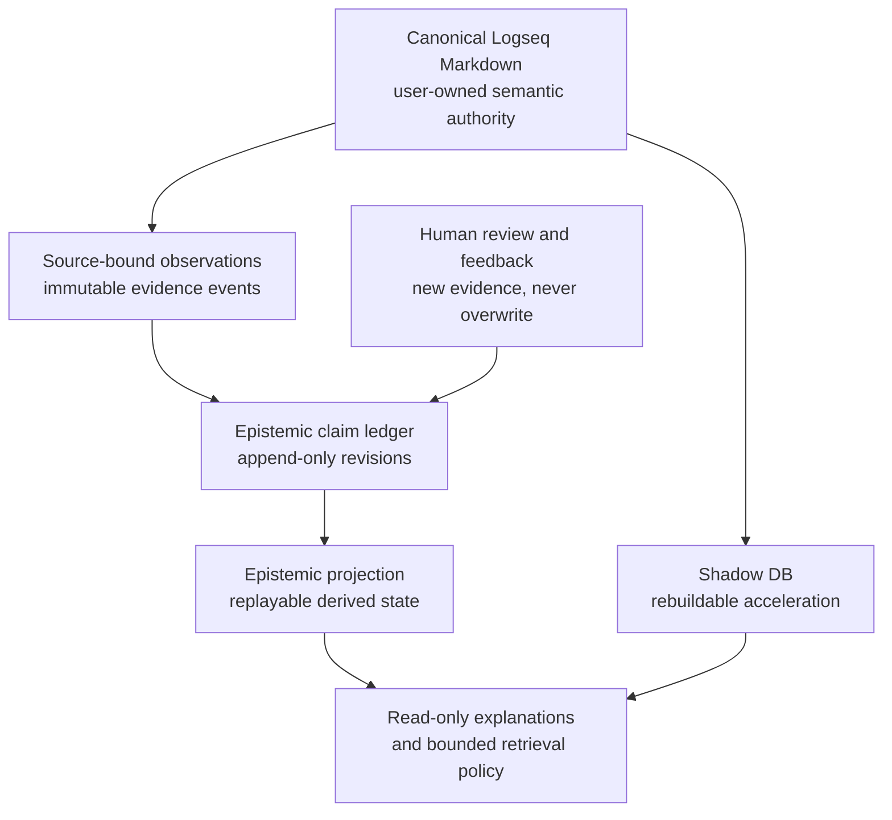

# Epistemic memory landscape and standard direction

## Status and reading contract

This is an active research and architecture-direction document. It is not a
runtime contract, release promise, interoperability claim, or proof that a new
standard is needed. It records the current landscape, the verified Plumber
foundation, a bounded design direction, and the evidence required before any
feature or external proposal may advance.

The implementation and documentation baseline reviewed for this document is
`origin/main@1673bc0167d5b45e8ce09567f75d86f2f50a302e`, read on 2026-09-02.
This anchor records the state assessed here; it does not transfer evidence to a
later revision.

The central hypothesis is:

> An agent memory should record not only information available for retrieval,
> but also what the system currently considers a claim, why it considers that
> claim, which evidence supports or challenges it, which revision produced the
> current state, and what remains uncertain.

The hypothesis does **not** require retraining an LLM, treating an LLM score as
a probability, or replacing a user-owned Logseq graph with a database. The
first useful implementation could keep the model fixed and make only a
rebuildable, inspectable external projection adaptive.

## Executive decision

Matryca Plumber should investigate an **Epistemic Claim Layer** as a versioned,
derived, human-governed projection. It should not begin by claiming a new agent
memory standard or by implementing a general Bayesian reasoning engine.

The recommended order is:

1. define terms, prior art, non-goals, and falsifiable success conditions;
2. specify a small claim/evidence/revision contract with deterministic replay;
3. evaluate it on synthetic, provenance-recorded fixtures;
4. expose only read-only explanations and review surfaces;
5. consider controlled feedback and revision policies;
6. publish a neutral specification and conformance suite only after an
   independent implementation can exercise a stable contract.

This order preserves the existing rule that Markdown is semantic authority and
that derived state is disposable. It also prevents a retrieval experiment from
being misrepresented as autonomous truth maintenance.

## Why this matters

Ordinary retrieval can return a relevant block. It does not answer all of the
following questions:

- Is the retrieved statement an observation, inference, user confirmation, or
  stale historical assertion?
- Which exact source revision supports it?
- What evidence challenges it?
- Is its score a retrieval ranking signal, an evidence assessment, or a
  calibrated probability?
- Is it valid now, only valid for a past interval, or superseded?
- What other conclusions depend on it?
- What changed after a human corrected the system?

An epistemic layer addresses these questions without altering the canonical
content model. It may make an agent more auditable, more conservative under
uncertainty, and better able to explain why it suggests an action. It must not
make unsupported claims of truth, authority, or user intent.

## Current Matryca Plumber foundation

The following capabilities exist at the source anchor recorded in the related
programme documents. They are foundations, not an implemented epistemic-memory
system.

| Existing capability | What it establishes | What it does not establish |
| --- | --- | --- |
| `EvidenceRef` | Opaque, revision-pinned provenance for a candidate observation. | Claim content, source reliability, confidence, temporal validity, or contradiction semantics. |
| `EvidenceEvent` | Immutable, replay-safe `candidate_observed` record with a content-addressed event identifier. | User feedback, confirmation, refutation, supersession, or belief revision. |
| `EvidenceArchive` | Graph-scoped, append-only JSONL storage with locking, `fsync`, idempotency, and bounded replay outside the graph. | Authoritative memory store, retrieval index, or canonical write path. |
| `RecallBundle` | Provider-neutral retrieval envelope with graph generation, bounded results, and deterministic fingerprinting. | A belief state or a probability distribution. |
| Shadow DB | External, query-only derived acceleration that can be rebuilt. | Canonical knowledge, durable epistemic authority, or a substitute for source provenance. |
| `confidence::` lint | A human-authored convention can be checked for stale high-confidence content. | Machine-governed confidence semantics. |
| `memory_procedures` metadata | Bounded operational projection fields, including confidence and contradiction counts. | A general claim ledger, evidence graph, or revision history. |

The existing Human-Governed Adaptive Retrieval Programme makes an especially
important distinction: Matryca may learn what to retrieve in a context, but it
must not infer what is true, who is authorized, or what the user intended from
interaction frequency alone. The Epistemic Claim Layer must preserve that
boundary rather than weaken it.

## Terms and separations

The following terms are deliberately separate.

| Term | Meaning | Must not be conflated with |
| --- | --- | --- |
| Canonical assertion | User-owned Markdown content in the source graph. | A derived claim record. |
| Observation | A source-bound event that was seen or extracted. | A verified fact. |
| Claim | A normalized assertion about a subject, predicate, and object or value. | The source text, a retrieval hit, or a probability. |
| Evidence | Revision-pinned material that supports, challenges, or contextualizes a claim. | A causal guarantee. |
| Assessment | A policy-versioned interpretation of evidence for one claim. | Evidence itself. |
| Epistemic status | Procedural state such as proposed, supported, challenged, or user-confirmed. | Numerical confidence. |
| Confidence | An explicitly defined assessment output. | A BM25 score, embedding similarity, or model self-report. |
| Valid time | When a claim is asserted to hold in the represented world. | When the system learned it. |
| Recorded time | When an observation, claim, or revision entered the ledger. | Valid time. |
| Provenance | Entities, activities, and agents involved in producing a record. | Truth or quality by itself. |

These separations are the minimum defense against common failure modes:
retrieval score inflation, stale fact reuse, opaque learning, silent overwrite,
and accidental promotion of model output into canonical knowledge.

## Architecture direction



### Authority rules

1. Logseq Markdown remains the canonical semantic source for Logseq OG.
2. A DB-hosted Logseq graph, if later supported, retains its own host-defined
   authority; this document does not expand current DB compatibility scope.
3. Evidence events and claim-ledger revisions are external derived records.
4. The materialized epistemic projection and Shadow DB are disposable and
   rebuildable from approved inputs and immutable events.
5. No component may convert an observation, a cache hit, or a model output into
   a canonical write without a separately specified human-governed workflow.
6. A missing, invalid, or unreplayable ledger must fail closed for epistemic
   features. Baseline graph reads remain independently available.

### Relationship to the Matryca ecosystem

| Component | Responsibility in this direction | Explicit non-responsibility |
| --- | --- | --- |
| Logseq Matryca Parser | Deterministic graph structure, block identity, source locations, properties, and parsed revisions. | Belief scoring, claim acceptance, or cross-source truth resolution. |
| Matryca Plumber | Local evidence/claim projection, replay, retrieval-policy boundaries, safety controls, and operator-visible explanations. | Owning canonical user knowledge or presenting unsupported automatic truth. |
| Matryca Trama | Future user-facing composition and read-only presentation through stable contracts. | Duplicating Plumber safety internals or defining hidden claim semantics. |
| Matryca Knowledge | Read-only, Git-provenanced cross-repository discovery and documentation projection. | Becoming a competing editing source or private claim store. |

The work is separate from the immediate Logseq DB read-only programme. DB work
answers how a graph may be identified and read safely. Epistemic-memory work
answers how derived observations and claims may be represented and assessed.
Neither result transfers qualification to the other.

## Candidate data model: non-normative v0 sketch

The first normative RFC, if approved, should define exact closed schemas. This
sketch is intentionally illustrative and not an API promise.

```json
{
  "claim_id": "sha256:...",
  "schema_version": "epistemic-claim.v0",
  "assertion": {
    "subject_ref": "opaque-reference",
    "predicate": "works_on",
    "object_ref": "opaque-reference"
  },
  "status": "supported",
  "valid_time": {"from": "2026-01-01T00:00:00Z", "to": null},
  "recorded_at": "2026-09-02T00:00:00Z",
  "assessment": {
    "policy_id": "deterministic-v0",
    "policy_revision": "sha256:...",
    "kind": "ordinal",
    "value": "supported"
  },
  "evidence_links": [
    {"event_id": "sha256:...", "relation": "supports"},
    {"event_id": "sha256:...", "relation": "challenges"}
  ],
  "revision": {"supersedes": [], "depends_on": []}
}
```

The initial vocabulary should remain intentionally small:

- entities or opaque references;
- claims;
- immutable observations/evidence;
- assessments;
- temporal intervals;
- revision edges;
- support and challenge relations;
- actor and policy provenance.

The model must preserve raw-source privacy. Public contracts should carry opaque
identifiers, revision digests, approved classifications, and bounded metadata;
they must not expose vault text, prompts, absolute paths, credentials, or
private event payloads.

## Evidence, status, and confidence

### Evidence is not belief

An email, block, calendar record, parser result, human confirmation, or model
extraction may be evidence. None becomes a belief merely because it exists.
An assessment policy decides how the evidence can affect a claim, and the policy
identifier and revision must travel with the result.

### Status is not confidence

Status records procedural governance. A safe starting vocabulary is:

```text
proposed
supported
user_confirmed
challenged
superseded
rejected
```

Confidence, if introduced, must state its interpretation. Early versions should
prefer ordinal or bounded policy labels over a decimal that users may mistake
for a calibrated probability. For example, `supported` is useful before there
is a defensible statistical model; `0.94` is not.

### Time is not one field

Every claim-oriented record needs at least:

- `observed_at`: when source material was observed;
- `recorded_at`: when Matryca recorded the event;
- `valid_from` and `valid_to`: the asserted world interval, when known;
- `superseded_at`: when a later revision replaces an interpretation.

This avoids presenting an old but valid historical statement as a current fact,
or a newly extracted statement as newly true.

## Deterministic v0 update policy

The v0 update engine should not be Bayesian. It should be a deterministic,
versioned reducer over immutable events:

1. validate closed schemas and source/revision binding;
2. reject duplicate or invalid event identities;
3. build explicit support, challenge, dependency, and supersession edges;
4. derive a bounded status from declared rules;
5. emit a materialized projection plus a deterministic explanation trace;
6. permit complete replay into an empty external location.

Human feedback enters as a new event, for example `claim_confirmed_by_user` or
`claim_challenged_by_user`; it never mutates or deletes prior evidence. A
future policy may give human feedback a defined priority, but that priority must
be explicit, inspectable, scoped to an actor/context, and reversible through a
new revision.

Bayesian updating, Dempster-Shafer, defeasible logic, Truth Maintenance
Systems, probabilistic logic, and learned assessment models are possible future
strategies. The data contract should allow a declared strategy without
standardizing one prematurely.

## Prior-art landscape

The landscape is real and overlapping. Matryca must describe its contribution
precisely rather than claim invention of epistemic graphs or belief revision.

| Area | Relevant established or public work | Practical implication |
| --- | --- | --- |
| Provenance | W3C PROV defines interoperable provenance concepts for entities, activities, and agents. | Reuse or map to PROV concepts; do not create an incompatible generic provenance vocabulary without need. |
| Truth maintenance | Doyle's TMS records assumptions and reasons, then revises beliefs after contradiction. | Dependency and invalidation must be first-class if Matryca later claims revision support. |
| Belief revision | AGM-style research formalizes rational operations over belief states. | Do not call ad-hoc score changes “belief revision” without explicit semantics and invariants. |
| Typed agent memory | ENGRAM research describes typed episodic, semantic, and procedural records behind routing and retrieval. | Typed records and deterministic retrieval are sensible early engineering, but not an epistemic graph by themselves. |
| Epistemic graph research | Contextual Epistemic Graph models claims, observations, evidence, contexts, assumptions, uncertainty, and provenance. | Close conceptual overlap; treat it as research architecture, not proof of a mature production competitor. |
| Graph-memory product practice | `smrti` documents persisted graph memory, extraction, salience, and agent interfaces. | Useful integration comparison; project documentation is not independent quality evidence. |
| Metagraph and Semantic Space-Time proposals | Pavlyshyn's public writing treats relationship types and relation-level structure as important. | Useful design prompts for typed relation objects; not a substitute for evaluated runtime semantics. |

### Source confidence

The W3C provenance family and the original TMS literature are primary
foundations. Public repositories and product sites are useful implementation
signals, but their claims need separate reproduction before they influence
Matryca guarantees. The research brief that initiated this direction was
truncated before its complete prior-art list; this document therefore records
only sources independently identified or verified during the initial review.

### References

- [W3C PROV overview](https://www.w3.org/TR/prov-overview/)
- [W3C PROV namespace and ontology family](https://www.w3.org/ns/prov)
- [Jon Doyle, *A Truth Maintenance System*](https://doi.org/10.1016/0004-3702(79)90008-0)
- [Stanford Encyclopedia of Philosophy: Logic of Belief Revision](https://plato.stanford.edu/entries/logic-belief-revision/)
- [ENGRAM research paper](https://arxiv.org/abs/2511.12960)
- [ENGRAM epistemic-node project](https://engram-agents.org/)
- [Contextual Epistemic Graph](https://github.com/YOGSoftware/Contextual-Epistemic-Graph)
- [`smrti`](https://github.com/cyqlelabs/smrti)
- [Semantic Space-Time for Agentic AI](https://leanpub.com/sst-4-agenticai)
- [Metagraph for AI Agents](https://leanpub.com/metagraphforaiagents)

## What can distinguish Matryca

The differentiation should be concrete and testable:

1. **Logseq-native source authority.** Claims retain block/page provenance and
   never silently replace user-owned Markdown semantics.
2. **Derived-state discipline.** Evidence archives, epistemic projections, and
   Shadow acceleration remain external and rebuildable.
3. **Human-governed revision.** Feedback becomes auditable evidence, not an
   invisible score mutation or automatic canonical write.
4. **Reproducible explanation.** A claim explanation can identify source
   revisions, policy revision, supporting/challenging events, and the exact
   reducer that produced its state.
5. **Safety before autonomy.** Read-only inspection, abstention, and review
   precede automatic actions or any canonical mutation.
6. **Outcome-oriented evaluation.** Retrieval quality is evaluated separately
   from agent action and final graph outcomes.
7. **Interoperability without lock-in.** A neutral schema, fixtures, and
   conformance checks can outlive any individual LLM, database, or UI.

None of these claims is fully qualified today. They are the acceptance
criteria for future work.

## Standard strategy

### Do not standardize too early

An external standard should not begin as a renamed Plumber API. Premature
standardization risks freezing incomplete semantics, creating governance work
without implementers, and implying consensus that does not yet exist.

The first public artefact should therefore be research and RFC-oriented. A
future neutral repository, tentatively `epistemic-memory-spec`, should contain:

```text
README.md
docs/motivation.md
docs/terminology.md
docs/prior-art.md
docs/open-questions.md
rfcs/0001-epistemic-claim-and-evidence-model.md
spec/draft.md
examples/
conformance/
```

Matryca Plumber may be its first reference implementation and testbed, but not
its sole authority. A credible v1 standard needs at least one independent
consumer or implementation, public fixtures, semantic-versioned schemas, and
negative conformance cases.

### AAIF posture

The Agentic AI Foundation is a neutral home for agent interoperability work.
That fact does not prove that it lacks an epistemic-memory standard. Before any
external proposal, survey current AAIF projects and specifications, record the
result with date and source links, and describe any gap as an open research
finding rather than a marketing claim.

The appropriate future posture is:

> Agent ecosystems may benefit from an interoperable epistemic-memory layer.
> This repository offers research, a proposed contract, and a reference
> implementation for discussion.

It is not:

> An external foundation should adopt Matryca Plumber.

## Evaluation and conformance

No epistemic feature should advance on narrative plausibility alone. Each stage
needs frozen fixtures, explicit negative cases, and a valid NO-GO outcome.

| Stage | Required evidence | Positive result | Valid stopping result |
| --- | --- | --- | --- |
| Terminology and prior art | Primary-source citations and collision review. | Terms are bounded and non-derivative. | Rename, narrow, or stop. |
| Schema v0 | Closed-schema fixtures and invalid-input tests. | Deterministic parse and stable canonical bytes. | Contract not publishable. |
| Replay reducer | Append-only event fixtures, crash/replay tests, deterministic projection digest. | Identical input produces identical state and explanation. | Research-only. |
| Contradiction handling | Explicit support/challenge/dependency cases. | No hidden overwrite; affected claims are inspectable. | Defer revision engine. |
| Human feedback | Consent, actor/context, retention, export/delete, and rollback tests. | Feedback is auditable and reversible. | No feedback feature. |
| Retrieval influence | Frozen baseline/control evaluation plus abstention metrics. | Bounded net benefit without policy leakage. | Keep projection read-only. |
| Graph outcome | Resettable graph-outcome and safety controls. | Safe agent behaviour improves under declared gate. | No write-adjacent integration. |
| External standard | Independent consumer/implementation and conformance suite. | Stable, neutral interoperability boundary. | Keep work implementation-specific. |

The existing graph-outcome programme remains authoritative for the distinction
between finding evidence, acting on it, and leaving a user-owned graph in the
right state.

## Delivery roadmap

### R0 — Research boundary

- Complete primary-source prior-art and AAIF landscape review.
- Publish terminology, non-goals, and source-confidence classification.
- Decide whether the external name needs collision avoidance.
- Keep output documentation-only.

### R1 — Epistemic Claim Layer v0 design

- Specify identities, closed schemas, event taxonomy, time model, status model,
  policy provenance, and failure vocabulary.
- Define a minimal PROV mapping or document why one is unnecessary.
- Establish that no raw vault payload reaches public contracts.

### R2 — Deterministic ledger and projection

- Add an isolated external append-only claim ledger, distinct from P0 evidence.
- Implement deterministic replay and materialized-projection rebuild.
- Add synthetic support, challenge, supersession, and invalidation fixtures.
- Keep all consumers read-only.

### R3 — Explanation and governed feedback

- Add a read-only explanation contract.
- Model explicit feedback as new evidence events.
- Implement consent, retention, export/delete, actor/context, and rollback
  boundaries before feedback can influence retrieval.

### R4 — Evaluation before influence

- Run frozen retrieval, abstention, contradiction, privacy, and graph-outcome
  controls.
- Select qualified integration, research-only retention, falsified NO-GO, or
  supersession without changing acceptance criteria after observation.

### R5 — Neutral externalization

- Extract only stable, implementation-neutral RFCs into a separate repository.
- Provide JSON Schema, examples, negative cases, and conformance fixtures.
- Seek an independent consumer before any standards-body engagement.

## Non-goals

The current direction excludes:

- direct access to Logseq DB files or undocumented storage;
- canonical graph writes, automatic promotion, or automated correction;
- events, sync, Shadow changes, or Logseq DB host claims;
- collection of implicit user behaviour as truth evidence;
- persistent raw vault content in public evidence artefacts;
- a Bayesian Neural Network or LLM fine-tuning requirement;
- a claim that an LLM's token probability is epistemic confidence;
- a claim of AAIF adoption, ecosystem gap, or industry leadership;
- replacement of current P0 evidence/archive contracts;
- reuse of procedural-memory tables as a general claim system.

## Open questions

1. What is the smallest claim identity that survives legitimate source edits
   without disguising semantic change as continuity?
2. Which PROV concepts should be directly adopted, mapped, or intentionally
   excluded?
3. How should multiple human actors, delegated agents, and source reliability
   be represented without building an authorization system into the ledger?
4. Which temporal representation is sufficient for v0: intervals only, or
   richer bitemporal semantics?
5. What exact conditions justify an ordinal assessment becoming a calibrated
   probability?
6. How can evidence independence be represented without making unsupported
   statistical claims?
7. What explanation is useful to a user while preserving source privacy?
8. What independent implementation or consumer would demonstrate that the
   proposed interoperability surface is genuinely neutral?
9. Does current AAIF work already cover any needed contract surface?
10. Which outcomes would falsify the hypothesis that this layer improves agent
    behaviour more than a simpler provenance-aware retrieval interface?

## Next decision

The next implementation-facing artefact is a separate design specification:
`Epistemic Claim Layer v0 — authority, schema, replay, and non-goals`.

It must be reviewed and approved before code, schemas, events, APIs, issues, or
an external standard repository are created. Until then, this document is the
public research anchor and the existing evidence/retrieval contracts remain
unchanged.
