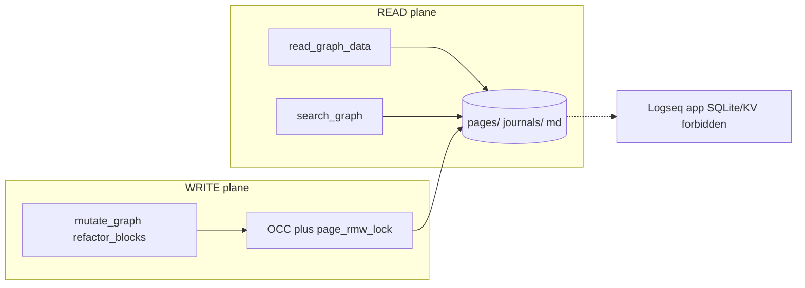

# Graph plane

This maintained concept is the canonical progressive-disclosure entry for the graph plane. [`docs/ARCHITECTURE.md`](../../ARCHITECTURE.md) remains the detailed architecture contract.

The graph plane is Matryca's **headless mutation and read contract** over Logseq OG Markdown on disk. All surfaces (daemon, MCP, CLI) share the same path: `graph_dispatch.py` delegates to `dispatch_*_handlers.py` and `src/graph/` primitives. Logseq Markdown under `LOGSEQ_GRAPH_PATH` is the **system of record**.

## Parser-backed spatial truth

**[logseq-matryca-parser](https://github.com/MarcoPorcellato/logseq-matryca-parser)** (`>=1.6.0`) owns block hierarchy, indentation, and `id::` semantics. Matryca does not maintain a competing full-file AST for vault-wide work.

| Concern | Module(s) |
| --- | --- |
| Block/page surgery | `markdown_blocks.py`, `property_line_edit.py`, `page_properties.py` |
| Fence-safe scanning | `global_fence_scanner.py` |
| Property grammar | `mldoc_properties.py`, `mldoc_guards.py` |
| Path confinement | `path_sandbox.py` — `is_relative_to(graph_root)` before every read/write |
| Atomic commits | `atomic_write_bytes` — temp file, `fsync`, `os.replace` |
| Agent read adapter | `src/rag/matryca_hooks.py` |

Normative block/property rules: [`openspec/logseq-paradigm.md`](../../openspec/logseq-paradigm.md).

## `graph_dispatch` routing

| Handler module | Mega-tool | Role |
| --- | --- | --- |
| `dispatch_read_handlers.py` | `read_graph_data` | Page, subtree, xray, dashboard |
| `dispatch_search_handlers.py` | `search_graph` | bm25, semantic, regex, journal_tasks |
| `dispatch_mutate_handlers.py` | `mutate_graph` | write_outline, edit_property, append_journal |
| `dispatch_refactor_handlers.py` | `refactor_blocks` | split, reparent, flashcards |
| `dispatch_lint_handlers.py` | `run_linter` | unify_tags, block_refs, wiki scan |

Subtree reads use **`GraphReadPort`** (`MarkdownGraphRepository` by default; optional shadow routing — see [Shadow DB](shadow-db.md)). Writes flow through OCC-aware helpers such as `_headless_append_child` in `graph_dispatch.py`.

## Safe-Sync read/write boundary

Tier-2 agents read through Plumber tools and write through atomic mutators. They must not scrape daemon JSON sidecars as L2 truth or touch Logseq's internal app database.

Contract detail: [`openspec/llm-os-instructions.md`](../../openspec/llm-os-instructions.md).

## Optimistic concurrency control (OCC)

Local LLM work is slow; humans keep editing. Matryca uses **two complementary layers**:

| Layer | Mechanism | Prevents |
| --- | --- | --- |
| Serialization | `page_rmw_lock` — in-process registry + cross-process flock sidecar | Torn RMW interleaving |
| Lost-update detection | `baseline_mtime` / `st_mtime_ns` snapshot → verify → commit | Stale LLM output overwriting fresher bytes |

Canonical order: `occ_snapshot` → inference → `occ_verify_before_write` → `page_rmw_lock` → re-read + drift check → `atomic_write_bytes_if_unchanged`. Phase-2 cognitive lint holds the page lock only for the final commit, not across inference.

`platform_lock.py` unifies page RMW flock and JSON sidecar flock (NB acquire, exponential backoff, thread-local reentrancy). Hub pages (`write_generated_hub_page`) snapshot mtime before compile and skip gracefully if humans edit during generation.

## Sandbox and reads

| Concern | Implementation |
| --- | --- |
| Path traversal | `path_sandbox.assert_path_within_graph` |
| Graph UTF-8 reads | `read_graph_file_text()` — enforced by CI `sandbox-read-check` |
| Bounded JSON sidecars | `read_bounded_json()` + `MATRYCA_JSON_MAX_BYTES` |
| Page lock registry | LRU cap in `page_write_lock.py`; cross-process sidecar via `platform_lock` |

Full security contract: [`openspec/security-sandbox.md`](../../openspec/security-sandbox.md). Layer map: [`CLEAN_CODE_ARCHITECTURE.md`](../../CLEAN_CODE_ARCHITECTURE.md).

## Legacy deep dives

| Topic | Legacy document |
| --- | --- |
| Full OCC sequence diagrams | [`ARCHITECTURE.md`](../../ARCHITECTURE.md#optimistic-concurrency-control-occ) |
| Trust & Safety tiers | [`ARCHITECTURE.md`](../../ARCHITECTURE.md#trust--safety-levels) |
| JSON sidecar flock details | [`ARCHITECTURE.md`](../../ARCHITECTURE.md#json-sidecar-concurrency-v1100--v1106) |
