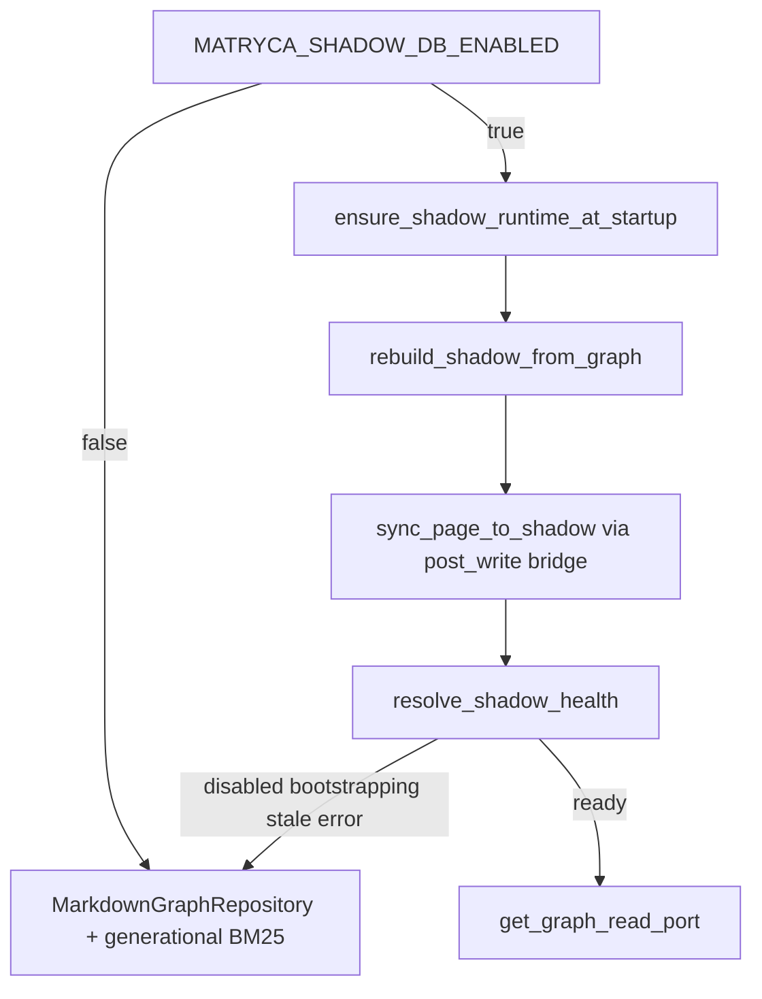

# Shadow DB read architecture

> **Pilot document — [`docs/ARCHITECTURE.md`](../../ARCHITECTURE.md) remains authoritative during Phase 1.**

Logseq Markdown on disk remains the **system of record**. `shadow.sqlite` is an **opt-in read cache** owned by the daemon under `.matryca_semantic_cache/`. It accelerates hierarchical reads when healthy; it never replaces vault writes or OCC on `.md` files.

**Introduced:** `v2.0.0-alpha` (opt-in read path). **Current hardening baseline:** `v2.0.0-alpha.1` (writer coordination and meta/pages health — see below).

## Activation gate

| Check | Module / symbol |
| --- | --- |
| Env flag (default off) | `shadow_db_enabled()` — `MATRYCA_SHADOW_DB_ENABLED` |
| Runtime health | `resolve_shadow_health()` → `ShadowHealthState` |
| Read port selection | `get_graph_read_port()` → `ShadowGraphRepository` when `shadow_read_port_ready()` |

Routing applies only when the flag is **on** and health is **`ready`**. Otherwise `search_graph(bm25)` uses generational BM25 and `read_graph_data(subtree)` uses `MarkdownGraphRepository` — unchanged v1 behavior.

## Schema and memory tables

Canonical DDL: [`src/shadow/schema.py`](../../../src/shadow/schema.py). Default path: `shadow_db_path()` → `<vault>/.matryca_semantic_cache/shadow.sqlite`.

| Layer | Tables | Runtime status |
| --- | --- | --- |
| Meta | `shadow_meta` | **Active** — schema version, sync timestamps, error keys |
| Read cache | `pages`, `blocks`, `block_refs`, `blocks_fts` | **Active** — FTS5 BM25 + recursive CTE subtree reads |
| Memory graph | `memory_nodes`, `memory_edges`, … | **Schema only** — reserved for biological-memory Phase 4; **not** a shipped read/write path today |

Do not treat memory-graph tables as a live feature; they are forward-compatible DDL, not operator surface.

## Lifecycle

| Stage | Key symbols |
| --- | --- |
| Bootstrap / reconcile | `shadow_needs_bootstrap`, `rebuild_shadow_from_graph`, `ensure_shadow_runtime_at_startup` |
| Incremental sync | `sync_page_to_shadow`, `ensure_shadow_sync_bridge` (hooks `post_write`) |
| FTS search | `search_blocks_fts` → `handle_search_bm25` when routed |
| Subtree read | `query_subtree_by_block_uuid` → `ShadowGraphRepository.read_subtree_markdown` |

## Health and fallback

`resolve_shadow_health` returns `disabled`, `bootstrapping`, `ready`, `stale`, or `error`. Since **v2.0.0-alpha.1**, `ready` requires `shadow_meta` page counts to match the `pages` table (`shadow_meta_matches_page_rows`) — mismatches downgrade to `stale` rather than serving inconsistent cache rows.

SQLite errors, schema mismatch, or sync errors also force fallback; the vault Markdown path is unaffected.

## Writer coordination (v2.0.0-alpha.1)

Cross-process writers serialize through advisory **`shadow.writer.flock`** (`shadow_writer_lock`, `shadow_rebuild_lock` in `src/shadow/writer_lock.py`):

| Operation | Lock | Default timeout env |
| --- | --- | --- |
| Post-write / incremental sync | `shadow_writer_lock` | `MATRYCA_SHADOW_WRITER_LOCK_TIMEOUT_S` (10s) |
| Full rebuild | `shadow_rebuild_lock` | `MATRYCA_SHADOW_REBUILD_LOCK_TIMEOUT_S` (120s) |

`MATRYCA_SHADOW_DB_BUSY_TIMEOUT_MS` sets SQLite `busy_timeout` on connections.

## Operator surfaces

- Sovereign UI: `/api/state.shadow_db` via `resolve_shadow_db_state_for_api`
- Operator contract: [`llms.txt`](../../../llms.txt) §2.6
- Roadmap checklist: [`ROADMAP_V2_SHADOW_DB.md`](../../roadmaps/ROADMAP_V2_SHADOW_DB.md)

## Legacy deep dives

| Topic | Document |
| --- | --- |
| Full architecture contract | [`ARCHITECTURE.md`](../../ARCHITECTURE.md) |
| Epic tracking | [GitHub #20](https://github.com/MarcoPorcellato/matryca-plumber/issues/20), [#24](https://github.com/MarcoPorcellato/matryca-plumber/issues/24) |
| Graph write plane (unaffected) | [Graph plane](graph-plane.md) |
