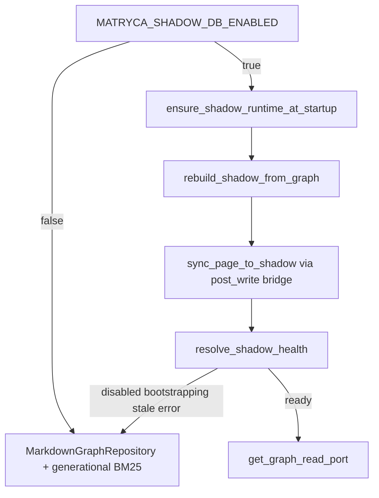

# Shadow DB read architecture

This maintained concept is the canonical current runtime and operator contract for the
v2 Shadow read path. Change current activation, Read Only, cache-location, health,
fallback, or quarantine guidance here first; other maintained surfaces link here rather
than restating those mutable claims. [`docs/ARCHITECTURE.md`](../../ARCHITECTURE.md)
retains deeper system design, while roadmaps describe future work only.

## Operator start

| Question | Authoritative answer |
| --- | --- |
| What is authoritative? | Logseq Markdown on disk; Shadow is disposable derived state. |
| Where is Shadow stored? | In the per-user external cache resolved by `shadow_db_path()`, optionally rooted by `MATRYCA_CACHE_PATH`; never in the graph under the RC contract. |
| Is Shadow enabled? | Yes by default; `MATRYCA_SHADOW_DB_ENABLED=false` opts out explicitly. |
| Can Strict Read Only use Shadow? | Yes. `MATRYCA_READ_ONLY=true` blocks graph-local mutation while validated external derived-cache writes remain available. |
| What happens when Shadow is unavailable or unhealthy? | Reads fall back to generational BM25 and the Markdown repository; graph writes never depend on cache success. |
| Where are release gates defined? | [`docs/RELEASE_PROCESS.md`](../../RELEASE_PROCESS.md#v20-promotion-override). |
| Where is current qualification evidence recorded? | [`v2-rc-stable-readiness.md`](../../quality/issue-bodies/v2-rc-stable-readiness.md). |

The sections below own the detailed current contract. Version deltas belong in
[`CHANGELOG.md`](../../../CHANGELOG.md), release mechanics in
[`docs/RELEASE_PROCESS.md`](../../RELEASE_PROCESS.md), future proposals in roadmaps,
and timestamped observations in `docs/quality/`.

Logseq Markdown on disk remains the **system of record**. The published beta used an
opt-in graph-local cache. The v2.0.0-rc.1 contract uses a **default-on external derived
cache**, isolated per canonical graph path. It accelerates hierarchical reads when
healthy; it never replaces vault writes or OCC on `.md` files.

**Implemented RC direction:** Shadow DB uses a canonical per-user external cache so
`MATRYCA_READ_ONLY=true` can protect every graph-local file while retaining Shadow
acceleration. The detailed storage, migration, security, bootstrap, and evidence
contract is [`v2-external-shadow-cache-read-only.md`](../../quality/issue-bodies/v2-external-shadow-cache-read-only.md).

**Introduced:** `v2.0.0-alpha` (opt-in read path). **Hardening baseline:** `v2.0.0-alpha.5` (seven-axis campaign complete — see below). **Published `v2.0.0-beta.1`:** default-off and graph-local. **v2.0.0-rc.1:** Gate A qualified; default-on, external, explicit false opt-out; Phase 4 biological memory/Safe-Sync remains out of scope.

## Activation gate

| Check | Module / symbol |
| --- | --- |
| Env flag (default on; explicit false opt-out) | `shadow_db_enabled()` — `MATRYCA_SHADOW_DB_ENABLED` |
| Runtime health | `resolve_shadow_health()` → `ShadowHealthState` |
| Read port selection | `get_graph_read_port()` → `ShadowGraphRepository` when `shadow_read_port_ready()` |

Routing applies only when the flag is **on** and health is **`ready`**. Otherwise `search_graph(bm25)` uses generational BM25 and `read_graph_data(subtree)` uses `MarkdownGraphRepository` — unchanged v1 behavior.

## Schema and memory tables

Canonical DDL: [`src/shadow/schema.py`](../../../src/shadow/schema.py). Published beta
path: `<vault>/.matryca_semantic_cache/shadow.sqlite`. Current `shadow_db_path()` target:
`<platform user cache>/matryca-plumber/graphs/<versioned-graph-id>/shadow/shadow.sqlite`,
with `MATRYCA_CACHE_PATH` as an external-root override.

| Layer | Tables | Runtime status |
| --- | --- | --- |
| Meta | `shadow_meta` | **Active** — schema version, sync timestamps, error keys |
| Read cache | `pages`, `blocks`, `block_refs`, `blocks_fts` | **Active** — FTS5 BM25 + recursive CTE subtree reads |
| Memory graph | `memory_nodes`, `memory_edges`, … | **Schema only** — reserved for biological-memory Phase 4; **not** a shipped read/write path today |

Do not treat memory-graph tables as a live feature; they are forward-compatible DDL, not operator surface.

## Lifecycle

Under the v2.0.0-rc.1 contract, the same lifecycle writes SQLite, WAL/SHM, and lock
state only to the resolved external cache. Read Only blocks graph-local provisioning
and mutations but does not block this validated derived-cache lifecycle.

| Stage | Key symbols |
| --- | --- |
| Bootstrap / reconcile | `shadow_needs_bootstrap`, `rebuild_shadow_from_graph`, `ensure_shadow_runtime_at_startup` |
| Incremental sync | `sync_page_to_shadow`, `ensure_shadow_sync_bridge` (hooks `post_write`) |
| FTS search | `search_blocks_fts` → `handle_search_bm25` when routed |
| Subtree read | `query_subtree_by_block_uuid` → `ShadowGraphRepository.read_subtree_markdown` |

## Health and fallback

`resolve_shadow_health` returns `disabled`, `bootstrapping`, `ready`, `stale`, or `error`. Since **v2.0.0-alpha.1**, `ready` requires `shadow_meta` page counts to match the `pages` table (`shadow_meta_matches_page_rows`) — mismatches downgrade to `stale` rather than serving inconsistent cache rows.

SQLite errors, schema mismatch, or sync errors also force fallback; the vault Markdown path is unaffected.
An invalid or unavailable external cache root resolves to health `error` and the public,
content-free `cache_unavailable` reason; paths are never included in the state payload.

## Writer coordination (v2.0.0-alpha.1)

Cross-process writers serialize through advisory **`shadow.writer.flock`** (`shadow_writer_lock`, `shadow_rebuild_lock` in `src/shadow/writer_lock.py`):

| Operation | Lock | Default timeout env |
| --- | --- | --- |
| Post-write / incremental sync | `shadow_writer_lock` | `MATRYCA_SHADOW_WRITER_LOCK_TIMEOUT_S` (10s) |
| Full rebuild | `shadow_rebuild_lock` | `MATRYCA_SHADOW_REBUILD_LOCK_TIMEOUT_S` (120s) |

`MATRYCA_SHADOW_DB_BUSY_TIMEOUT_MS` sets SQLite `busy_timeout` on connections.

## Operational diagnostics

`shadow_diagnostics_snapshot()` reads an existing Shadow connection and returns a
schema-versioned, content-free snapshot for benchmark and operator adapters. It reports
the committed generation, a strictly validated last-incremental-sync timestamp, current
quarantine cardinality, retries, reason-weighted attempts, maximum attempts, and oldest
age. Invalid timestamps become `None`; graph-relative paths and row content are never
projected.

The timeout/error attempt fields reflect each currently quarantined row's latest reason
weighted by its attempt count. The schema does not retain a reason-transition history,
so these fields are operational pressure indicators rather than lifetime incident
counters. The snapshot performs only aggregate `SELECT` operations and works with a
query-only connection. It does not open a database, alter metadata/schema, instrument
writer-lock wait or sync duration, or change health, routing, and Markdown fallback.

## Operator surfaces

- Sovereign UI: `/api/state.shadow_db` via `resolve_shadow_db_state_for_api`
- Sovereign UI settings: independent Strict Read Only and Shadow DB switches; graph-mutating controls are unavailable while Read Only is active
- Operator contract: [`llms.txt`](../../../llms.txt) §2.6
- Roadmap checklist: [`ROADMAP_V2_SHADOW_DB.md`](../../roadmaps/ROADMAP_V2_SHADOW_DB.md)
- Beta-readiness decision record: [`v2-beta-readiness.md`](../../quality/issue-bodies/v2-beta-readiness.md)
- RC external-cache decision: [`v2-external-shadow-cache-read-only.md`](../../quality/issue-bodies/v2-external-shadow-cache-read-only.md)

## Legacy deep dives

| Topic | Document |
| --- | --- |
| Full architecture contract | [`ARCHITECTURE.md`](../../ARCHITECTURE.md) |
| Epic tracking | [GitHub #20](https://github.com/MarcoPorcellato/matryca-plumber/issues/20), [#24](https://github.com/MarcoPorcellato/matryca-plumber/issues/24) |
| Graph write plane (unaffected) | [Graph plane](graph-plane.md) |
