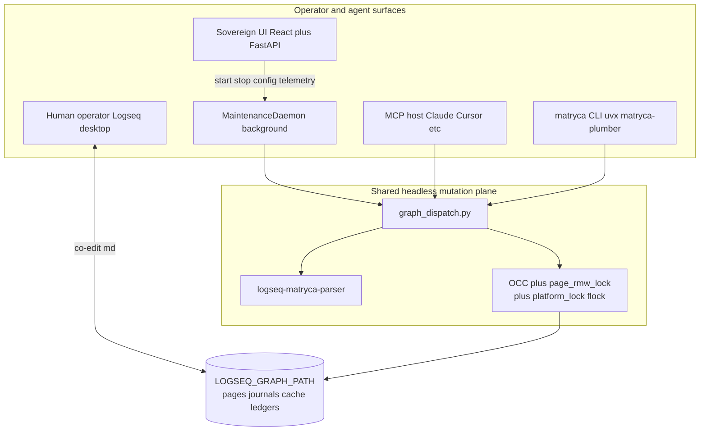
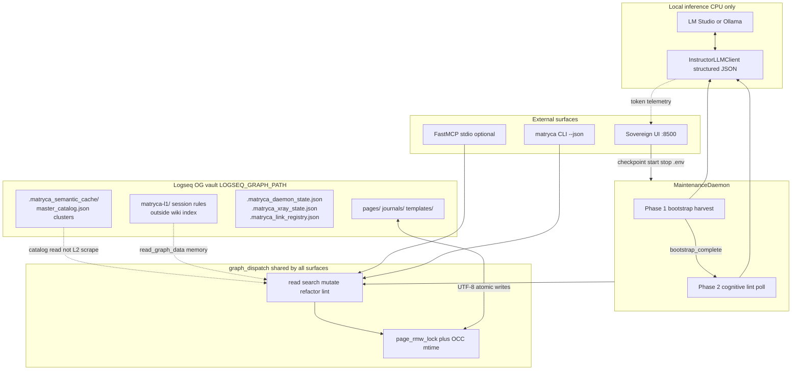
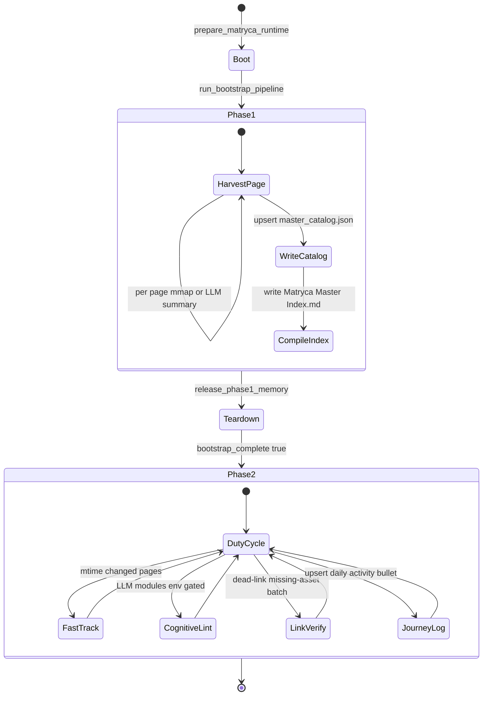

# System overview

This maintained concept is the canonical progressive-disclosure overview. [`docs/ARCHITECTURE.md`](../../ARCHITECTURE.md) remains the detailed architecture contract.

Matryca Plumber is a **local-first background AI daemon** that mutates Logseq OG Markdown on disk. It is not a Logseq plugin, not a cloud service, and not dependent on Logseq HTTP JSON-RPC. Humans and the daemon co-edit the same `.md` trees. Safety on the graph plane — AST parity, OCC, path sandboxing — is documented in [Graph plane](graph-plane.md). Operator Trust & Safety tiers remain in the legacy architecture contract.

## Clean Architecture map

Matryca maps Robert C. Martin's concentric rings to Python packages. **Dependencies point inward:** frameworks (FastMCP, FastAPI) → adapters (`graph_dispatch`, `mcp_server`, `cli`) → use cases (`maintenance_daemon`, `plumber_modules`) → domain (`src/graph/`, `safety/validators`, `utils/env_parse`) → entities (Logseq blocks, Pydantic lint models).

| Enforcement | Mechanism |
| --- | --- |
| Graph layer isolation | `tests/test_graph_layer_boundary.py` — no `graph` → `agent` / `daemon` imports |
| Prompt domain isolation | `tests/test_daemon_prompts.py` — `*/prompts.py` imports only `prompts/core.py` |
| Fat modules, thin edges | MCP/CLI delegate to `graph_dispatch` / `graph/*` |

Full contributor SSOT: [`CLEAN_CODE_ARCHITECTURE.md`](../../CLEAN_CODE_ARCHITECTURE.md). Prompt tiers: [`PROMPT_ARCHITECTURE.md`](../../PROMPT_ARCHITECTURE.md).

## Three-surface runtime

Matryca Plumber evolved from an MCP-first bridge into a **three-surface runtime** that shares one headless mutation plane:

| Surface | Technology | Primary role |
| --- | --- | --- |
| **Maintenance daemon** | Python (`MaintenanceDaemon`) | Autonomous duty-cycle scans, semantic indexing, cognitive lint, ledger checkpoints |
| **Sovereign UI** | React SPA + FastAPI (`ui_server.py`) | Loopback control room: telemetry, Trust & Safety toggles, daemon lifecycle, `.env` hot-swap |
| **MCP sidecar** | FastMCP stdio (`main.py`) | Optional tool host for Claude Desktop, Cursor, Hermes Agent, and other MCP clients — **same `graph_dispatch` contract** |

**FastMCP is auxiliary.** The product's center of gravity is `matryca plumber start` plus the Sovereign UI. MCP attaches the identical read/write path when an external host spawns `matryca-plumber` without CLI-shaped arguments.

**Quality bar:** Mypy strict on `src` and `tests`, Ruff lint/format clean via `make ci`; maintainer gates include `make agents-check` and `make check-system-prompt`.

## Separation of concerns

| Surface | Entry | Role |
| --- | --- | --- |
| **Maintenance daemon** | `matryca plumber start` → `src/agent/maintenance_daemon.py` | Polls `pages/` and `journals/`, calls a local OpenAI-compatible endpoint, commits through `graph_dispatch.py`, cognitive modules, and OCC |
| **Sovereign UI** | `matryca plumber ui` → `src/cli/ui_server.py` | Monolithic Uvicorn on loopback; REST + static SPA; reads daemon checkpoints — never a second source of truth |
| **MCP sidecar** | `matryca-plumber` with no CLI argv → `src/main.py` | Five polymorphic mega-tools plus `store_fact`, `ingest_document`, `import_tana`; lazy AST bootstrap on large vaults |

The daemon orchestrator delegates to `daemon_*` modules. `graph_dispatch.py` routes through `dispatch_*_handlers.py` and `GraphReadPort` adapters — see [Graph plane](graph-plane.md) for the mutation contract.

## System topology

**Invariant:** one **system of record** — `LOGSEQ_GRAPH_PATH`. No auxiliary database for the default read path, no Logseq Electron dependency, no split-brain HTTP API for background work.

### Daemon lifecycle: Phase 1 → Phase 2

The maintenance daemon enforces **strict phase separation**. Phase 2 cognitive lint and cluster scheduling stay disabled until bootstrap harvest completes and `bootstrap_complete` is persisted.

### Journal pages — structural-only indexing

Daily fleeting notes under **`journals/`** receive structural indexing only in Phase 2; semantic LLM indexing is skipped for journals. Detail: [`openspec/llm-performance.md`](../../openspec/llm-performance.md).

## Architecture pilots

| Topic | Pilot document |
| --- | --- |
| Graph plane (parser, OCC, sandbox) | [Graph plane](graph-plane.md) |
| Shadow DB read cache (opt-in) | [Shadow DB](shadow-db.md) |

## Legacy deep dives

This pilot omits operational depth available in the legacy architecture contract:

| Topic | Legacy document |
| --- | --- |
| Graph plane (full OCC/sandbox) | [`ARCHITECTURE.md`](../../ARCHITECTURE.md#optimistic-concurrency-control-occ) · [pilot](graph-plane.md) |
| Shadow DB | [`ARCHITECTURE.md`](../../ARCHITECTURE.md) · [pilot](shadow-db.md) |
| Trust & Safety tiers | [`ARCHITECTURE.md`](../../ARCHITECTURE.md#trust--safety-levels) |
| Runtime bootstrap | [`ARCHITECTURE.md`](../../ARCHITECTURE.md#runtime-bootstrap) |
| Sandboxing (normative) | [`openspec/security-sandbox.md`](../../openspec/security-sandbox.md) |
| Release engineering | [`RELEASE_PROCESS.md`](../../RELEASE_PROCESS.md) |
| Maintainer timeline | [`PROJECT_DIARY.md`](../../PROJECT_DIARY.md) |
| Agent runtime law | [`SYSTEM_PROMPT.md`](../../../SYSTEM_PROMPT.md) |
