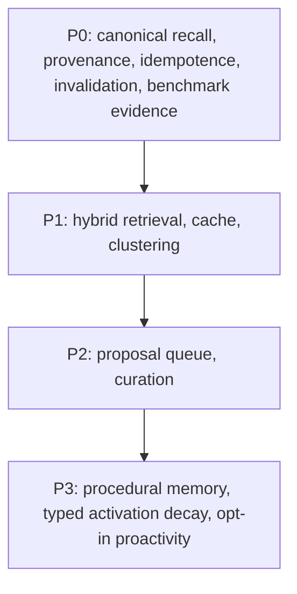

# Agentic Memory Leadership Programme — 2026-08-10

> **Successor plan (2026-08-11):** Contributor feedback in
> [Discussion #455](https://github.com/MarcoPorcellato/matryca-plumber/discussions/455)
> identified the need for resettable, final-world-state evaluation beyond the
> retrieval-heavy P0 foundation. The accepted
> [Agentic Memory Graph-Outcome Evaluation Plan](AGENTIC_MEMORY_GRAPH_OUTCOME_EVALUATION_PLAN_2026-08-11.md)
> preserves this dossier as historical evidence and adds a P0.5 bridge before
> write-adjacent, procedural, or proactive memory capabilities.

**Canonical scope:** `MarcoPorcellato/matryca-plumber` documentation execution plane
**Source branch:** `main`
**Baseline commit:** `013267d168a66947fb581a95ed20b98194b29edb`
**Authority boundary:** repository docs are canonical for execution; source-of-truth is repository code and live GitHub state

## Initial plan

1. Establish the exact public-main and live GitHub baseline without touching the active v2 release qualification.
2. Review the new memory issues against the accepted excellence study, biological-memory roadmap, OpenSpec, and current architecture.
3. Delegate bounded issue-control, benchmark-research, and documentation-architecture audits; retain integration and claim decisions in the primary review.
4. Reconcile the results into one evidence-first P0–P3 programme with explicit dependencies, non-goals, rollback boundaries, and claim gates.
5. Apply the accepted issue, label, milestone, Project, native hierarchy, and Discussion changes, then read them back from live GitHub.
6. Update the canonical roadmap and OpenSpec, create this durable dossier, regenerate the documentation inventory, and run deterministic documentation gates.

## Delegated audit roles (generic only)

| Role | Scope | Exit criteria |
| --- | --- | --- |
| Program coordinator | Phase sequencing and gate integrity | P0 → P1 → P2 → P3 sequence is explicit and maintained |
| Evidence curator | GitHub claim and citation checks | No unverifiable claim remains in changed documentation |
| Control-plane steward | Issue/milestone/project/discussion mapping | Exact issue relations are recorded and non-conflated |
| Benchmark curator | Benchmark evidence and claim labels | Evidence classifications and comparability limits are explicit |
| Documentation integrator | Canonical Markdown updates only | No runtime, release, tag, Gate B, or publication-artifact edits |

## Delegated audit receipts

| Audit | Result used by the primary review | Primary correction |
| --- | --- | --- |
| Issue and milestone reconciliation | Confirmed the relevant open trackers, dependencies, and existing milestone placements | Preserved historical trackers but gave each one a non-overlapping role; added native hierarchy only after live parent checks |
| Benchmark and competitive-strategy research | Confirmed that retrieval, memory correctness, agent outcomes, and operations/safety require separate evidence layers | Rejected any current universal leadership claim and moved decay, procedural promotion, and proactivity behind matched controls |
| Documentation control-plane design | Proposed the dossier shape, authority links, and validation workflow | Rejected two draft rounds for title conflation, sequencing drift, invalid source references, incomplete GitHub receipts, and unsafe local links |

## Baseline and evidence inventory

- **Docs baseline:** this dossier is aligned to `main@013267d168a66947fb581a95ed20b98194b29edb`.
- **Repository scope before edit:** no runtime changes, no runtime config changes, no releases, no Gate B evidence edits.
- **Authority files:** `docs/knowledge/index.md`, `docs/knowledge/documentation-evolution.md`, `docs/knowledge/profile.md`, `AGENTS.md`.

## Correction log

1. **Baseline correction:** a local checkout ref differed from live GitHub `main`; all repository documentation work was anchored to exact public commit `013267d168a66947fb581a95ed20b98194b29edb`.
2. **Strategy correction:** the previous decay-first roadmap was replaced by governed evidence, canonical recall, and benchmark foundations.
3. **Control-plane correction:** prose-only relationships were supplemented with native parent/sub-issue links after checking existing parents and preserving `#25` under `#20`.
4. **First documentation draft rejected:** `#99` and `#186` were conflated, decay-first wording remained, and the source ref was invalid.
5. **Second documentation draft rejected:** it omitted part of the GitHub mutation ledger, used machine-local links, understated benchmark manifests and metrics, and incorrectly described remote metadata mutations.
6. **Accepted draft:** exact issue roles, benchmark evidence layers, native hierarchy, public links, risks, deferrals, and verification gates are mutually consistent.

## Baseline source and validation commands

The final primary verification ran these commands against the integrated documentation bytes:

```bash
make agents-check
make public-metrics-check
make docs-inventory-sync
make docs-inventory-md
make docs-check
make docs-audit
```

Receipts:

- `docs-inventory-sync`: 0 added, 0 marked missing, 166 total.
- `docs-inventory-md`: generated view rebuilt from the curated JSON inventory.
- `agents-check`: agent-router coherence passed.
- `public-metrics-check`: no public code-intelligence metrics found.
- `docs-check`: inventory and generated view synchronized; OKF v0.2 format compatibility passed with 0 findings; Matryca quality profile v1.0 passed with 0 findings.
- `docs-audit`: 166 inventory entries matched 166 discovered paths; 0 missing and 0 stale-only paths; six historical `keep` classifications remain informational.

## Baseline evidence and dependencies

### Exact GitHub change ledger (live-recorded)

- [#446](https://github.com/MarcoPorcellato/matryca-plumber/issues/446) updated with child/release gates and claim policy.
- [#447](https://github.com/MarcoPorcellato/matryca-plumber/issues/447) updated with accepted decomposition.
- [#186](https://github.com/MarcoPorcellato/matryca-plumber/issues/186) retitled to `"[Memory P0] Implement canonical recall envelope and gated recall method"`.
- [#99](https://github.com/MarcoPorcellato/matryca-plumber/issues/99) retitled/reframed as `"[Memory P3] Add typed activation decay without deleting truth"` and moved to milestone `v2.3`.
- [#178](https://github.com/MarcoPorcellato/matryca-plumber/issues/178) retitled/reframed as `"[Epic] Coordinate v2.1 memory, Safe-Sync, and import programme"`.
- New issues created: [#448](https://github.com/MarcoPorcellato/matryca-plumber/issues/448), [#449](https://github.com/MarcoPorcellato/matryca-plumber/issues/449), [#450](https://github.com/MarcoPorcellato/matryca-plumber/issues/450), [#451](https://github.com/MarcoPorcellato/matryca-plumber/issues/451), [#452](https://github.com/MarcoPorcellato/matryca-plumber/issues/452), [#453](https://github.com/MarcoPorcellato/matryca-plumber/issues/453), [#454](https://github.com/MarcoPorcellato/matryca-plumber/issues/454).
- New labels created: [benchmark](https://github.com/MarcoPorcellato/matryca-plumber/labels/benchmark), [privacy](https://github.com/MarcoPorcellato/matryca-plumber/labels/privacy), [v2.2](https://github.com/MarcoPorcellato/matryca-plumber/labels/v2.2), [v2.3](https://github.com/MarcoPorcellato/matryca-plumber/labels/v2.3).
- Milestone change:
  - [Milestone #9](https://github.com/MarcoPorcellato/matryca-plumber/milestone/9) description updated to evidence-first foundation.
  - [Milestone #10 v2.3.0 Procedural Memory & Trusted Proactivity](https://github.com/MarcoPorcellato/matryca-plumber/milestone/10) created.
  - [Milestone #11 v2.2.0 Hybrid Recall & Memory Curation](https://github.com/MarcoPorcellato/matryca-plumber/milestone/11) created.
- Project #1 control placement updates:
  - [#446](https://github.com/MarcoPorcellato/matryca-plumber/issues/446) → In Progress.
  - [#186](https://github.com/MarcoPorcellato/matryca-plumber/issues/186), [#447](https://github.com/MarcoPorcellato/matryca-plumber/issues/447), [#448](https://github.com/MarcoPorcellato/matryca-plumber/issues/448), [#449](https://github.com/MarcoPorcellato/matryca-plumber/issues/449) → Up Next.
  - [#450](https://github.com/MarcoPorcellato/matryca-plumber/issues/450), [#451](https://github.com/MarcoPorcellato/matryca-plumber/issues/451), [#452](https://github.com/MarcoPorcellato/matryca-plumber/issues/452), [#453](https://github.com/MarcoPorcellato/matryca-plumber/issues/453), [#454](https://github.com/MarcoPorcellato/matryca-plumber/issues/454) → Backlog.
- Discussion created:
  - [#455: RFC: A reproducible benchmark for agentic memory](https://github.com/MarcoPorcellato/matryca-plumber/discussions/455).

### Exact live titles and roles

- `#99` is distinct from `#186` and belongs only to P3.
- `#99` and `#186` are both linked under [#446](https://github.com/MarcoPorcellato/matryca-plumber/issues/446).
- `#178` is the v2.1 programme anchor with native children [#139](https://github.com/MarcoPorcellato/matryca-plumber/issues/139) and [#446](https://github.com/MarcoPorcellato/matryca-plumber/issues/446).
- `#25` remains under [#20](https://github.com/MarcoPorcellato/matryca-plumber/issues/20) as Safe-Sync shared dependency.

#### Exact issue mapping by phase

- **P0:** [#186](https://github.com/MarcoPorcellato/matryca-plumber/issues/186), [#447](https://github.com/MarcoPorcellato/matryca-plumber/issues/447), [#448](https://github.com/MarcoPorcellato/matryca-plumber/issues/448), [#449](https://github.com/MarcoPorcellato/matryca-plumber/issues/449)
- **P1:** [#450](https://github.com/MarcoPorcellato/matryca-plumber/issues/450), [#451](https://github.com/MarcoPorcellato/matryca-plumber/issues/451)
- **P2:** [#452](https://github.com/MarcoPorcellato/matryca-plumber/issues/452)
- **P3:** [#99](https://github.com/MarcoPorcellato/matryca-plumber/issues/99), [#453](https://github.com/MarcoPorcellato/matryca-plumber/issues/453), [#454](https://github.com/MarcoPorcellato/matryca-plumber/issues/454)
- **Parent umbrella:** [#446](https://github.com/MarcoPorcellato/matryca-plumber/issues/446)
- **Program umbrella:** [#178](https://github.com/MarcoPorcellato/matryca-plumber/issues/178)

## Accepted architecture and documentation commitments

1. Roadmap is the canonical sequence source for delivery phases.
2. OpenSpec is a projection-only, forward contract derived from roadmap.
3. P0 evidence gates must complete before downstream phase work is authorized.
4. Typed activation decay is P3 only; it must never alter or delete truth/authority semantics.
5. Logseq Markdown is the canonical semantic source of truth; Shadow remains derived and disposable, including indexes, embeddings, hashes, generations, activation and utility projections, bounded caches, and aggregates.

## Benchmark portfolio and claim policy

### Linked benchmark targets (official repositories)

- [LongMemEval](https://github.com/xiaowu0162/longmemeval)
- [LongMemEval-V2](https://github.com/xiaowu0162/LongMemEval-V2)
- [LoCoMo](https://github.com/snap-research/locomo)
- [BEAM](https://github.com/mohammadtavakoli78/BEAM)
- [MemoryAgentBench](https://github.com/HUST-AI-HYZ/MemoryAgentBench)
- [STATE-Bench](https://github.com/microsoft/STATE-Bench)
- [Letta Evals](https://github.com/letta-ai/letta-evals)
- [Mem0 memory-benchmarks](https://github.com/mem0ai/memory-benchmarks)
- [Graphiti](https://github.com/getzep/graphiti)

### Benchmark suites versus design/reference harnesses

- **Benchmark suites:** LongMemEval, LongMemEval-V2, LoCoMo, BEAM, MemoryAgentBench, STATE-Bench
- **Design/reference harnesses:** Letta Evals, Mem0 memory-benchmarks, Graphiti

### Claim labels

- `independently reproduced`
- `upstream-reported not rerun`
- `synthetic design evidence`
- `hypothesis/proposal`
- `not comparable`

### Required metric layers

1. Retrieval layer:
   - Recall@k
   - MRR
   - nDCG
   - evidence-hit rate
   - stale-hit rate
   - retrieval latency by query/path and context bytes/tokens
2. Memory correctness layer:
   - update correctness
   - contradiction detection and suppression
   - temporal consistency under revision
   - abstention precision/recall
   - provenance sufficiency and traceability
   - correction latency
3. Agent outcomes layer:
   - task completion rate
   - pass^5 and repeated-run reliability on memory-intensive tasks
   - tool-calling success and failure rates
   - regression against baseline and ablation groups
   - UX friction/clarity scores
   - cost per resolved task
4. Operations and safety layer:
   - p50/p95/p99 latency and throughput
   - RSS/CPU/memory profile
   - rebuild/invalidation cycle counts and durations
   - unauthorized write attempts blocked
   - data egress volume and classification
   - proactive duplicate-rate and interruption incidents

### Evidence policy

- Reproducibility requires task selection, corpus/version, seed policy, model/implementation revision, and output fingerprint capture.
- Design/reference materials are not accepted as implementation evidence by themselves.
- No best/SOTA/world-leading claim may be added until independent evidence exists under this section.

### #448 benchmark execution gate

**Verified, retrieval-only synthetic evidence:** the Italian hard-negative scorecard
has deterministic fixtures, retrieval metrics, signal ablations, bootstrap confidence
intervals, and host diagnostics. It is valid regression evidence, not a cross-system
or end-to-end quality claim.

**Adapter and contract evidence only:** the LoCoMo, LongMemEval, LongMemEval-V2, and
BEAM boundaries bind caller-supplied local inputs to closed provenance contracts. They
do not download or execute a suite, run a model, access a vault, persist benchmark
results, or establish production capability.

**Missing before comparative claims:** independently retained, real runs for the
Matryca no-memory baseline, the Matryca candidate configuration, and two distinct
external open systems. Every run must share an immutable, license-cleared public
dataset/repository pin and retain raw results, exclusions, failed runs, and confidence
intervals. Retrieval and end-to-end answer outcomes must remain separately reported.

**Decision:** GO is limited to synthetic regression and local adapter/contract work.
Comparative, leadership, or end-to-end claims remain **NO-GO** until every requirement
above is independently reproducible and the governed cohort receipt validates it.

### Pinned manifest requirements

- Every benchmark claim must attach manifest identifiers and runtime context:
  - Matryca commit hash and commit date.
  - Benchmark repository commit hash and dataset revision/SHA.
  - Dependency lockfile hash and full dependency closure.
  - OS/version, Python/runtime versions, container/runtime image, and hardware metadata.
  - Reader, extractor, reranker, judge model/version/prompt versions, temperature, seeds, and sampling policy.
  - `top_k`, context budget, concurrency, cache state, timeout/retry policy, and failure classification.
  - Control switches:
    - No-memory baseline.
    - Full-context baseline.
    - BM25-only, semantic-only, and hybrid retrieval baselines.
  - Per-item raw outputs, exclusions, failed runs, latency profile, token usage, cost, licensing posture, and data-egress classification.
  - Metric-layer mapping and pass/fail thresholds used for each target decision.
  - Evidence labels: `independently reproduced`, `upstream-reported not rerun`, `synthetic design evidence`, `hypothesis/proposal`, or `not comparable`.

## P0–P3 dependency graph



### Risk register

- Benchmark overfitting from narrow synthetic tasks; mitigation: rotate task families, publish task provenance, and pre-register target metrics.
- Judge/model confounding; mitigation: fixed judge configs, model-agnostic adjudication checks, and alternate adjudicators for sensitive claims.
- Privacy and egress risk; mitigation: explicit dataset sensitivity labels, license audits, and redaction policies.
- Shadow authority drift where projections shadow canonical memory; mitigation: mandatory provenance traces and non-authoritative replay checks.
- Cache staleness and stale-hit inflation; mitigation: entry/row bounds, generation/content invalidation proofs, and staleness reporting.
- Graph-cluster collapse or fragmentation; mitigation: cluster quality constraints and controlled retrieval fallback.
- Autonomous-write risk; mitigation: explicit disable-by-default controls and Safe-Sync review checkpoints.
- Proactivity interruption and surprise writes; mitigation: opt-in gating and interruptibility criteria.
- Roadmap drift against GitHub sequence; mitigation: execution order checks and blocked transitions until prior gates complete.

## Decisions rejected and deferred

- Rejected: generic truth decay as a P0 foundation mechanism.
- Rejected: Shadow-as-semantic-authority as canonical source model.
- Rejected: duplicate remote cache as source-of-truth architecture.
- Rejected: autonomous writes in projection surfaces.
- Deferred to P3: broad proactivity and procedural-memory expansion.
- Deferred to independent matched evidence: any universal superiority, best, or SOTA claim.

## Completion audit

### Completed in this documentation cycle (GitHub/documentation edits and recorded control-plane edits)

- Added one durable dossier:
  [AGENTIC_MEMORY_LEADERSHIP_PROGRAMME_2026-08-10.md](AGENTIC_MEMORY_LEADERSHIP_PROGRAMME_2026-08-10.md)
- Reconciled:
  [ROADMAP_V2_BIOLOGICAL_MEMORY.md](../roadmaps/ROADMAP_V2_BIOLOGICAL_MEMORY.md)
- Reconciled:
  [biological-memory.md](../openspec/biological-memory.md)
- Added cross-links:
  [REPOSITORY_EXCELLENCE_STUDY_2026-08-06.md](REPOSITORY_EXCELLENCE_STUDY_2026-08-06.md), [ISSUE_CONTROL_PLANE_2026-08-08.md](ISSUE_CONTROL_PLANE_2026-08-08.md)
- Recorded the architecture-contract change under `CHANGELOG.md` → `Unreleased / Changed`.
- Recorded and linked live control-plane mutations:
  - issue retitles/updates, created issues, labels, milestones, project placements, and discussion.

### Primary verification receipts

- [x] `make agents-check`
- [x] `make public-metrics-check`
- [x] `make docs-inventory-sync`
- [x] `make docs-inventory-md`
- [x] `make docs-check`
- [x] `make docs-audit`
- [x] `git diff --check`

### Future implementation not completed by this dossier

- This documentation programme did mutate issues, labels, milestones, Project #1 placements, and discussion artifacts as recorded in the control-plane ledger.
- This documentation programme did **not** modify runtime code, releases, tags, Gate B evidence, or publication artifacts.
- Documentation-only checks are not proof of runtime implementation.

## Next execution order

1. Run P0 sequencing baseline: execute #448 + #449 and finalize contracts in #186 + #447.
2. Permit #450 and #451 only after P0 evidence closes with accepted canonical recall and benchmark policy.
3. Permit #452 only after [#25](https://github.com/MarcoPorcellato/matryca-plumber/issues/25) Safe-Sync dependency is satisfied.
4. Permit #453, #99, and #454 only after prior gates and matched controls are complete.
