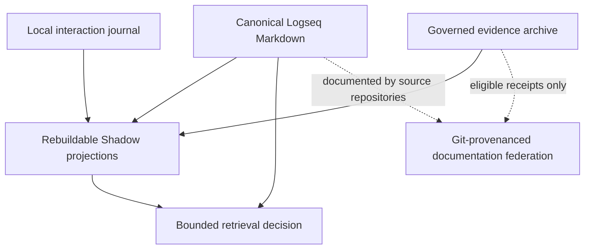

# Human-Governed Adaptive Retrieval Programme — 2026-08-16

This file is the canonical execution contract for the programme. Conversation
history, the public Gist, issue descriptions, local notes, generated knowledge
projections, and delegated reviews are supporting context, not competing plans.

## Executive decision

Proceed with the idea behind the original public Gist, but replace its global
node-weight model with **human-governed adaptive retrieval**.

The governing principle is:

> Matryca may learn what to retrieve in a specific context. It must never learn
> what is true, who is authorized, or what the user intended from interaction
> frequency alone.

This is a retrieval-policy programme, not model training and not an autonomous
truth-maintenance system. It must extend the completed governed-evidence and
canonical-recall foundation in Matryca Plumber rather than introduce another
memory subsystem.

Implementation is **NO-GO** for write-adjacent curation, procedural promotion,
proactive delivery, default-on reranking, or public improvement claims until the
applicable graph-outcome, privacy, identity, and rollback gates in this plan are
terminal.

## Outcome

The target release outcome, if supported by the frozen evidence gates, is that
an opted-in Matryca user can provide explicit, revision-bound feedback about
retrieval results. A qualified release must record that feedback outside
canonical Markdown, replay it deterministically into a rebuildable preference
projection, and use the bounded projection only to rerank an already retrieved
candidate set.

The user can inspect why a result moved, disable the feature, export or delete
the interaction history, rebuild all derived state, and return to baseline
retrieval without changing canonical knowledge.

Later implicit signals, activation decay, procedural memory, and proactive
delivery remain separate evidence-gated extensions. They are not part of the
first release.

## Initial work plan

1. Freeze exact public anchors and distinguish verified implementation from
   historical proposal text.
2. Publish this canonical programme before changing the public Gist, then add a
   historical-proposal banner without waiting for runtime qualification.
3. Reconcile the work with existing Plumber issues and open only non-duplicating
   cross-repository trackers.
4. Freeze target identity, interaction, privacy, replay, and policy contracts
   before implementing ranking behavior.
5. Build one benchmark-only policy simulator, then execute frozen feedback and
   no-feedback retrieval and graph-outcome controls before runtime integration.
6. Treat `qualified_release`, `research_only`, `falsified_no_release`, and
   `superseded` as valid terminal outcomes; never tune the protocol after seeing
   results without a separately reviewed amendment.
7. In a parallel non-blocking documentation track, onboard Latent TRIZ into
   Matryca Knowledge and refresh the reviewed projection separately.
8. Rewrite the Gist as a concise claim-appropriate public manifesto after the
   canonical source documents are accepted, then update empirical status only
   after the A5 research decision and any later A7 preview qualification.

## Authoritative anchors

Repository heads are drift-prone observations, not permanent contract anchors.
Public heads below were read from live GitHub at `2026-08-16T06:56:47Z`;
immutable reviewed commits and file blobs define the evidence actually used by
this programme. Re-verify both head movement and semantic drift before opening
issues, publishing a Gist revision, merging, tagging, or qualifying a release.

| Item | Observed live state | Immutable reviewed contract anchor | Evidence |
| --- | --- | --- | --- |
| Public concept Gist | Revision `62e2819d2ae1a2c9028e7635530786b4e28bda04`; two files; global node-weight proposal | Same immutable revision | [Gist revision](https://gist.github.com/MarcoPorcellato/9e5226408c56048b16957771f9056e28/62e2819d2ae1a2c9028e7635530786b4e28bda04) |
| Matryca Plumber | `main@bfac3fd4e3e685582fbcb1c7dbbbdd150bc22191` | Same exact commit | [commit](https://github.com/MarcoPorcellato/matryca-plumber/commit/bfac3fd4e3e685582fbcb1c7dbbbdd150bc22191) |
| Logseq Matryca Parser | `main@e2a3f9a8d190fd115028d0ad344c31fded0357d9` | Functional review at `8ecb6e37c1ebc01a2e79eb999599eb3ecb7babc6`; `src/logseq_matryca_parser/logos_parser.py` blob `2826108b7fa1b7dab35f807b3979bd7984614bce` | [live head](https://github.com/MarcoPorcellato/logseq-matryca-parser/commit/e2a3f9a8d190fd115028d0ad344c31fded0357d9), [reviewed commit](https://github.com/MarcoPorcellato/logseq-matryca-parser/commit/8ecb6e37c1ebc01a2e79eb999599eb3ecb7babc6) |
| Latent TRIZ | `main@fa1e254ec373092278b1ab63f05504545e295b67` | Method review at `85180041717f336de554300dda109731b48c6b95`; `docs/EVIDENCE_LADDER.md` blob `c04e2f22a3bbc471d5a68c3f7cd3548cc716bf80` | [live head](https://github.com/MarcoPorcellato/Latent-TRIZ/commit/fa1e254ec373092278b1ab63f05504545e295b67), [reviewed commit](https://github.com/MarcoPorcellato/Latent-TRIZ/commit/85180041717f336de554300dda109731b48c6b95) |
| Matryca Knowledge | Private `main@6b4d8b3c9e755dc996ecb1896cca5a5814735b91`; five registered sources at its separately recorded 2026-08-16 readback | Same exact private commit for the reviewed federation state | Private GitHub GraphQL readback and clean exact-commit worktree audit |
| Plumber parent programme | Open [#446](https://github.com/MarcoPorcellato/matryca-plumber/issues/446) | Not a contract anchor; re-read mutable issue state | Live issue readback |
| Completed P0 | Closed [#186](https://github.com/MarcoPorcellato/matryca-plumber/issues/186), [#447](https://github.com/MarcoPorcellato/matryca-plumber/issues/447), [#448](https://github.com/MarcoPorcellato/matryca-plumber/issues/448), and [#449](https://github.com/MarcoPorcellato/matryca-plumber/issues/449) | Merged implementation at the Plumber anchor above | Live issue and exact Plumber commit readback |
| Graph-outcome bridge | Open [#483](https://github.com/MarcoPorcellato/matryca-plumber/issues/483) | Not a contract anchor; re-read mutable issue state | Live issue readback |
| Later memory work | Open [#450](https://github.com/MarcoPorcellato/matryca-plumber/issues/450)–[#454](https://github.com/MarcoPorcellato/matryca-plumber/issues/454) and [#99](https://github.com/MarcoPorcellato/matryca-plumber/issues/99) | Not a contract anchor; re-read mutable issue state | Live issue readback |
| Safe-Sync dependency | Open [#25](https://github.com/MarcoPorcellato/matryca-plumber/issues/25) | Not a contract anchor; re-read mutable issue state | Live issue readback |
| Local delivery worktree | `docs/human-governed-adaptive-retrieval-plan-20260816` from exact Plumber public main | Local base `bfac3fd4e3e685582fbcb1c7dbbbdd150bc22191` | Local Git evidence |

The Parser head advance is a repository-metrics update; the reviewed
`logos_parser.py` blob is identical at the live and reviewed commits. The
Latent TRIZ head advance adds the A0-R2 study, while the reviewed evidence-ladder
blob is identical at the live and reviewed commits. The new study is not
silently imported into this programme's claims. A live-head change alone does
not invalidate an immutable contract review, but a reviewed blob, public
contract, dependency, or relevant policy change disables reuse until a semantic
drift receipt or a reviewed programme amendment accepts it.

The normal Plumber, Parser, and Latent TRIZ checkouts contained unrelated local
state when this plan was prepared. They were inspected read-only and were not
used as publication bases.

## Status vocabulary

- **Verified:** terminal authoritative evidence exists at the stated anchor.
- **In delivery:** saved work exists but qualification is incomplete.
- **Blocked:** a named external, evidence, or human-authority dependency prevents
  the path.
- **Planned:** dependency-ordered work has an explicit exit gate.
- **Deferred:** work is intentionally excluded until a predecessor justifies it.

Valid terminal programme outcomes are:

- **`qualified_release`:** A7 qualifies a default-off, explicitly experimental
  operator preview after runtime integration, operator controls, artifact, and
  platform gates pass. It does not imply general availability, default-on
  qualification, or longitudinal usefulness;
- **`research_only`:** the contracts or simulator are useful research assets,
  but the stopping gate does not justify continuing toward release;
- **`falsified_no_release`:** the preregistered policy does not demonstrate a
  safe net benefit at A5 and remains disabled;
- **`superseded`:** a separately reviewed protocol or architecture replaces
  this programme while preserving its evidence and decision history.

`qualified_for_runtime_integration` is the only positive A5 advance decision.
It is non-terminal and authorizes A6 only after a separate milestone authority
gate. It is not a release qualification.

A weakened, null, falsified, or evidence-backed NO-GO decision is a successful
completion of the research programme when its protocol was followed. It must
not be converted into a release by changing hypotheses, thresholds, controls,
or acceptance gates after observing results. `research_only` first becomes
valid at A1 and may close the programme at any later gate through A7 when
current evidence cannot justify or safely permit further progress.
`falsified_no_release` is reserved for a completed A5 confirmatory comparison;
`superseded` may close at any accepted gate.

## Verified current state

### Matryca Plumber

The following foundations already exist and must be reused:

- a provider-neutral `RecallBundle` with graph generation, query, method,
  ordered block UUID and content-hash references, stable fingerprint, bounded
  expansion, and explicit disabled or unavailable states;
- immutable, content-free `EvidenceRef`, `MemoryCandidate`, and `EvidenceEvent`
  contracts;
- an append-only, idempotent evidence archive outside Shadow DB;
- coordination receipts joining recall and archive evidence without granting a
  write path;
- provider-free graph-outcome task, event, report, veto, and receipt contracts;
- a derived, query-only Shadow FTS path and Strict Read Only behavior.

These are completed P0 contracts, not proof that adaptive feedback improves
retrieval or final graph outcomes.

The exact implementation also constrains this programme:

- `RecallBundle.results[].content_hash` is SHA-256 of `hit.content` only. It is
  a stable text reference, not a complete canonical block-revision digest.
- Shadow stores block content and `properties_json` separately and chooses an
  explicit `id`, `source_uuid`, or parser UUID for `block_uuid`, but it does not
  persist an `identity_kind` field.
- the current external `graph_id` is a truncated SHA-256 of the resolved graph
  path. It is private and location-scoped, not portable across graph moves or
  machines.
- the existing evidence archive is cache-rooted, capped at 16 MiB, and scans
  existing events during append for idempotency. It is appropriate for sparse
  governed evidence, not for a durable user interaction history.

The adaptive programme must compose with these P0 surfaces without renaming or
silently broadening their existing contracts.

Two older surfaces require explicit review before adaptive behavior:

1. `src/memory/decay.py` contains generic decay calculations and tests but has
   no demonstrated production policy binding. It must be treated as dormant
   utility code, not as authority to enable forgetting.
2. `src/shadow/schema.py` contains scaffold tables with semantic-looking fields
   such as labels, excerpts, summaries, statements, weights, reinforcement
   counts, procedures, and episodes. Existing or future rows cannot become
   canonical truth merely because the schema exists.

### Logseq Matryca Parser

The parser already owns deterministic AST and graph construction, native Logseq
block-ID extraction, source locations, parent and outline topology, references,
properties, backlinks, and deterministic synthetic UUID generation.

Its synthetic UUID payload currently includes page title, line number, parent
UUID, and block content. It is deterministic for the same parsed state but is
not guaranteed to survive every edit, move, reparent, or line-number change.
No long-lived feedback design may call that identifier edit-stable.

### Latent TRIZ

Latent TRIZ already provides a disciplined research method: cumulative E0–E6
proof obligations, preregistration, frozen artifacts, lexical and causal
controls, blinded evaluation, null-result retention, falsification criteria,
replication, and an explicit claim lifecycle.

Its currently registered scientific claims remain hypotheses. The repository
is a methodology source for this programme, never a Plumber runtime dependency
or a shortcut to a product claim.

### Matryca Knowledge

Matryca Knowledge is a private, Git-provenanced federation and discovery plane.
Source repositories remain authoritative; `knowledge/`, the local SQLite
registry, and the generated Logseq view are projections.

Its exact live source manifest contains five sources and does not yet contain
Latent TRIZ. Its current contract models Git repositories with allowlisted
Markdown and resolves relations between indexed documents. A Gist is therefore
not a first-class source under the current design.

### Public Gist

The current Gist is valuable historical evidence, but its architecture is no
longer an adequate implementation contract. It:

- calls the concept RLHF although it describes retrieval-policy adaptation;
- assigns one mutable global weight to each node;
- conflates relevance, salience, truth, importance, and decay;
- updates weights directly from clicks and other ambiguous signals;
- multiplies base retrieval scores by the weight without bounded reranking,
  context, revision, actor, or policy semantics;
- has no event provenance, replay, consent, retention, poisoning, or rollback
  contract;
- overstates the effect of an Apache-2.0 NOTICE file.

The Gist must remain available through revision history, but its current text
must not be cited as the product architecture.

## Accepted conceptual correction

### Preferred terms

Use these terms in normative documents:

- **human-governed adaptive retrieval** for the full programme;
- **human-feedback-driven adaptive retrieval** when emphasizing signals;
- **contextual retrieval utility** for the bounded learned projection;
- **interaction journal** for raw accepted interaction events;
- **governed evidence archive** for evidence that may support claims or memory
  candidates.

Avoid describing the implementation as RLHF unless a document is explicitly
contrasting it with model-training RLHF. Matryca is not updating model weights.

### Six-plane architecture



1. **Canonical knowledge plane:** user-owned Logseq Markdown, including explicit
   corrections, decisions, constraints, and approved semantic content.
2. **Interaction plane:** local append-only events representing explicit or
   later qualified implicit interaction. These are observations, not evidence
   of truth.
3. **Governed evidence plane:** the existing append-only Plumber evidence
   archive. Promotion into this plane requires a typed policy and cannot happen
   automatically from clicks.
4. **Projection plane:** Shadow indexes, aggregates, utility statistics,
   activation, caches, and policy-versioned derived state. Everything is
   rebuildable.
5. **Decision plane:** base retrieval followed by optional bounded reranking,
   stable ordering, budgets, explanations, fallback, and abstention.
6. **Knowledge-federation plane:** committed documentation projected by Matryca
   Knowledge with exact Git provenance. It contains no raw interaction journal.

## Repository and artifact ownership

| Surface | Sole responsibility | Must not own |
| --- | --- | --- |
| Matryca Plumber | Interaction contracts, journal, privacy policy, evidence-promotion boundary, utility projection, reranking, replay, diagnostics, graph-outcome qualification | Parser syntax semantics, scientific truth, public Gist authority |
| Logseq Matryca Parser | Markdown syntax, native ID extraction, deterministic synthetic identity, topology, source location, parser revision and compatibility fixtures | Feedback values, actor authority, ranking utility, product policy |
| Latent TRIZ | Research design, preregistration, evidence ladder patterns, falsification and replication method | Plumber runtime, user data, ranking implementation, product release authority |
| Matryca Knowledge | Source registry, exact Git provenance, reviewed projection, cross-repository discovery and explicit relations | Editing source docs, raw interactions, adaptive runtime state, public product truth |
| Public Gist | Concise manifesto, historical continuity, public discovery and links to canonical sources | Normative schemas, release state, executable contract, empirical claims |

## Scope

- Correct and modernize the public concept without erasing its history.
- Define typed, versioned, privacy-minimized interaction events.
- Bind feedback to graph, actor class, target revision, context, consent, and
  policy revision.
- Keep the interaction journal separate from the governed evidence archive.
- Derive contextual utility into a versioned, rebuildable Shadow projection.
- Add deterministic replay, corruption recovery, export, deletion, and policy
  migration.
- Add a default-off, bounded top-N reranker over an existing candidate set.
- Explain adaptive rank changes with stable reason codes.
- Compare no-feedback, explicit-feedback, and later implicit-feedback behavior
  using retrieval and graph-outcome evidence.
- Connect Plumber, Parser, Latent TRIZ, and Matryca Knowledge documentation with
  explicit source links and exact provenance.

### Frozen first-release scope

The first release is intentionally limited to:

- one local user and one graph;
- native Logseq UUID blocks for durable feedback;
- explicit declarative pairwise or set-state feedback;
- explicit `exact_recall`, `named_context`, and narrowly allowed
  `personal_global` scopes;
- no automatic context inference, implicit events, evidence promotion,
  canonical writes, decay, proactivity, or remote telemetry;
- a default-off permutation of one bounded base top-N result set;
- complete disable, export, deletion, rebuild, and baseline restoration.

This scope is sufficient to test the programme's central hypothesis without
building later memory infrastructure first.

## Non-goals

- No direct mutation of canonical knowledge from feedback.
- No global truth, trust, authority, or importance score per block.
- No model training, fine-tuning, or inference-engine KV cache.
- No automatic promotion of clicks, dwell time, zoom, or context inclusion into
  governed evidence.
- No use of a real vault in blocking benchmarks.
- No requirement that Latent TRIZ experiments succeed.
- No direct indexing of the Gist as a Matryca Knowledge source in the first
  programme version.
- No default-on implicit monitoring, remote telemetry, or proactive delivery.
- No universal leadership, superiority, cognitive, or neuroscience claim.

## Invariants and authority boundaries

1. Canonical Markdown remains the semantic source of truth.
2. Explicit constraints, permissions, approvals, corrections, and user intent
   never decay from inactivity.
3. Feedback affects contextual retrieval utility only.
4. An interaction event cannot create or modify `EvidenceEvent`,
   `MemoryCandidate`, canonical Markdown, or write authority.
5. Source priority affects ranking at most; it never grants authorization.
6. Shadow and all feedback projections are disposable and rebuildable.
7. Disabled mode preserves baseline retrieval semantics.
8. Strict Read Only remains graph-immutable. External Shadow storage remains
   valid and preferred for read-only deployments.
9. Unknown identity, stale revision, unknown consent, policy mismatch, corrupt
   journal, or incomplete provenance fails closed.
10. External publication, commit, push, PR, merge, tag, release, and projection
    refresh are separate authority gates.
11. Every base result has one unique stable candidate ID. The V1 reranker cannot
    add, remove, or duplicate candidates: result cardinality is unchanged, the
    candidate-ID multiset for `final_results[0:N]` equals that of
    `base_results[0:N]`, and `final_results[N:] == base_results[N:]`.
12. Interaction events are not promoted automatically into the governed
    evidence archive. Journal deletion must not leave an immutable duplicate of
    the same feedback there.

## Required contracts before behavior

Names below are planning identifiers. Final names may change only through a
recorded architecture decision with equivalent fields and invariants.

### `GraphScopeRefV1`

The current path-derived `graph_id` remains an internal cache namespace only.
It must not appear in durable events or exports because a predictable path hash
is dictionary-testable.

The first release uses `local_random_scope_v1`: a random local UUID associated
with the resolved graph only in a private binding record. Events and exports
carry that UUID, never the path or its unsalted digest. Moving the graph or
restoring it on another machine creates a new scope unless a future explicit
migration imports and verifies the binding; V1 never silently reattaches
feedback.

A future `portable_graph_uuid_v1` requires its own opt-in, storage, migration,
export/import, collision, and recovery contract. It must not be simulated by
calling the current path-derived hash portable.

### `FeedbackContextRefV1` and `NamedContextRefV1`

V1 context references are a tagged union:

- `exact_recall`, bound to one opaque or HMAC-protected base recall fingerprint;
- `named_context`, bound to a stable `NamedContextRefV1.context_id`;
- `personal_global`, allowed only for explicit promote/deprioritize declarations.

`NamedContextRefV1` contains `context_id`, principal scope, graph scope,
mutable display label, status, and creation time. Renaming a label does not
change identity. Deleting or retiring a context makes its declarations
inapplicable; another context with the same label cannot inherit them.

### `FeedbackTargetRefV1`

Minimum fields:

- `graph_scope_ref`;
- `identity_kind`: `native_logseq`, `synthetic_session`, or `unresolved`;
- native Logseq block UUID when present;
- `target_revision_digest` over one frozen canonical block-revision record;
- `observed_graph_generation`, used as observation provenance rather than a
  graph-wide applicability equality test;
- parser contract and parser version;
- bounded structural locator where privacy policy permits;
- locator confidence and resolution status.

The frozen revision record must declare its exact normalization and fields. It
must cover block content, relevant block properties, page identity, and the
parent/outline identity where applicability depends on structure. The current
`RecallBundle.content_hash` remains a text-only reference and must not be
renamed or treated as this complete revision digest.

The first safe MVP accepts durable feedback only for blocks carrying an
explicit native Logseq UUID plus an exact target revision digest. Feedback
targeting a synthetic-only block is session-scoped or `unresolved` until a
separately qualified lineage contract exists. A future user-approved action to
make a block durable by adding `id::` belongs to Safe-Sync and is never an
implicit side effect of recording feedback.

### `InteractionEventV1` tagged union

The common event envelope contains:

- schema version and event ID;
- idempotency and correlation keys;
- graph scope and typed context reference;
- event variant and explicit class;
- actor class, delegation depth, and pseudonymous principal scope;
- context fingerprint, request fingerprint, candidate IDs, original ranks, and
  bounded result-set size;
- action and outcome classification;
- event and observation times with clock-quality classification;
- journal-assigned sequence is not supplied by the caller and is added only by
  the journal record envelope under the writer lock;
- consent state and consent-policy revision;
- retrieval-policy revision and feature configuration;
- redaction class and retention class.

V1 accepts only `actor_class=human`, `delegation_depth=0`, and explicit consent.
An agent, importer, model inference, or automated tool cannot create an
equivalent human declaration. An authenticated external UI may transport a
direct human declaration only when its adapter preserves channel, principal,
consent, and request provenance; inferred satisfaction is never feedback.

The event body is one strictly validated variant. Context exists only in the
common envelope; variant bodies never duplicate it:

- `PairwisePreferenceDeclaredV1` with distinct `preferred_target` and
  `dispreferred_target`, each a complete `FeedbackTargetRefV1`;
- `PromoteIfPresentDeclaredV1` with one target;
- `DeprioritizeIfPresentDeclaredV1` with one target;
- `PreferenceClearedV1` with the exact preference or relation key and reason;
  it neutralizes the current semantic preference state for the envelope's
  target/context scope without erasing history;
- `FeedbackRevokedV1` with the exact prior `event_id` and reason; it marks that
  specific event invalid for logical replay after error or explicit withdrawal.

For pairwise declarations, the targets must differ, belong to the same graph,
principal, and context scope, appear exactly once in the bound frozen base
`RecallBundle`, and carry original ranks that match that bundle. A clear and a
revocation are therefore not interchangeable reducer operations.

This tagged union avoids optional target combinations that cannot be validated.

The event must not contain note text, raw prompts, raw query text, vectors,
secrets, credentials, absolute paths, or unrelated candidate content.

### `InteractionJournalRecordV1` and `InteractionJournalV1`

The journal owns an envelope containing `journal_generation`,
`journal_sequence`, and `previous_record_digest`, assigned under the
cross-process writer lock. The strictly increasing sequence within a generation
is the authoritative reducer order. Timestamps are policy inputs only and never
resolve concurrent write ordering.

The journal is durable user data, not a cache and not the governed evidence
archive. A provisional `MATRYCA_DATA_PATH` planning identifier may override its
root; introducing that environment contract requires the normal environment,
documentation, UI, and test synchronization gate. Proposed platform defaults
are:

- macOS: `~/Library/Application Support/Matryca Plumber/`;
- Linux: `$XDG_DATA_HOME/matryca-plumber/`, falling back to the platform data
  convention;
- Windows: `%LOCALAPPDATA%\Matryca Plumber\Data\`.

`MATRYCA_READ_ONLY` continues to mean that canonical Logseq graph content is
not mutated; it does not authorize any external feedback write. Journal append
requires a separate, explicit feedback opt-in even when graph read-only mode is
active. A2 must also freeze a future full-data-read-only policy under which
persistent journal append, projection materialization, and export-file creation
are disabled. Mandatory user-data deletion remains a privacy operation and
must not be blocked by a mode intended to prevent ordinary writes.

The first implementation uses bounded segments: the active segment is
append-only, while explicit retention compaction writes a validated replacement
generation and atomically swaps it before deleting superseded local segments.
Every replacement starts with `JournalGenerationGenesisV1`, which binds the
prior generation's final digest, `compacted_through_sequence`, canonical
retained-state fingerprint, compaction-policy version, and new generation root
digest. The replacement chain begins from that root rather than pretending its
first retained event directly follows a deleted record.

Compaction receipts bind old generation, old final digest, compacted sequence
range, replacement generation, replacement genesis digest, retained-state
fingerprint, and removed managed segments. Projection fingerprints bind the
accepted generation genesis and event prefix. Tombstones provide logical
revocation but are not themselves physical deletion.

The journal must therefore be:

- bounded, idempotent, single-record atomic, generation and sequence ordered;
- outside canonical graph Markdown, Shadow DB, and cache roots;
- scoped to one `GraphScopeRefV1` and one principal;
- protected against symlink and path escape;
- replayable in canonical record order;
- exportable and physically deletable from active local storage through an
  explicit user action and receipt;
- able to record tombstones or revocations before compaction;
- recoverable after interrupted append or compaction without silently accepting
  a malformed tail;
- governed by documented retention, segment, compaction, backup, and external
  copy limitations.

A2 must also freeze and test:

- idempotency after compaction: retrying a compacted idempotency key cannot
  recreate a declaration or change the projection;
- one serialization/snapshot protocol across append, compaction, export,
  full deletion, and projection rebuild, so no operation observes mixed
  generations;
- scope-secret lifecycle: generation, private storage, `0600` file and `0700`
  directory permissions where supported, rotation, compatibility with existing
  events, export treatment, and deletion;
- deletion-receipt disposition: return ephemerally, export only on explicit
  request, or retain only a rigorously content-free global receipt with no
  identifiable graph or principal scope.

Full-scope deletion removes all journal generations, projection records,
secrets used only by that scope, and local indexes; it creates no replacement
generation. It can state only what was removed from managed active storage;
external backups and user-created exports require an explicit limitation
statement. Encryption or cryptographic erasure is deferred unless a later
threat model makes it a release requirement.

### `FeedbackPolicyV1`

The policy binds:

- eligible signal types;
- explicit actor and delegation rules;
- context dimensions;
- declarative set semantics and cold-start behavior;
- per-target, per-context, and total bounds;
- maximum rank movement and top-N reranking window;
- policy version, activation time, expiry, and migration behavior;
- consent, retention, redaction, deletion, and export rules;
- fallback and abstention behavior;
- adversarial and anomaly thresholds.

V1 accepts only declarative state changes such as `prefer A over B`,
`promote_if_present A`, `deprioritize_if_present A`, and
`clear previous preference`. Repeating the same declaration does not accumulate
reward or strength. `promote_if_present` never forces inclusion;
`deprioritize_if_present` never filters or removes a result. Contradictory
pairwise relations cause deterministic cycle detection and abstention, with the
base order as fallback.

V1 context scopes are limited to `exact_recall`, explicit `named_context`, and
`personal_global` only for explicit promote/deprioritize actions. It performs no
semantic clustering or model inference of context. Query or recall identifiers
stored in durable events use an opaque local reference or
`HMAC(per_graph_secret, recall_fingerprint)`, not an unsalted dictionary-testable
hash of raw query text.

No numeric reward from the historical Gist is accepted without controlled
evidence. Statistical utility estimates are deferred until a later separately
qualified policy.

A compatible Parser contract, target-revision normalization, base retrieval
adapter, retrieval instruction, or candidate-generation version change disables
adaptive application until an exact compatibility receipt or requalification
exists. Existing feedback is never silently reinterpreted over a changed base.

### `FeedbackProjectionV1`

The projection contains only content-free, derived state:

- policy and replay versions;
- journal prefix fingerprint; operational rebuild timestamps or epochs remain
  outside deterministic identity;
- target revision and explicit context scope;
- current declarative preference relations and revocation state;
- contradiction, cycle, and support class;
- last applicable event time;
- rejection, stale, and anomaly counters;
- deterministic projection fingerprint.

Deleting Shadow and replaying the same accepted journal generation genesis and
event sequence under the same policy must reproduce the same canonical
projection records, ordering, logical projection fingerprint, and observable
adaptive decisions. It does not require byte-identical SQLite files, page
allocation, WAL state, or runtime metadata.

### `AdaptiveRecallDecisionV1`

Do not reopen or mutate the completed P0 `RecallBundleV1`. Compose a read-only
adaptive decision around the frozen base bundle with:

- base recall fingerprint and ordered base result references;
- feedback policy version and projection fingerprint;
- context scope, adaptive mode, and reranking window;
- original order and final order;
- bounded adjustment classification and maximum displacement;
- reason codes such as `explicit_preference`, `context_match`, `stale_feedback`,
  `insufficient_support`, `policy_disabled`, or `identity_unresolved`.

The wrapper carries its own adaptive decision fingerprint. Volatile scores and
timing remain outside reusable identity where they do not change ordering. A
policy, projection, context, or ordered-result change invalidates the adaptive
decision fingerprint without redefining the base recall fingerprint.

## Ranking semantics

The programme rejects unbounded score multiplication by one global node weight.

The first implementation must:

1. obtain a deterministic candidate set from the existing retrieval path;
2. preserve the base score and original rank;
3. evaluate only applicable, revision-valid, consent-valid feedback;
4. apply the declarative preference relation set with deterministic cycle
   detection and abstention;
5. permute only the first `N` unique candidate IDs without changing cardinality
   or multiset membership;
6. enforce maximum rank displacement, then order by applicable preference,
   promote/deprioritize level, original base rank, and candidate ID only as the
   final technical total-order tie-break;
7. preserve the original base rank whenever no applicable declaration changes
   the relation;
8. emit content-free reason codes and a decision fingerprint.

The exact fusion algorithm remains a hypothesis until #450 establishes the
base hybrid ordering and controlled experiments select an adaptive policy.
Reciprocal-rank, pairwise-preference, Bayesian, or other policies may be tested,
but none is accepted from conceptual elegance alone.

## Signal policy

### First release: explicit signals only

Eligible examples:

- prefer result A over result B for this context;
- promote this result if present in this context;
- deprioritize this result if present in this context;
- do not use this feedback again.

UI wording maps normatively as follows:

| User action | Internal declaration |
| --- | --- |
| Useful | `promote_if_present` in the current context |
| Not useful | `deprioritize_if_present` in the current context |
| Prefer A over B | `pairwise_preference` |
| Stale for this context | `deprioritize_if_present`, never canonical supersession |
| Incorrect | `CONTEST` or `CORRECT` proposal under #452, never retrieval feedback |

An explicit correction to truth remains a canonical curation proposal under
#452 and Safe-Sync #25. It is not encoded as a ranking downvote.

### Deferred implicit signals

Clicks, scroll-past, focus, dwell time, transclusion, repeated retrieval, and
agent context use are ambiguous. They remain disabled until explicit-feedback
evidence has passed graph-outcome and privacy gates.

Each implicit signal requires its own preregistered hypothesis, confound model,
opt-in scope, negative control, poisoning test, and removal policy. Absence of a
click is never automatically negative feedback.

## Threat model

| Threat | Required control | Release veto |
| --- | --- | --- |
| Feedback becomes truth | Separate types, storage, APIs, and tests | Any interaction changes canonical evidence or authority |
| Stale target attachment | Native UUID, target revision digest, Parser contract/version, policy binding, and observed-generation provenance | Feedback applies after an unresolved revision change |
| Synthetic-ID aliasing | Explicit-ID MVP; adversarial edit/move/reparent fixtures | Feedback silently attaches to a different block |
| Repetition and automation flooding | Direct-human-only authority, idempotent set semantics, per-scope caps, and anomaly rejection | Repetition alone dominates explicit human preference |
| Shared-graph or colluding actors | Principal scope, delegation depth, policy separation | One actor silently changes another actor's ranking scope |
| Replay, reordering, or clock manipulation | Canonical event order, sequence checks, clock-quality status | Non-deterministic projection from the same accepted prefix |
| Feedback-loop collapse | Bounded displacement, unchanged candidate membership, base-order fallback, and diversity/concentration controls | Candidate diversity or ranking quality collapses beyond threshold |
| Metadata privacy leakage | Content-free schema, secret/path/query tests, export review | Raw text, path, vector, credential, or unrelated identity leaks |
| Corrupt or partial journal | Bounded reads, validated tail, quarantine, fail closed | Corrupt bytes are silently skipped or trusted |
| Shadow semantic authority | Schema audit, projection version, rebuild proof | Shadow-only semantic content changes a canonical decision |
| Policy drift | Exact policy pin and incompatibility failure | Old events are interpreted under an unrecorded new policy |
| Disable or rollback failure | Kill switch, baseline parity, rebuild and deletion tests | Disabling cannot restore baseline behavior |

## Evidence ladder for adaptive retrieval

This programme adapts the discipline of the Latent TRIZ evidence ladder; it
does not copy its scientific claim levels or make Latent TRIZ a dependency.
Levels are cumulative proof obligations.

| Level | Name | Minimum proof |
| --- | --- | --- |
| AM0 | Registered hypothesis | Precise signal, scope, expected effect, confounds, falsification criterion, and no empirical claim |
| AM1 | Contract and replay evidence | Schema validation, privacy bounds, identity fixtures, canonical logical replay, corruption recovery, disable parity |
| AM2 | Controlled retrieval effect | Preregistered explicit-feedback versus no-feedback paired runs; retrieval metrics and confidence intervals; no safety regression |
| AM3 | Graph-outcome effect | #483 final-state, process, safety-veto, reliability, context-use, and no-memory/no-feedback control evidence |
| AM4 | Longitudinal opt-in usefulness | Bounded real-user opt-in study with retention, deletion, interruption, drift, fairness, and privacy evidence |
| AM5 | Independent replication | Independent implementation or team reproduces the qualified effect from public fixtures and exact manifests |

Claim states are `untested`, `in_progress`, `preliminary`, `supported`,
`weakened`, `falsified`, or `retracted`. Null, weakened, and falsified results
remain visible. Repository tests, code review, attractive demos, and synthetic
smoke runs cannot by themselves promote an outcome claim.

### Acquisition, compliance, and confirmatory separation

The protocol distinguishes preference compliance from future usefulness:

- `exact_recall` tests whether a frozen declaration is applied correctly to the
  same retrieval identity. It proves contract obedience and replay only.
- `named_context` may test transfer to unseen queries or tasks inside one
  explicit context.
- `personal_global` is evaluated first for robustness and safety; it does not by
  itself prove general usefulness.

A4 freezes four non-overlapping evidence surfaces:

1. **development fixtures** for algorithm selection, cycle handling, and
   implementation debugging;
2. **acquisition fixtures** that produce the frozen feedback journal without
   access to confirmatory labels;
3. **confirmatory holdout** containing unseen queries, tasks, revisions, and
   outcomes that is unblinded once;
4. **independent grader** that evaluates retrieval and final graph state without
   consuming the acquisition labels as answers.

The event used as feedback cannot be generated from the same ground-truth label
that later scores it. Any redesign after confirmatory unblinding requires a
separately approved protocol revision and new untouched holdout or seeds. The
old result remains retained and cannot be replaced by the redesign result.

## Metrics and falsification

### Retrieval metrics

- MRR, nDCG, pairwise preference accuracy, and top-k usefulness;
- stale-hit, contradiction, and abstention rates;
- original-to-final rank displacement and diversity;
- cold-start and sparse-support behavior;
- p50/p95/p99 latency, peak RSS, context bytes, and token use.

Candidate recall at `N` is an invariant diagnostic, not an adaptive improvement
claim: the reranker receives and returns the same base top-N membership. Recall
improvements remain owned by the base retrieval and candidate-generation work
under #450 and #451.

### Graph-outcome metrics

- canonical final-state correctness;
- derived-state correctness and rebuild convergence;
- task completion and repeated-run reliability;
- correction count, tool-call success, and process compliance;
- every #483 safety veto;
- no-feedback and no-memory control deltas.

### Privacy and governance metrics

- rejected stale, replayed, unauthorized, and malformed events;
- export and deletion completeness;
- residual data after deletion and rebuild;
- content/path/query leakage incidents;
- opt-in, opt-out, and policy-migration correctness;
- implicit-signal false inference and user override rate.

### Falsification conditions

The programme or a signal policy is weakened or rejected when:

- the benefit disappears under matched no-feedback controls;
- retrieval improves while final graph outcomes, safety, reliability, context
  use, or user control regress;
- effects depend on one dataset, one model, one actor, one query family, or
  leaked labels;
- synthetic identity cannot prevent stale or wrong-block attachment;
- repeated events create runaway rank loops or suppress useful evidence;
- disabling, deletion, policy migration, or rebuild does not restore the stated
  baseline;
- privacy or authority boundaries cannot be proven from retained receipts;
- users cannot understand or reverse material rank changes.

## Existing issue reconciliation

Do not duplicate these responsibilities:

| Existing tracker | Preserved role |
| --- | --- |
| #446 | Parent evidence-backed memory programme |
| #186, #447–#449 | Completed P0 recall, evidence, benchmark, and archive foundation |
| #483 | P0.5 resettable graph-outcome evaluation and final-state gate |
| #450 | Base bounded semantic cache and deterministic hybrid fusion |
| #451 | Graph-aware candidate generation and collapse-safe clustering |
| #452 | Human-governed proposal and curation lifecycle |
| #25 | Host-authoritative Safe-Sync boundary for canonical writes |
| #99 | Typed activation decay that never deletes truth |
| #453 | Procedural memory against no-memory controls |
| #454 | Opt-in proactivity and remote/privacy qualification |

### Proposed new control plane

After this document is merged, create one Plumber sub-epic under #446. Open only
the immediately actionable children for identity feasibility, interaction and
journal contracts, and the benchmark-only policy simulator. Keep runtime
integration, operator release, implicit signals, and later memory work as
planned sub-epic nodes until predecessor evidence exists.

The initial child scopes are:

1. **Feedback identity P0 — freeze `GraphScopeRefV1`, target revision identity,
   native-UUID coverage measurement, and adversarial Parser fixtures.**
2. **Feedback contract P0 — freeze interaction, journal storage, sequence,
   consent, deletion, and policy contracts.**
3. **Feedback benchmark P0.5 — extend #483 fixtures and implement a
   benchmark-only declarative policy simulator with no runtime exposure.**

Historical Shadow semantic scaffolds and dormant decay utilities are audited as
part of the first projection implementation, not used as authority. Later issue
creation is rolling-wave work and requires current predecessor evidence.

Open separate repository issues only when that repository owns the work:

- Parser: identity/revision compatibility decision and fixtures, only if the
  explicit-UUID MVP cannot be implemented without a new parser contract;
- Latent TRIZ: documentation onboarding and methodology cross-reference, with
  no runtime code;
- Matryca Knowledge: sixth-source admission, relation policy, and separate
  generated projection refresh.

## Delivery tracks and ordered gates

Runtime qualification, research evidence, and publication/federation are
separate tracks. Publication and Matryca Knowledge work may proceed in parallel
after their source prerequisites, but neither is a runtime qualification gate.

### Track A — Product and research

### A0 — Programme acceptance and control plane

**Outcome**

- This programme, persistent goal, and separate execution-status ledger are
  accepted in Plumber.
- Existing issue responsibilities are re-read and a non-duplicating sub-epic is
  prepared.

**Dependencies**

- Exact anchors in this document.

**Exit evidence**

- Documentation gates pass at exact PR head.
- Review confirms no runtime, release, tag, or Gist mutation in the plan PR.
- Before the accepted PR is merged, all three documents move from
  `decision_status: proposed` to the repository-validated accepted value and
  the documentation gates rerun. `status` and `authority` change only when a
  currently validated repository convention requires it; accepted documents in
  this repository already demonstrate both `authority: roadmap` and
  `authority: roadmap-proposal`, so no new enum is invented.

**Impact**

- One canonical architectural contract replaces conversation and Gist
  ambiguity; mutable delivery status remains in the execution ledger.

**Residual risk**

- No adaptive behavior exists and no benefit is claimed.

### A1 — Identity and authority feasibility

**Outcome**

- Freeze `GraphScopeRefV1`, `FeedbackTargetRefV1`, and the
  explicit-native-UUID MVP.
- Prove the random event/export graph scope cannot expose or be confused with
  the path-derived internal cache namespace.
- Audit synthetic-ID behavior across edit, move, rename, reparent, duplicate
  content, parser-version change, and graph rebuild.
- Measure native UUID coverage first on an exploratory sample, use only that
  sample to choose and preregister the product-viability threshold, then apply
  the frozen threshold once to a disjoint coverage holdout for the A1 decision.
  If no independent holdout is available, the coverage report remains
  exploratory and cannot provide terminal A1 evidence.
- Decide whether Plumber can own revision hashing without a Parser release.

**Dependencies**

- A0.

**Exit evidence**

- Cross-repository compatibility fixture report.
- Exploratory and holdout UUID coverage receipts with disjoint populations,
  exclusions, frozen threshold, exact graph fixture provenance, and one-time
  holdout decision; or an explicit non-terminal exploratory result.
- Every stale or ambiguous target becomes inapplicable, never silently rebound.

**Impact**

- Long-lived feedback has a safe target boundary.

**Residual risk**

- Synthetic-only blocks may remain unsupported for durable feedback.
- Low native UUID coverage may lead to `research_only` or a future identity
  protocol revision, but it is not a falsification of the adaptive policy.
  Feedback must never add hidden `id::` properties.

### A2 — Interaction and privacy contracts

**Outcome**

- Freeze `InteractionEventV1`, `InteractionJournalRecordV1`, segmented
  `InteractionJournalV1`, consent, retention, export, deletion, redaction,
  sequence, compaction, and actor-scope policies.
- Freeze `GraphScopeRefV1`, `FeedbackContextRefV1`, `NamedContextRefV1`, the V1
  direct-human tagged event union, declarative set semantics, and explicit
  context scopes.
- Prove interactions cannot invoke evidence or canonical-write paths.

**Dependencies**

- A1.

**Exit evidence**

- Strict schema, content-leakage, data-path, path/symlink, replay,
  malformed-tail, idempotency, generation/sequence, multi-process, restart,
  compaction-genesis, chain-continuity, revocation, export, and
  physical-deletion tests.

**Impact**

- Explicit feedback can be retained safely without ranking changes.

**Residual risk**

- Stored events still have no proven usefulness.

### A3 — Deterministic journal projection and rollback

**Outcome**

- Build `FeedbackProjectionV1` as a separate Shadow projection from canonical
  journal records.
- Audit old Shadow memory tables and dormant decay helpers.
- Add kill switch, quarantine, rebuild, policy migration, and baseline restore.

**Dependencies**

- A2.

**Exit evidence**

- Identical canonical projection export, logical projection fingerprint, and
  observable decisions from the same journal sequence and policy.
- Corruption, deletion, old-schema, policy-mismatch, clock-skew, and interrupted
  rebuild tests fail closed.
- No canonical bytes change.

**Impact**

- Utility state is reproducible and disposable.

**Residual risk**

- No retrieval decision consumes the projection.

### A4 — Benchmark-only adaptive policy

**Outcome**

- Extend #483 with explicit-feedback, no-feedback, stale-feedback,
  poisoned-feedback, identity-drift, contradiction, and cycle episodes.
- Implement one benchmark-only declarative policy simulator that consumes the
  frozen base recall and `FeedbackProjectionV1` without runtime exposure.
- Freeze the base adapter, candidate-set invariant, fixtures, AM2 and AM3
  hypotheses, thresholds, controls, acquisition corpus, confirmatory holdout,
  unblinding rule, and receipts before outcome runs.

**Dependencies**

- A3, #450 stable base ordering or an explicitly frozen current-base adapter,
  and the applicable #483 infrastructure slices.

**Exit evidence**

- Simulator contract tests prove bounded permutation, maximum displacement,
  unique candidate IDs, unchanged cardinality and top-N multiset membership,
  deterministic cycle abstention, baseline fallback, and no runtime entry point.
- Resettable fixtures, exact manifests, paired controls, independent final-state
  grading, process metrics, and zero-tolerance vetoes are ready before trials.
- Development, acquisition, and confirmatory datasets are disjoint; acquisition
  events cannot read confirmatory labels; the holdout fingerprint is frozen
  before one-time unblinding.

**Impact**

- Adaptive policy can be evaluated causally before product integration.

**Residual risk**

- The frozen policy may be rejected. One redesign requires a separately
  reviewed protocol revision before new outcome data is observed.

### A5 — AM2 and AM3 qualification decision

**Outcome**

- Execute preregistered AM2 retrieval and AM3 graph-outcome comparisons for the
  benchmark-only policy.
- Preserve null, negative, safety-veto, non-comparable, and subgroup results.
- Record exactly one decision: non-terminal
  `qualified_for_runtime_integration`, or terminal `research_only`,
  `falsified_no_release`, or `superseded`.

**Dependencies**

- A4 and terminally comparable #483 infrastructure evidence.

**Exit evidence**

- Exact paired-run manifests and independent grading receipts.
- Frozen acquisition-journal, confirmatory-holdout, one-time-unblinding, and
  independent-grader receipts.
- Retrieval, graph outcome, safety, reliability, latency, RSS, context use,
  displacement, diversity, stale-hit, contradiction, and abstention reports.
- Candidate membership and no-feedback baseline invariants pass.
- The decision cites the frozen protocol and explains every veto or unmet
  threshold. `qualified_for_runtime_integration` states explicitly that it is
  neither a release nor proof of longitudinal usefulness.

**Impact**

- The confirmatory research question receives an evidence-backed stop or
  advance decision.

**Residual risk**

- A positive AM2/AM3 advance decision still does not prove longitudinal
  usefulness.
- A non-release decision ends the runtime path without being an operational
  failure.

### A6 — Disabled runtime integration

**Outcome**

- Compose `AdaptiveRecallDecisionV1` around the frozen base `RecallBundleV1`.
- Integrate only the policy advanced at A5 behind a default-off flag, with no
  user-visible enablement yet.

**Dependencies**

- A5 non-terminal `qualified_for_runtime_integration` decision and a separate A6
  authority gate.

**Exit evidence**

- Exact-head runtime tests prove bounded top-N membership, stable fallback,
  reason codes, fingerprint invalidation, kill switch, latency/RSS bounds, and
  disabled-mode parity.
- Parser contract, revision normalization, base adapter, retrieval instruction,
  or candidate-generation drift disables adaptive application unless an exact
  compatibility or requalification receipt exists.

**Impact**

- A qualified research policy exists in production-shaped code but remains
  inaccessible and disabled.

**Residual risk**

- Operator usability and longitudinal evidence remain unproven.

### A7 — Operator preview qualification

**Outcome**

- Provide opt-in/out, inspection, explanation, correction, export, deletion,
  retention, and rebuild controls through supported Plumber surfaces.
- Qualify a default-off, explicitly experimental operator preview on applicable
  platforms.

**Dependencies**

- A6.

**Exit evidence**

- End-to-end operator scenarios and accessibility review.
- Deletion and disable receipts prove managed-data removal and baseline
  restoration, with explicit backup/export limitations.
- Exact release artifacts and required platform checks are terminal.
- The release surface states that AM2–AM3 support controlled evidence only and
  that AM4 longitudinal usefulness remains unproven.

**Impact**

- The feature becomes governable by explicitly opted-in preview users.

**Residual risk**

- No implicit, procedural, decayed, or proactive behavior is authorized.
- AM4 is required before default-on behavior, broad availability, longitudinal
  usefulness claims, stable real-work improvement claims, or implicit-signal
  learning.

### Track B — Public documentation and knowledge federation

Track B is parallel to Track A and never blocks A1–A5, a benchmark-only
prototype, or a qualified experimental operator preview. It publishes only the
claim level already supported by Track A.

#### B0 — Historical Gist banner

After A0 is merged and under a separate Gist-edit authorization, add a short
banner at the top of the Gist stating that the global-weight/RLHF architecture
is historical and has been superseded by this programme. Link the canonical
document and preserve revision history. Do not make implementation or benefit
claims.

Exit evidence is the exact Gist revision readback, rendered-link review,
public/privacy scan, and publication receipt.

#### B1 — Manifesto and Matryca Knowledge federation

- Replace the Gist body with the accurate claim-free manifesto after the RFC is
  accepted and canonical links resolve.
- Add maintained Latent TRIZ documentation entry points if missing.
- Register Latent TRIZ as the sixth Matryca Knowledge source through a
  source-policy admission PR.
- Create explicit Plumber-to-Parser and Plumber-to-Latent-TRIZ document links.
- Publish and verify the reviewed six-source projection in a separate PR and
  post-publication readback gate.

Matryca Knowledge failure leaves the last-known-good projection available and
does not block Track A. Public communication remains in source repositories and
the Gist because Matryca Knowledge is private.

#### B2 — Empirical status update

After A5, update only the Gist's implementation and evidence status. A
`research_only`, `falsified_no_release`, or `superseded` outcome must be stated
as clearly as a qualified result. No future or partial evidence is promoted.

### Track C — Deferred extensions

The following are separate future programmes, not completion requirements for
V1:

- an AM4 longitudinal opt-in programme before default-on behavior, broad
  availability, or longitudinal usefulness claims;
- each implicit signal as an independent AM0–AM3 hypothesis after A7 and
  AM4 evidence sufficient for that signal's proposed scope;
- procedural-memory evaluation inputs under #453;
- typed activation or utility decay under #99;
- canonical proposal promotion under #452 and Safe-Sync #25;
- proactivity and remote/privacy qualification under #454;
- multi-user, shared-graph, portable graph identity, and automatic context
  inference.

Every extension keeps its existing owner issue, requires independent controls,
and may remain disabled or be falsified without reopening the V1 decision.

## Matryca Knowledge integration contract

### Latent TRIZ admission

The live Matryca Knowledge manifest does not include Latent TRIZ. Add it only
after verifying its canonical URL and exact head and after the source repository
has the maintained documentation entry points required by the Matryca profile.

The expected minimal allowlist is `README.md` and `docs/**/*.md`. Exclusions
must correspond to real generated, private, or archival directories; do not add
speculative patterns merely to make admission pass.

An unaudited or unprofiled source must not be treated as conformant because it
reports zero enforced findings. Admission must either block or be explicitly
non-qualifying until profile coverage is real.

### Gist boundary

Do not register the Gist as a first-class source in the initial integration.
Record it as an external publication receipt with URL, exact revision,
publication date, license, attribution, public/private classification, and
links to canonical source documents.

### Required explicit relations

- Plumber programme → Parser identity/topology documentation;
- Plumber programme → Latent TRIZ evidence ladder and research protocol;
- Plumber programme → existing Plumber leadership and graph-outcome plans;
- source documents → Gist as an external publication link;
- no relation from Latent TRIZ to Parser unless a real methodological dependency
  is documented.

Similarity or inferred connection must not become an asserted relation.

### Projection sequence

1. Merge source-repository documentation changes.
2. Pass the **source-policy admission gate** in a Matryca Knowledge
   policy/manifest PR that admits Latent TRIZ and defines coordination records;
   do not include generated `knowledge/` bytes.
3. Refresh clean exact-head mirrors and run admission/quality checks.
4. Build and inspect one content-addressed projection proposal.
5. Pass the separate **generated-projection publication gate** in a
   projection-only PR.
6. Pass the independent **post-publication readback gate** by rebuilding and
   verifying SQLite, relations, MCP retrieval, generated Logseq, and exact
   committed projection metadata.

No one gate proves either of the other two.

Failure at any step leaves the prior reviewed projection and last-known-good
query surface available. Imported projection files are never edited manually.

Raw interactions, feedback aggregates, actor identifiers, queries, local paths,
runtime logs, and private vault data are outside Matryca Knowledge scope.

## Public Gist rewrite specification

### Proposed title

`RFC: Human-Governed Adaptive Retrieval for Personal Knowledge Graphs`

### Required structure

1. Status, revision date, author, and canonical links.
2. Abstract: why static retrieval misses user-specific contextual utility.
3. Core principle: learn what to retrieve, never what is true.
4. Authority model: Markdown, journal, evidence, Shadow, and decision planes.
5. Typed explicit feedback and revision binding.
6. Bounded contextual reranking and explainability.
7. Privacy, consent, deletion, poisoning, and rollback.
8. Evidence ladder, controls, and falsification.
9. Relationship to Matryca Plumber, Parser, Latent TRIZ, and Matryca Knowledge.
10. Current implementation status and non-goals.
11. License, attribution, and further reading.

Remove direct SQL mutation pseudocode and fixed reward constants. If pseudocode
is retained, it must show validation, applicability, bounded projection, and
fallback rather than `UPDATE nodes SET weight = weight + reward`.

### License correction

The Gist should include the unmodified Apache License 2.0 text or an accurate
license pointer and may include a NOTICE file for informational attribution.
It must not claim that Apache-2.0 creates a broader attribution condition than
the license text. Section 4 applies NOTICE propagation when the distributed
work includes a NOTICE file, and NOTICE content cannot modify the license.

This plan is not legal advice. The final Gist wording requires maintainer review
and, if the attribution requirement is strategically important, independent
legal review before publication.

## Cross-repository release order

1. Merge canonical planning documentation in Plumber.
2. Complete the Parser identity decision. If the existing Parser contract is
   sufficient, pin its verified SHA and add Plumber compatibility fixtures
   without requiring a new Parser release.
3. If Parser public code or contract changes, release Parser first; only then
   update the Plumber dependency pin and compatibility fixtures.
4. Add the historical Gist banner under a separate publication gate.
5. Complete A2–A5 in Plumber and record either a terminal research decision or
   non-terminal `qualified_for_runtime_integration`.
6. Only after `qualified_for_runtime_integration` and separate authority,
   complete A6–A7; `qualified_release` may then publish a default-off
   experimental operator preview.
7. In the parallel documentation track, onboard Latent TRIZ documentation and
   Matryca Knowledge source policy, then publish a separate reviewed Knowledge
   projection.
8. Update the Gist with the exact terminal status and no unsupported claims.

Milestone names are dependency gates, not calendar promises. A documentation
or research repository does not become a runtime release dependency.

## Delegation and cost policy

1. Use deterministic Git, source, schema, and test evidence first.
2. Use the lowest-cost bounded worker that satisfies the required capability,
   privacy, independence, and evidence class for read-only discovery, issue
   reconciliation, documentation checks, and mechanical validation.
3. Give every worker exact anchors, scope, exclusions, and exit criteria.
4. Keep overlapping writes serialized and owned by one task at a time.
5. Keep architecture, security, privacy, scientific claims, integration,
   publication, and release decisions in primary review.
6. Verify every delegated conclusion against live source or terminal tests.
7. If a worker or local runtime is unavailable, record that fact and reassign or
   proceed from deterministic evidence; never treat an unavailable review as a
   pass.

### Review corrections accepted during plan preparation

- P0 is complete and must not be reopened.
- P0.5 #483 gates outcome claims and later write-adjacent behavior.
- P1 read-only prototypes may proceed, but remain disabled and claim-free.
- The explicit-native-UUID MVP is safer than pretending synthetic IDs survive
  arbitrary edits.
- The interaction journal and governed evidence archive must be separate.
- The interaction journal is durable user data outside cache roots; V1 uses
  bounded segments, authoritative journal sequence, and explicit deletion
  compaction.
- Reproducibility applies to canonical logical projection records and decisions,
  not SQLite file bytes.
- `RecallBundleV1` remains frozen; adaptive output composes through
  `AdaptiveRecallDecisionV1`.
- The benchmark-only simulator precedes AM2/AM3, eliminating the earlier
  M4–M5 dependency cycle.
- Null, falsified, research-only, and superseded outcomes are valid terminal
  decisions and cannot be tuned away after results.
- Existing Shadow semantic scaffolds require audit and quarantine.
- Matryca Knowledge must register Latent TRIZ before it can project its method,
  but federation is not on the runtime critical path.
- Source-policy changes and generated-projection changes belong in separate PRs.
- The Gist is an external publication surface, not a first-class Knowledge
  source or execution authority.

## Validation and publication gates

### Documentation-only plan delivery

```bash
make agents-check
make public-metrics-check
make docs-inventory-sync
make docs-inventory-md
make docs-check
make docs-audit
git diff --check
```

### Runtime milestones

- focused contract and adversarial tests;
- deterministic replay and rebuild receipts;
- full Plumber CI at exact head;
- applicable prompt, environment, and changelog gates;
- #483 fast and extended graph-outcome evidence;
- native-platform and release evidence where runtime behavior changes;
- no skipped, partial, stale, mismatched, or running evidence treated as pass.

### External mutations

Before each issue, PR, merge, Gist edit, Knowledge projection, tag, or release:

1. re-read live exact base and head;
2. recheck diff scope and unresolved review state;
3. obtain fresh terminal required checks;
4. verify authorship and public vendor-neutral wording;
5. request or apply the exact authority gate for that mutation only.

## Interruption and recovery

Maintain the separate
`HUMAN_GOVERNED_ADAPTIVE_RETRIEVAL_EXECUTION_STATUS_2026-08-16.md` ledger after
every material checkpoint. It contains:

- canonical specification path and current milestone;
- exact repository HEADs, branches, worktree paths, and dirty state;
- completed commits, PRs, issues, projection IDs, and Gist revisions;
- terminal validation receipts and their exact artifact bindings;
- active processes and whether they are safe to resume;
- blocked, unproven, weakened, or falsified claims;
- next deterministic commands and authority boundary.

This canonical programme changes only through a separately reviewed
architecture or protocol amendment. Execution workers must not self-amend its
hypotheses, thresholds, controls, terminal outcomes, or gates after seeing
results.

Never rely on `/private/tmp` as the sole copy of uncommitted work. Before a Mac
restart, preserve dirty and untracked files in a persistent worktree or a
recoverable patch/bundle, then verify the checkpoint can be read back.

## Milestone report format

- Result obtained
- Exact source and terminal validation evidence
- User-visible behavior or public claim changed
- Negative, null, weakened, or rejected outcomes
- Residual risks and rollback state
- Next dependency and authority gate

## Completion checklist

### Universal closure obligations

- [ ] Canonical programme, persistent goal, and execution ledger are merged and
      discoverable before A1 begins.
- [ ] The stopping gate and decision are named explicitly.
- [ ] Every obligation up to and including that gate has authoritative current
      evidence; later-gate items are marked `inapplicable`, not failed or
      silently omitted.
- [ ] All null, negative, vetoed, non-comparable, and superseded evidence up to
      the stopping gate is retained.
- [ ] No post-result threshold, hypothesis, holdout, or control change occurred
      without a separately approved protocol revision.
- [ ] Runtime behavior remains disabled unless A7 reaches
      `qualified_release`.
- [ ] Gist and other public claims match the exact stopping gate and preserve
      null or falsifying results.

### Outcome and stopping-gate matrix

| Outcome | First valid gate | Required evidence |
| --- | --- | --- |
| `research_only` | First valid at A1; valid at every later gate through A7 | Every accepted artifact and receipt through the stopping gate, the concrete feasibility, safety, qualification, or evidence limit, rollback state, and reopening conditions |
| `falsified_no_release` | A5 only | Completed frozen acquisition/confirmatory protocol, independent grading, failed benefit or safety criterion, and disabled runtime |
| `superseded` | Any accepted gate | Approved replacement protocol or architecture, exact handoff, retained prior evidence, and explicit disposition of unfinished later gates |
| `qualified_release` | A7 only | Complete A1–A7 evidence, default-off preview controls, exact artifacts, and all applicable platform, security, accessibility, deletion, and release gates |

Low native UUID coverage at A1 is a `research_only` feasibility result, never
`falsified_no_release`. A5 `qualified_for_runtime_integration` is an advance
decision and does not satisfy this terminal matrix.

Examples of valid `research_only` stops include identity or coverage limits at
A1; privacy, storage, or deletion limits at A2; replay or rollback limits at
A3; an invalid simulator or confirmatory protocol at A4; inconclusive but
non-falsifying evidence at A5; runtime parity, latency, or memory limits at A6;
and operator-control, platform, or artifact qualification limits at A7.

### Gate-specific release obligations

- [ ] A1 proves target identity, Parser compatibility, and native UUID coverage.
- [ ] A2 proves typed direct-human events, context identity, durable journal,
      privacy, compaction, idempotency, export, and deletion contracts.
- [ ] A3 proves canonical logical projection replay, corruption recovery,
      historical Shadow/decay disposition, and baseline restoration.
- [ ] A4 proves candidate-set preservation, baseline fallback, and strict
      separation of development, acquisition, and confirmatory holdout.
- [ ] A5 proves comparable AM2/AM3 outcomes or records a terminal NO-GO.
- [ ] A6 composes `AdaptiveRecallDecisionV1` around unchanged P0 recall and
      preserves disabled-mode parity.
- [ ] A7 provides inspect, enable, disable, export, delete, rebuild,
      accessibility, platform, and exact-artifact qualification for the
      experimental preview.

AM4 is a later programme requirement before default-on behavior, broad
availability, longitudinal usefulness claims, stable real-work improvement
claims, or implicit-signal learning. It is not retroactively implied by
`qualified_release`.

### Parallel publication and federation track

- [ ] Latent TRIZ is onboarded into Matryca Knowledge without becoming runtime
      authority.
- [ ] Six-source Knowledge projection, relations, registry, MCP, and Logseq view
      verify from exact source heads.

Failure or delay in this parallel federation track does not invalidate a Track
A terminal decision.

Completion is unproven until every applicable item has authoritative current
evidence. A sound architecture, green unit tests, or an attractive public Gist
does not by itself prove that adaptive retrieval helps users.
