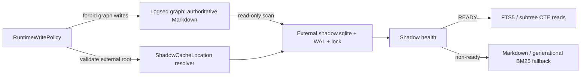

# v2 RC: external Shadow cache compatible with strict Logseq read-only mode

## Decision

For `v2.0.0-rc.1`, `MATRYCA_READ_ONLY=true` protects the Logseq graph from every
Matryca write, but it does not forbid writes to a validated cache root outside the
graph. Shadow DB is a derived read cache, not vault content, and must therefore be
able to bootstrap, reconcile, and update outside `LOGSEQ_GRAPH_PATH` while Markdown
remains the only system of record.

The current beta stores `shadow.sqlite` under
`<LOGSEQ_GRAPH_PATH>/.matryca_semantic_cache/`. That location makes Shadow
acceleration unavailable under strict read-only mode. The RC architecture moves
Shadow DB, its WAL/SHM files, and its writer lock to one canonical per-user external
cache root. `MATRYCA_CACHE_PATH` remains the explicit operator override.

This decision is a prerequisite for changing `MATRYCA_SHADOW_DB_ENABLED` to
default-on. It does not itself authorize an RC tag or publication.

## User contract

| Setting | Vault Markdown | External Shadow cache | Effective reads |
|---|---|---|---|
| `MATRYCA_READ_ONLY=false`, Shadow enabled | Existing OCC-protected writes allowed | Read/write | Shadow only while `READY`; fallback otherwise |
| `MATRYCA_READ_ONLY=true`, Shadow enabled | No writes, locks, temp files, metadata, or cache files inside the graph | Read/write | Shadow only while `READY`; fallback otherwise |
| Shadow explicitly disabled | Governed independently by Read Only | No Shadow create/sync/read | Markdown/generational BM25 |
| External cache unavailable or unsafe | Unchanged | No write attempted | Markdown/generational BM25 with bounded operator state |

`MATRYCA_READ_ONLY` and `MATRYCA_SHADOW_DB_ENABLED` remain independent. Read Only
has authority over the graph boundary; the Shadow flag has authority over the
derived read cache. Neither flag changes Markdown's source-of-truth status.

## Target storage layout

```text
<platform user cache>/matryca-plumber/
└── graphs/
    └── <graph-id>/
        └── shadow/
            ├── shadow.sqlite
            ├── shadow.sqlite-wal
            ├── shadow.sqlite-shm
            └── shadow.writer.flock
```

`<graph-id>` is a versioned digest of the canonical graph path. It must:

- isolate multiple graphs without putting graph names or paths in directory names;
- remain deterministic across process restarts;
- change when the canonical graph location changes, causing a safe rebuild;
- include a namespace/version prefix so a future identity algorithm cannot collide
  silently with this layout.

The default root follows the operating system's per-user cache convention. An
absolute `MATRYCA_CACHE_PATH` overrides that root and must resolve outside the graph.
Relative paths, graph-contained paths, symlink escapes, and unresolvable paths fail
closed to Markdown/BM25 fallback.

## Path and permission invariants

1. Resolve `LOGSEQ_GRAPH_PATH` canonically before deriving `<graph-id>`.
2. Resolve the external cache root canonically and prove that it is not under the
   graph. Do not use `assert_path_within_graph` for external cache targets.
3. Resolve every Shadow child from a typed cache-location object; callers must not
   reconstruct paths independently.
4. Keep SQLite database, WAL, SHM, and writer lock in the same private directory.
5. Create cache directories with user-only permissions where the platform supports
   them; do not log canonical graph paths or graph-derived identifiers at normal
   verbosity.
6. Reject symlinked database or lock files that escape the resolved Shadow directory.
7. A path-resolution or permission failure must not create graph-local fallback
   files and must not make Shadow health `READY`.

## Runtime architecture



The bootstrap must be split into graph mutation duties and external-cache duties.
With `MATRYCA_READ_ONLY=true`:

- skip graph-local provisioning, templates, state recovery, lock sweeping, catalog
  mutation, post-write hooks that can mutate the graph, and every Markdown mutator;
- allow a Shadow bootstrap that only reads `pages/` and `journals/` and writes the
  resolved external cache;
- allow watcher-driven Shadow reconciliation from external filesystem changes without
  registering any handler that writes back to the vault;
- run the maintenance daemon as an explicit foreground-only Shadow observer: no LLM
  bootstrap, semantic writes, journey log, hygiene, generated content, post-write hooks,
  robot Git, graph-local checkpoint, PID, or lock; detached startup fails closed until a
  separately qualified external control plane exists;
- preserve bounded parsing, quarantine, writer coordination, health validation, and
  fallback behavior.

## Migration from `2.0.0b1`

The beta graph-local database is disposable derived state. RC startup must never move,
rename, delete, migrate in place, or write to it while Read Only is enabled.

1. Resolve the new external location.
2. Ignore the graph-local beta database for routing once the external-location contract
   is active.
3. Build a fresh external database from authoritative Markdown into an atomic candidate.
4. Publish the candidate only after a complete successful generation.
5. On interruption or failure, retain the last complete external generation and use
   Markdown/BM25 until health is `READY`.
6. Leave the old graph-local beta cache untouched. Removal is an explicit operator
   cleanup action outside the RC migration path.

Copying the old SQLite file is deliberately rejected: a rebuild gives deterministic
provenance, re-applies the current schema and parse budget, and does not require trusting
mutable beta cache state.

## Operator and state contract

The Sovereign UI must expose both independent choices:

- **Read-only graph:** protects Logseq content and graph-local support files.
- **Shadow DB read cache:** enables the external acceleration cache; explicit off is the
  emergency legacy-path switch.

`GET /api/state.shadow_db` must distinguish at least:

- disabled by operator;
- external cache bootstrapping;
- ready;
- stale/non-ready with Markdown fallback;
- external cache path invalid or unavailable;
- schema/sync/database error.

State and logs must not expose the graph path, cache root, page titles, block IDs, or
content. UI help, `.env.example`, `llms.txt`, `.well-known/llms.txt`, OpenSpec fragments,
generated prompt, roadmap, tests, and changelog must use the same semantics.

## Implementation slices

**Implementation status (2026-08-01):** Slices 1–4 are complete in source. Slice 5
qualification remains open and is the next release gate; no RC tag or publication is
authorized by this status.

### Slice 1 — typed external cache location

- Add a single resolver for platform default root, `MATRYCA_CACHE_PATH` override,
  versioned graph identity, Shadow directory, database path, and lock path.
- Keep the existing beta path available only as a named legacy locator for migration
  tests; no new writes use it.
- Add path containment, symlink, multi-graph isolation, deterministic identity,
  permissions, and platform-path tests.

### Slice 2 — Shadow connection and writer coordination

- Route connection, state, health, bootstrap, sync, quarantine, WAL/SHM, and locks through
  the typed location.
- Preserve atomic rebuild and fail-closed fallback.
- Ensure explicit Shadow-off performs no external cache creation or read.

### Slice 3 — read-only bootstrap separation

- Split graph-mutating runtime bootstrap from external Shadow bootstrap.
- Permit external Shadow maintenance under Read Only without registering vault mutators.
- Prove unchanged Markdown and absence of new graph-local files.

### Slice 4 — operator contract and default-on

- **Complete:** expose independent Read Only and Shadow settings in the Sovereign UI;
  Read Only visibly disables graph-mutating controls while preserving Shadow status.
- **Complete:** unset `MATRYCA_SHADOW_DB_ENABLED` is enabled after Slices 1–3 passed;
  explicit false remains the emergency Markdown/BM25 opt-out.
- **Complete:** synchronize operator/agent documentation and generated prompt surfaces;
  invalid external roots report bounded `cache_unavailable` state and safe fallback.

### Slice 5 — qualification and release evidence

- Upgrade matrix from stable, alpha, and beta artifacts.
- Exact-wheel smoke for read-write, Read Only, explicit Shadow-off, invalid external root,
  restart recovery, and schema mismatch.
- Restart-resilient default-on soak with unchanged Markdown fingerprints and proof that
  all SQLite/WAL/SHM/lock writes remain outside the source graph.

## Verification matrix

- Unit: resolver identity, containment, override parsing, permissions, symlink rejection.
- Integration: bootstrap, full rebuild, incremental create/update/delete/rename, quarantine,
  FTS, subtree, health, and state API at the external location.
- Safety: graph tree fingerprint unchanged; no graph-local temp, lock, SQLite, WAL, SHM,
  state, or cache file created under Read Only.
- Recovery: interruption before candidate publish, corrupt external DB, stale schema,
  unavailable cache root, process restart, graph rename/move.
- Isolation: two graphs with equal filenames never share a database or lock.
- Compatibility: explicit Shadow-off retains the legacy Markdown/BM25 path; existing
  read-write behavior remains correct while the physical cache location changes.
- Platform: macOS, Linux, and Windows default cache roots and path semantics.

## Non-goals

- Shadow DB never becomes a write authority for Logseq content.
- No direct mutation of Logseq's internal database.
- No automatic deletion of the beta graph-local cache.
- No synchronization or portability promise for derived caches between machines.
- No biological memory or Logseq DB Safe-Sync work in this v2.0 slice.

## Definition of Done

- Every implementation slice above is merged with targeted tests and full CI.
- Read Only + Shadow enabled reaches `READY` using only external writes.
- The graph remains byte-for-byte unchanged throughout bootstrap, CRUD observation,
  restart, failure, and recovery probes.
- Explicit Shadow-off and every non-ready state retain correct fallback.
- Gate A records separate evidence for external-cache compatibility and default-on.
- Tagging and publication remain separate maintainer authority gates.

---

**Parent release gate:** [#343](https://github.com/MarcoPorcellato/matryca-plumber/issues/343)

**Parent epic:** [#20](https://github.com/MarcoPorcellato/matryca-plumber/issues/20)
