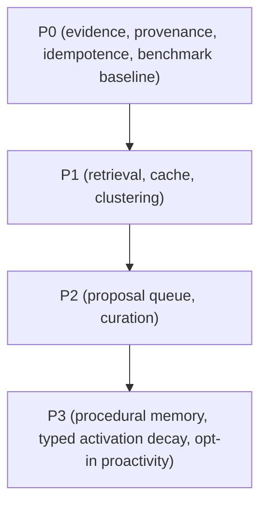

# v2.1+ — Biological Memory Layer (evidence-first)

**Historical architecture context:** [#20 — v2.0.0 Shadow DB & Safe-Sync](https://github.com/MarcoPorcellato/matryca-plumber/issues/20)

**Active delivery tracker:** [#178 — Coordinate v2.1 memory, Safe-Sync, and import programme](https://github.com/MarcoPorcellato/matryca-plumber/issues/178)
**Status:** P0 ships only a disabled-by-default, provider-free canonical recall envelope over a
fresh query-only Shadow FTS cache. No memory write, decay, consolidation, remote provider, or
autonomous behavior is shipped; scaffolded later-phase components remain roadmap-only.

**Canonical surface:** this roadmap in `docs/roadmaps`

**Projection surface:** [`biological-memory.md`](../openspec/biological-memory.md)

**Preparation index:** [`ROADMAP_V2_PREPARATION.md`](ROADMAP_V2_PREPARATION.md)
**Prerequisite:** [`ROADMAP_V2_SHADOW_DB.md`](ROADMAP_V2_SHADOW_DB.md) ([#24](https://github.com/MarcoPorcellato/matryca-plumber/issues/24), [#17](https://github.com/MarcoPorcellato/matryca-plumber/issues/17))  
**Leading programme:** [AGENTIC_MEMORY_LEADERSHIP_PROGRAMME_2026-08-10](../quality/AGENTIC_MEMORY_LEADERSHIP_PROGRAMME_2026-08-10.md)

---

## Source-of-truth and authority model

- **Logseq Markdown is canonical for semantic memory and approved decisions.**
- **`Shadow DB` is derived and disposable/rebuildable:** indexes, embeddings, hashes, generations, activation/utility projections, bounded caches, and aggregates may exist there, but never as sole semantic authority.
- This roadmap is the canonical execution sequence.
- The OpenSpec is a projection contract; it must not widen implementation scope.

## Delivery sequence (evidence-first)

### P0 — evidence controls, canonical recall/provenance/idempotence, and benchmark baseline

1. Define governed evidence and provenance rules for recall envelope behavior.
2. Define canonical recall fingerprints, invalidation behavior, and idempotent processing boundaries.
3. Define benchmark baseline and acceptance policy.
4. Define replay/rollback/freshness boundaries before any P1 rollout.

### P1 — hybrid retrieval, cache, clustering

1. Implement hybrid retrieval composition over semantic, graph, and recency signals under P0 evidence gates.
2. Define deterministic cache behavior for recall under fallback conditions.
3. Add clustering controls tied to retrieval stability and reproducibility evidence.

### P2 — proposal queue and curation

1. Define proposal queue and curation path.
2. Define curation state transitions and rejection/acceptance governance.
3. Require provenance links for every accepted proposal.

### P3 — procedural memory, typed activation decay, opt-in proactivity

1. Define procedural memory primitives under Logseq-native constraints.
2. Add typed activation decay for non-authoritative procedural utility projections.
3. Enable proactivity only by explicit opt-in with privacy and safety controls.

## Issue mapping and project anchors

### Exact phase-to-issue map

- **P0:** [#186](https://github.com/MarcoPorcellato/matryca-plumber/issues/186), [#447](https://github.com/MarcoPorcellato/matryca-plumber/issues/447), [#448](https://github.com/MarcoPorcellato/matryca-plumber/issues/448), [#449](https://github.com/MarcoPorcellato/matryca-plumber/issues/449)
- **P1:** [#450](https://github.com/MarcoPorcellato/matryca-plumber/issues/450), [#451](https://github.com/MarcoPorcellato/matryca-plumber/issues/451)
- **P2:** [#452](https://github.com/MarcoPorcellato/matryca-plumber/issues/452)
- **P3:** [#99](https://github.com/MarcoPorcellato/matryca-plumber/issues/99), [#453](https://github.com/MarcoPorcellato/matryca-plumber/issues/453), [#454](https://github.com/MarcoPorcellato/matryca-plumber/issues/454)

### Native control-plane receipts

- Parent umbrella: [#446](https://github.com/MarcoPorcellato/matryca-plumber/issues/446)
- Parent umbrella: [#178](https://github.com/MarcoPorcellato/matryca-plumber/issues/178)
- Receipt:
  - `#178` -> `#139`, `#446`
  - `#446` -> `#99`, `#186`, `#447`, `#448`, `#449`, `#450`, `#451`, `#452`, `#453`, `#454`
  - `#25` remains under `#20` as a shared Safe-Sync dependency.
- Program project placement references:
  - `#446` In Progress
  - `#186`, `#447`, `#448`, `#449` Up Next
  - `#450`-`#454` Backlog

## Benchmark policy

- Neutral benchmark sets and design references are recorded in the dossier.
- This phase order does not imply any unverified performance ranking.
- Required evidence includes benchmark provenance, run fingerprints, and acceptance status.

## Phase dependency contract

## Open and future

- No decay algorithm or decay gate is included in P0 acceptance.
- Typed activation decay appears only in P3, and it must not delete or overwrite semantic truth.
- No runtime migration is inferred from this roadmap alone.

## Verification and next steps

1. Complete P0 evidence, provenance, and benchmark gate.
2. Release P1 work after P0 evidence acceptance.
3. Execute P2 and P3 under explicit phase gate approval.
