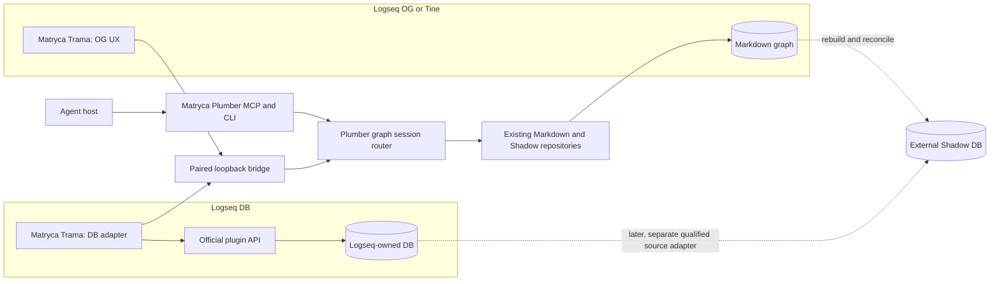

# Tine and Logseq ecosystem integration strategy

**Date:** 2026-08-12
**Decision status:** proposed, evidence-backed roadmap; no compatibility or release claim
**Scope:** Tine collaboration, Matryca Trama as the Logseq OG/DB companion, and the smallest Matryca Plumber changes with the highest expected impact

> **Historical/non-authorizing.** This strategy is retained for historical
> research and sequencing context. It is superseded for execution by the
> accepted [Plumber Logseq gateway authority](../decisions/2026-09-05-plumber-logseq-gateway-authority.md).
> It does not authorize a Trama host adapter and does not authorize
> `trama.logseq.read/v1` authority. `GraphReadPort remains
> filesystem/Shadow-only`; Plumber alone may qualify a future official-host
> adapter and public session contract.

## Historical 2026-09-05 evidence and sequencing update

The first executable Logseq DB investigation is now **CLI-first**. Current
official CLI documentation exposes explicit graph selection, graph metadata,
structured output, page lookup, and page/block tree reads. It also owns a
shared `db-worker-node` lifecycle and may replace a revision-mismatched server.
The spike must therefore prove both data semantics and process-level read-only
safety; a command named as a read is not assumed side-effect free.

Transport order is fixed until evidence changes it:

1. the exact CLI bundled with the selected Logseq application artifact;
2. the official plugin SDK inside Matryca Trama;
3. MCP stdio with one isolated process per session;
4. public NO-GO when none proves the complete contract.

MCP HTTP is excluded while
[Logseq DB issue #1101](https://github.com/logseq/db-test/issues/1101) remains
open. Every CLI probe uses explicit `--graph`; never `graph switch`. It runs on
one disposable synthetic DB graph with the app both closed and open, captures
pre/post graph identity, content and CLI-config fingerprints, bounds output and
timeouts, and stops on revision mismatch or server replacement. It never runs
arbitrary queries, sync, download, import/export, mutation, or direct SQLite
access.

Current anchors are Plumber
`12ca79cb14f9bbdf196ec409a48025afb6503ca1`, Trama
`9905e8a36acb83a17a33b702a5fa620d6bfed185`, Logseq source
`d2ab7726ab74402c14fdbc33041a89ac55c899ae`, Logseq docs
`08f855f24d66e4509b7ea808554c13b4649e6ee1`, and Logseq `db-test`
`f65c01b8f6101a0263ce6a8723fbbb89bc3a3a79`. The 2026-08-26 nightly
release targets `dde0aba2d441c962d28989b0af894cc261da3898`, but its tag is
mutable. Evidence must bind the downloaded asset digest and embedded runtime
revision rather than relying on the tag.

The historical record notes a Trama Python-first foundation and synthetic OG
`trama.logseq.read/v1` material. It is not a current contract authority or a
Logseq DB host claim. `GraphReadPort remains filesystem/Shadow-only`; any
future public session port is Plumber-owned and feature-off pending separate
qualification.

The existing `get_graph_read_port` selector may be reduced through a separate
characterization-first Clean Architecture lane. Its public signature, Shadow
fallback, wheel-probe behavior, and filesystem-only ownership remain frozen;
the refactor is not a prerequisite for DB compatibility.

## Historical 2026-09-01 execution update

The former execution authority was the [Logseq DB read-only compatibility implementation plan](../superpowers/plans/2026-09-01-logseq-db-read-only-compatibility.md). That plan is historical and non-authorizing; the accepted Plumber gateway decision above is current authority. It recorded three exploratory operations:

1. identify the active Logseq DB graph;
2. read one page;
3. read one complete, ordered block subtree.

The work uses short-lived branches cut from current `main`, with one independently reviewable pull request merged before its dependent branch begins. The existing filesystem `GraphReadPort` remains the Logseq OG and Shadow boundary. A separate session-bound `GraphSessionReadPort` may be introduced only after the executable capability spike proves stable graph identity and complete subtree semantics through an official Logseq host surface.

The superseded text below treated [Matryca Trama](https://github.com/MarcoPorcellato/matryca-trama) as the official Logseq adapter and contract authority. That model is not current: Plumber is the sole Logseq gateway, owns any future official-host adapter and public contract, and Trama and Brain remain consumers. Every historical use of “companion” below is non-authorizing.

[Matryca Brain issue #430](https://github.com/MarcoPorcellato/Matryca-per-Delineat/issues/430) and [Trama ADR-0002](https://github.com/MarcoPorcellato/matryca-trama/blob/main/docs/decisions/ADR-0002-TRAMA_BRAIN_PRODUCT_BOUNDARY.md) establish a second boundary: Trama and Brain remain separate products, repositories, runtimes, caches, and release cadences. The initial Trama/Plumber Logseq read path must work without Brain. A later optional Brain connection requires its own versioned public contract and must never import Brain-private source into Trama.

Events and convergence, DB-source Shadow acceleration, and every DB write remain deferred gates. Direct access to Logseq's internal database remains prohibited. The transport decision is intentionally unresolved until [issue #491](https://github.com/MarcoPorcellato/matryca-plumber/issues/491) records reproducible evidence for the tested Logseq build, SDK or built-in surface, fixture, and results.

The anchors recorded in this 2026-09-01 subsection are preserved as historical
planning evidence and are superseded for execution by the 2026-09-05 update
above. Every implementation branch must revalidate drift-prone anchors rather
than treating any dated observation as a permanent compatibility claim.

## Executive decision

Matryca Plumber should pursue **one ecosystem strategy with two complementary paths**:

1. **Tine:** begin as a qualified external, read-only intelligence layer over the same
   Logseq-format graph. Collaborate through a design proposal and shared compatibility
   evidence, not through an ordinary Tine plugin or an unsolicited code patch.
2. **Logseq:** build **Matryca Trama as the one dual-mode companion**, not separate
   OG and DB plugins. In OG mode it is a thin discovery, pairing, status, and context
   surface over Matryca's existing Markdown runtime. In DB mode it becomes Matryca's
   in-app read adapter. Any later mutation must use a separately qualified,
   host-authoritative Logseq surface; Trama does not become write authority merely by
   being the companion. Marketplace distribution would make it an official Matryca
   integration, not a Logseq-owned plugin.

The first product claim should be deliberately narrow:

> Matryca Plumber can provide fast, local-first, block-granular search and agent memory
> while Tine or Logseq remains the human editing environment; graph mutation stays off
> until the active host's write protocol is proven safe.

This produces the best impact-to-effort ratio because it reuses Matryca's strongest
assets—block semantics, MCP, BM25, Shadow DB, Strict Read Only, and external cache
isolation—without duplicating an editor, importing another application's private
database, or generalizing the entire codebase before one vertical slice proves demand.

## Operational status

As of 2026-09-01, the maintainer-first Tine contact and first response cycle are complete: the proposal is
public in [Tine Discussion #334](https://github.com/martinkoutecky/tine/discussions/334).
The maintainer confirmed that Direct Files already provides the basic read-only coexistence case and that Matryca-side mutations while Tine is closed need no new Tine protocol. Tine #337 later closed as completed after Concord/external-file synchronization work. That is version-bound upstream evidence, not a concurrent-write guarantee.

Work that does not require an upstream Tine change may proceed independently: publish
this roadmap, qualify the T0 read-only contract, freeze the shared Trama/Plumber protocol,
verify official Logseq OG/DB capabilities, and scaffold Matryca Trama. No Tine code, plugin, CLI, MCP, or write-path change is implied by that work.

### Go and no-go summary

| Direction | Decision | Reason |
| --- | --- | --- |
| Tine v0.6.98 Direct Files + Matryca Strict Read Only | **GO to versioned qualification** | Discussion #334 confirms no special adapter is needed; Matryca must prove zero graph writes and bind evidence to exact Tine mode/version. |
| Matryca writes while Tine is closed | **GO only after versioned compatibility tests** | The independent writers are serialized operationally, and Tine can validate the resulting graph when reopened. |
| Concurrent Tine and Matryca writes | **NO-GO today** | The two applications do not share locks, revision tokens, dirty-editor state, or a transaction coordinator. |
| Closed Tine #337 | **Evidence, not authority** | Concord addresses the reported stale/external-file flows, but issue closure does not qualify arbitrary external writers or Matryca concurrency. |
| Ordinary Tine plugin as the Matryca runtime | **NO-GO** | Tine API 0.2 intentionally denies filesystem, process, network, arbitrary-graph, and custom-UI authority. |
| Matryca Trama for Logseq OG and DB | **Historical proposal — non-authorizing** | Superseded by the Plumber gateway decision; Trama is a future consumer, not the Logseq adapter authority. |
| Logseq DB read-only bridge | **Conditional GO** | Official plugin APIs expose graph-mode detection, page/block reads, queries, and DB change hooks. Exact semantics still require a spike. |
| Logseq DB writes | **NO-GO until CAS evidence** | A read-before-write check is insufficient unless the official host provides atomic conditional mutation or equivalent conflict semantics. |
| Direct access to Logseq `db.sqlite` | **Permanent NO-GO** | It bypasses the official application contract, validation, undo/redo, and future schema compatibility. |
| DB-to-Shadow synchronization in the first slice | **NO-GO** | Current Shadow freshness is filesystem-based; a DB source needs its own revision, event, rebuild, and reconciliation contract. |
| Built-in Logseq DB MCP as the only backend | **Not yet** | It is useful and authenticated, but its documented TODOs still include child blocks and general property values. |

## Method and evidence policy

This study separates four kinds of statement:

- **Verified current fact:** supported by a pinned repository revision, current issue,
  or current Matryca source.
- **Documented upstream direction:** an open issue or roadmap, not shipped behavior.
- **Proposal:** a recommended design that still requires implementation and tests.
- **Uncertainty:** a contract that must be resolved by a focused spike before coding.

Repository source and official upstream documentation are authoritative. Code-graph
analysis was used only for orientation because the local index referred to another
Matryca worktree. Direct source inspection at the exact Matryca baseline was used for
every material conclusion. No Tine, Logseq, GitHub, release, or package state was
modified during the study.

### Frozen evidence baseline

| Surface | Revision observed on 2026-08-12 | Primary evidence |
| --- | --- | --- |
| Matryca Plumber | `4f82e12e737335f54fabfb7979b1b83026148663` | [system overview](../knowledge/architecture/system-overview.md), [graph plane](../knowledge/architecture/graph-plane.md), [Shadow DB](../knowledge/architecture/shadow-db.md), current `src/` |
| Tine | [`61ba2b4f255e54a0349ebc9af91958d72624277a`](https://github.com/martinkoutecky/tine/tree/61ba2b4f255e54a0349ebc9af91958d72624277a) | [README](https://github.com/martinkoutecky/tine/blob/61ba2b4f255e54a0349ebc9af91958d72624277a/README.md), [contributing contract](https://github.com/martinkoutecky/tine/blob/61ba2b4f255e54a0349ebc9af91958d72624277a/CONTRIBUTING.md), ADRs and plugin docs |
| Logseq OG | [`6e7afa8eb040686ff057156ee877193b581dd369`](https://github.com/logseq/og/tree/6e7afa8eb040686ff057156ee877193b581dd369) | [official OG repository](https://github.com/logseq/og/blob/6e7afa8eb040686ff057156ee877193b581dd369/README.md) |
| Logseq DB application | [`d3d6afa37b646dda90928c2a5f8a1e27dbcc5814`](https://github.com/logseq/logseq/tree/d3d6afa37b646dda90928c2a5f8a1e27dbcc5814) | [DB status](https://github.com/logseq/logseq/blob/d3d6afa37b646dda90928c2a5f8a1e27dbcc5814/README.md#database-version), [plugin type contracts](https://github.com/logseq/logseq/blob/d3d6afa37b646dda90928c2a5f8a1e27dbcc5814/libs/src/LSPlugin.ts) |
| Logseq DB documentation | [`08f855f24d66e4509b7ea808554c13b4649e6ee1`](https://github.com/logseq/docs/tree/08f855f24d66e4509b7ea808554c13b4649e6ee1) | [DB features and MCP](https://github.com/logseq/docs/blob/08f855f24d66e4509b7ea808554c13b4649e6ee1/db-version.md), [differences from file graphs](https://github.com/logseq/docs/blob/08f855f24d66e4509b7ea808554c13b4649e6ee1/db-version-changes.md) |
| Logseq marketplace | [`ddd03508f56e11b4efe08f7c006282ddec647276`](https://github.com/logseq/marketplace/tree/ddd03508f56e11b4efe08f7c006282ddec647276) | [submission contract](https://github.com/logseq/marketplace/blob/ddd03508f56e11b4efe08f7c006282ddec647276/README.md) |

### 2026-09-01 ownership and Tine supplement

| Surface | Current anchor | Meaning |
| --- | --- | --- |
| Matryca Plumber | [`3208bedfaeef0708034089057702cd21fa5dec52`](https://github.com/MarcoPorcellato/matryca-plumber/tree/3208bedfaeef0708034089057702cd21fa5dec52) | Engine and consumer-side session boundary |
| Matryca Trama | [`cd9ec408ed9d4ece39d3eeaef506f4b172ab77d5`](https://github.com/MarcoPorcellato/matryca-trama/tree/cd9ec408ed9d4ece39d3eeaef506f4b172ab77d5) | Document-first companion foundation; no runtime or release claim |
| Trama contract/adapters | [#2](https://github.com/MarcoPorcellato/matryca-trama/issues/2), [#4](https://github.com/MarcoPorcellato/matryca-trama/issues/4) | Shared contracts first, then initially read-only OG/DB adapters |
| Matryca Brain | [`main@e69a97a8c702a773c9a3ce8307b5a667ed2be1dd`](https://github.com/MarcoPorcellato/Matryca-per-Delineat/tree/e69a97a8c702a773c9a3ce8307b5a667ed2be1dd), [#430](https://github.com/MarcoPorcellato/Matryca-per-Delineat/issues/430) | Optional future destination; separate product and runtime, not an initial dependency |
| Tine | [`master@3f3a7afe49c488ba5444c4882fff727d7c0099c0`](https://github.com/martinkoutecky/tine/tree/3f3a7afe49c488ba5444c4882fff727d7c0099c0), [v0.6.98](https://github.com/martinkoutecky/tine/releases/tag/v0.6.98) | Current source/release observation for later versioned qualification |
| Tine external-file umbrella | [#337](https://github.com/martinkoutecky/tine/issues/337) | Closed completed; focused current-version regressions may reopen it |
| Tine automation surfaces | [#108](https://github.com/martinkoutecky/tine/issues/108), [#109](https://github.com/martinkoutecky/tine/issues/109) | Open future CLI/MCP design tracks |
| Tine Git integration | [#33](https://github.com/martinkoutecky/tine/issues/33) | Sync/backup direction, not host-authoritative graph mutation |

All upstream claims must be rechecked before implementation because Tine's plugin API
is experimental and Logseq DB is explicitly in beta with possible data loss.

## Current Matryca Plumber leverage and constraints

Matryca already contains most of the expensive product value needed by both paths:

- a block-aware parser and addressable `id::` semantics;
- one shared dispatch plane for CLI and MCP reads, searches, and guarded mutations;
- fast generational BM25 plus optional external Shadow FTS5 and subtree reads;
- Strict Read Only that blocks graph-local mutations while allowing validated external
  derived-cache maintenance;
- watcher reconciliation for external Markdown edits;
- OCC, page locks, path confinement, and atomic file replacement for OG writes;
- a local-first stdio MCP surface with eight tools;
- a loopback operator UI with health, configuration, and runtime controls.

The same source also defines the limits of a small implementation:

- [`GraphReadPort`](../../src/graph/ports/read.py) exposes only subtree Markdown and
  spatial-page Markdown methods and requires a filesystem `Path`.
- Only the subtree handler currently selects between Markdown and Shadow repositories;
  page reads and BM25 follow separate routes.
- Mutation handlers remain filesystem-specific and there is no mutation port.
- [`sync_page_to_shadow`](../../src/shadow/sync.py) stores file path, mtime, and size;
  Shadow freshness is therefore an OG filesystem contract, not a generic graph-source
  contract.
- Matryca's public MCP is stdio. The loopback UI API is a control plane, not a graph
  bridge.
- The current UI token must not be reused for a companion: the unauthenticated loopback
  session endpoint can issue it to local clients by design, so it is not a narrow,
  graph-bound integration credential.

The first integration should therefore add a narrow vertical seam rather than rename
or generalize every existing graph function.

## Tine collaboration analysis

### Why the projects fit

Tine and Matryca share an unusually strong philosophical and technical foundation:

- Tine operates directly on the standard Logseq graph layout and treats byte-faithful
  Logseq OG round-tripping as a hard constraint ([ADR 0004](https://github.com/martinkoutecky/tine/blob/61ba2b4f255e54a0349ebc9af91958d72624277a/docs/adr/0004-operate-on-the-logseq-format-og-parity.md)).
- Matryca treats the same human-readable graph as authoritative and keeps Shadow as a
  disposable derived cache.
- Tine is primarily an interactive editor; Matryca is primarily a background memory,
  retrieval, agent, and gardening plane. Their strengths are complementary rather than
  duplicative.
- Both treat silent lost updates as unacceptable and use conflict checks plus atomic
  persistence.

The immediate user value is compelling: a Tine user could gain block-granular BM25,
agent MCP access, external Shadow acceleration, and optional knowledge gardening
without migrating the graph or making Matryca the editor.

### The concurrency boundary

Tine's accepted [save/watch/edit protocol](https://github.com/martinkoutecky/tine/blob/61ba2b4f255e54a0349ebc9af91958d72624277a/docs/adr/0012-save-watch-edit-coherency-protocol.md)
has one writer path, per-page serial saves, `baseRev`, dirty-page reload protection,
last-moment conflict checks, atomic replacement, self-write markers, and graph-generation
leases. Matryca has its own mtime OCC, page lock sidecars, re-read checks, and atomic
replacement.

These are both good protocols, but they are **independent protocols**. Atomic writes
prevent torn bytes; they do not prevent this race:

```text
Tine checks revision A ────────────── writes Tine result B
Matryca checks mtime A ───────────── writes Matryca result C
                                      final bytes depend on order
```

Neither process can currently see the other's dirty editor, lock, revision token, or
self-write marker. Consequently, compatibility must be described in levels:

| Level | Contract | Current position |
| --- | --- | --- |
| T0 | Matryca Strict Read Only; Tine may edit; Matryca may update only its external cache | Candidate for versioned qualification against Tine v0.6.98 Direct Files |
| T1 | Tine closed; Matryca may perform reviewed, OCC-protected mutations | Candidate after round-trip and reopen tests |
| T2 | Both may mutate different pages | Unsupported until deterministic convergence tests pass |
| T3 | Both may target the same page | Unsupported until one writer provably rejects or a shared coordinator exists |

### Why an ordinary Tine plugin is not the answer

Tine plugin API 0.2 runs small WebAssembly guests with versioned events and inert,
host-validated effects. It intentionally provides no filesystem, network, process,
DOM, Tauri, arbitrary graph path, or ambient authority
([plugin API](https://github.com/martinkoutecky/tine/blob/61ba2b4f255e54a0349ebc9af91958d72624277a/docs/plugins/README.md),
[threat model](https://github.com/martinkoutecky/tine/blob/61ba2b4f255e54a0349ebc9af91958d72624277a/docs/plugins/threat-model.md)).

Matryca needs a long-running Python process, graph-wide reads, external caches, and
optionally model access. Asking Tine to weaken its sandbox would harm Tine and still
duplicate the real integration problem. The correct first seam is the shared on-disk
format. A future Tine plugin should be considered only for a bounded host-owned status,
command, or navigation contribution after user demand exists.

If a useful behavior remains impossible, follow Tine's
[porting policy](https://github.com/martinkoutecky/tine/blob/61ba2b4f255e54a0349ebc9af91958d72624277a/docs/plugins/porting-logseq-obsidian.md):
describe the smallest reusable semantic host operation in `port-gap.json`; do not ask
for broad compatibility or smuggle authority through another surface.

### How Matryca can help Tine's open work

| Tine issue | Upstream direction | Matryca contribution |
| --- | --- | --- |
| [#337 — external-file synchronization](https://github.com/martinkoutecky/tine/issues/337) | Closed completed after Concord and external-file safety work | Treat closure as version-bound evidence. Reopen only with an exact current-version failure; do not infer concurrent-writer safety. |
| [#108 — stable CLI](https://github.com/martinkoutecky/tine/issues/108) | Use-case-first automation; writes must share Tine locking, base revision, conflict, and atomic save | Supply concrete agent/search use cases, versioned output fixtures, and a read-only external consumer. Later prefer Tine CLI for host-authoritative mutations. |
| [#109 — MCP](https://github.com/martinkoutecky/tine/issues/109) | Semantic pages/blocks/properties/tasks; begin read-only; decide transport, graph selection, permissions, privacy, schemas | Offer Matryca's existing agent-facing operations and bounded-output experience as design evidence. Do not replace Tine's native MCP or define its internals accidentally. |
| [#33 — Git integration](https://github.com/martinkoutecky/tine/issues/33) | Commit/push-oriented sync and backups | Useful parallel workflow, but not a revisioned host-authoritative graph-write contract. |
| [#201 — official Wiki](https://github.com/martinkoutecky/tine/issues/201) | Tutorial, reference, and durable product memory maintained from issues, decisions, tests, and releases | Demonstrate a reviewed source-to-Logseq knowledge workflow and block-level retrieval over the documentation corpus. Repository documentation remains authoritative; Matryca's graph is a derived working memory, not an auto-publishing source. |

The strongest possible collaboration artifact is not code. It is a small shared compatibility corpus and state-transition matrix. Do not post it to closed #337 or open a new Tine issue without either a maintainer request or an exact current-version reproduction.

### Proposed Tine qualification matrix

The active lane is TINE-Q0/Q1 only. TINE-Q2 and later gates are deferred research and do not authorize Matryca writes while Tine may be active.

| Gate | Scenario | Pass condition |
| --- | --- | --- |
| TINE-Q0 | Pinned, provenance-recorded Markdown fixtures; Org recorded as unsupported | No unapproved byte or structural drift after Tine and Matryca parse/no-op paths |
| TINE-Q1 | Tine edits while Matryca runs in Strict Read Only | Zero graph-local Matryca writes; Shadow/search converges; diagnostics remain content-free |
| TINE-Q2 | Tine closed; each Matryca mutation class; Tine reopened | Tine parses the result; blocks, IDs, properties, links, namespaces, and fences remain valid |
| TINE-Q3 | Dirty Tine page and Matryca target the same page | One operation rejects explicitly; no silent overwrite |
| TINE-Q4 | Different-page create/modify/delete/rename load | Both watchers and indexes converge without stale or resurrected records |
| TINE-Q5 | Kill either process at commit and watcher boundaries | Disk contains complete old or new bytes; recovery is explicit and repeatable |
| TINE-Q6 | External sync interleavings | No duplicate, resurrected, or silently lost blocks |
| TINE-Q7 | Privacy inventory | No credentials, paths, queries, or note text in public diagnostics; endpoint behavior is disclosed |
| TINE-Q8 | Linux, macOS, Windows | Exact platform receipts; no portability claim inferred from source alone |
| TINE-Q9 | Fixture and license provenance | No Tine application code copied into Apache-2.0 artifacts without review |

Passing TINE-Q2 does not qualify concurrent writes. TINE-Q3 is the minimum gate for
any same-page concurrency claim.

Tine also supports Org files, but this roadmap does **not** infer Org interoperability
from that fact. Matryca's current shared-format path is Markdown-oriented. The first
qualification corpus must therefore use Markdown fixtures; Org must appear as an
explicit unsupported capability until a separate parser, round-trip, and safety study
proves otherwise.

### Maintainer-first collaboration proposal — completed historical artifact

Tine is a single-maintainer project whose contribution policy is "propose, don't
patch" for application code
([CONTRIBUTING](https://github.com/martinkoutecky/tine/blob/61ba2b4f255e54a0349ebc9af91958d72624277a/CONTRIBUTING.md)).
The first contact should therefore be short, use-case-led, and explicit about security.

```markdown
Title: Proposal: qualify Matryca Plumber as an external Logseq-format collaborator

Matryca Plumber and Tine both operate on Logseq-compatible graphs, but each owns an
independent save, watcher, and conflict protocol. I would like to establish the
smallest safe interoperability claim without adding ambient plugin authority or a
second Tine write path.

Proposed sequence:

1. qualify read-only Matryca coexistence while Tine edits;
2. qualify Matryca mutations only while Tine is closed;
3. keep concurrent mutation unsupported until deterministic two-process tests prove
   explicit conflict behavior;
4. share a small provenance-recorded Logseq compatibility corpus and test matrix.

This may also provide concrete consumer evidence for #108 and #109. Matryca would not
replace Tine's future CLI or MCP; once those surfaces exist, they could become the
host-authoritative route for writes.

Would read-only coexistence be a useful first target? If coordination becomes useful,
which reusable primitive would fit Tine best: a revision query, dirty-page refusal, or
an external-writer lease?

No implementation or API expansion is requested at this stage.
```

The maintainer's response in Discussion #334 narrowed the result: Direct Files already covers basic reads, Tine-closed Matryca writes require no new protocol, #337 supplied the immediate external-file safety context and is now closed, and future Tine-hosted automation belongs to #108/#109. The current action is to wait for any further maintainer request while running only independent, read-only, exact-version qualification.

## Matryca Trama: one dual-mode Logseq companion

### Why one plugin

The Logseq marketplace manifest distinguishes `supportsDB` from `supportsDBOnly` and
recommends keeping `@logseq/libs` current. It also discourages `effect` unless the
built-in API cannot express a required behavior and applies stricter review when it is
enabled ([marketplace contract](https://github.com/logseq/marketplace/blob/ddd03508f56e11b4efe08f7c006282ddec647276/README.md)).

The recommended package is therefore:

```json
{
  "supportsDB": true,
  "supportsDBOnly": false,
  "effect": false
}
```

The exact manifest and minimum Logseq version must be frozen during the contract spike.
One package gives users one name, one install path, one pairing model, and one adoption
funnel. Internally it selects behavior with `logseq.App.checkCurrentIsDbGraph()`.

### OG mode: thin companion, existing runtime

Logseq OG remains a file graph. Matryca already owns the expensive graph scanning,
parsing, caching, search, MCP, and guarded mutation work. The plugin should not embed
Python, a model, another index, or a second parser.

The smallest useful OG experience is:

1. toolbar and command-palette entry;
2. discover or start the local Matryca UI;
3. explicit one-time pairing with a narrow companion credential;
4. show Matryca health, Strict Read Only, Shadow readiness, and active graph match;
5. "Search this page/block with Matryca" and "Open in Matryca" commands;
6. mutation controls hidden unless the operator enables them in Matryca.

OG graph authority remains exactly where it is today: Markdown, Matryca's parser, OCC,
locks, and atomic writes. The plugin is a UX and active-context adapter, not a writer.

### DB mode: official adapter, read-only first

Logseq DB is not a file-format variation. Its official documentation says graph data
lives in `db.sqlite`, the `logseq/` directory no longer exists, blocks and pages are
unified as nodes, properties have typed values, and namespace behavior changes
([DB changes](https://github.com/logseq/docs/blob/08f855f24d66e4509b7ea808554c13b4649e6ee1/db-version-changes.md)).

Matryca must never open that SQLite file directly. The dual-mode companion should use
official APIs to normalize host objects into a small versioned Matryca contract. The
pinned SDK exposes:

- `App.checkCurrentIsDbGraph()`;
- `Editor.getPage`, `getBlock`, `getPageBlocksTree`, `insertBlock`, `updateBlock`, and
  property operations;
- `DB.onChanged`, `DB.onBlockChanged`, `DB.q`, and `DB.datascriptQuery`.

The initial DB surface should include only:

- graph identity and capability handshake;
- one page read;
- one block-subtree read;
- no events, broad search, Shadow ingestion, or mutation.

Events, bounded search/query expansion, and long-running convergence are later gates after page and complete-subtree parity pass.

### Official DB MCP: valuable second adapter

Logseq now documents an optional authenticated MCP server at
`http://127.0.0.1:12315/mcp`. It uses a bearer token, supports search, pages, tags,
properties, top-level blocks, batch creation/editing, pretend mode, app validation,
and undo/redo. Its documented TODOs include child blocks, properties associated with
arbitrary node types, namespaces, and property values
([official MCP documentation](https://github.com/logseq/docs/blob/08f855f24d66e4509b7ea808554c13b4649e6ee1/db-version.md#L411-L440)).

| Criterion | Companion SDK adapter | Built-in DB MCP adapter |
| --- | --- | --- |
| Active graph/session ownership | Directly tied to the running plugin | Current graph or CLI-selected graph; exact lifecycle must be probed |
| Marketplace UX and discovery | Yes | No Matryca-specific UX |
| Child-tree completeness | SDK exposes page/block tree reads | Documented as a current MCP TODO |
| Change events | SDK exposes DB hooks | Subscription/event contract not documented in the cited MCP section |
| Host-authoritative writes | Official Editor API | Official MCP validates and supports undo/redo, but exact stale-write semantics remain unknown |
| Authentication | Matryca-defined narrow pairing | Existing Logseq bearer token |
| Maintenance burden | Plugin must normalize SDK drift | Matryca must normalize MCP schema/capability drift |
| Best first role | Primary DB read bridge | Optional capability-probed read adapter and future simplification path |

The architecture should keep the transport replaceable. If Logseq's MCP later covers
the complete block tree, events, and safe conditional mutation, Matryca can add an MCP
adapter without changing its agent-facing tools.

## Proposed integration architecture



### Ownership rules

Matryca Trama owns:

- active Logseq graph and `og`/`db` mode detection;
- initial DB reads through official APIs; events and mutations remain deferred;
- mapping host entities to versioned vendor-neutral DTOs;
- graph-switch detection and session invalidation;
- the in-Logseq status and context UX.

Matryca Plumber owns:

- the service side of pairing, scopes, revocation, limits, and audit-safe diagnostics;
- graph-session routing above current filesystem repositories;
- stable CLI and MCP behavior;
- OG parsing, OCC, locks, atomic writes, and Shadow behavior unchanged;
- DB capability gates and bounded error mapping;
- any later DB-source cache as a separate adapter and qualification campaign.

Trama Phase 1 #2 owns the shared graph/session, DTO, capability, provenance, version, bound, and error vocabulary. Both repositories keep independent implementations, caches, release cadences, and CI, and both must run the same cross-repository fixtures before claiming compatibility.

Matryca Brain remains outside this initial bridge. For OG graphs, Markdown files remain the source authority. For DB graphs, the official Logseq host surface remains the source authority; neither Trama, Plumber, nor Brain may reinterpret a Markdown export or mirror as authoritative. A later Brain connection must cross public versioned ports, keep caches and releases independent, negotiate least-authority access explicitly, and fail closed on version skew. Brain-private source must never be imported into Trama.

## Minimum versioned bridge contract

The bridge should use one closed envelope and reject unsupported major versions,
unknown kinds, excessive payloads, foreign graph bindings, and stale sessions.

```json
{
  "protocol": "matryca.trama.logseq-read",
  "version": 1,
  "kind": "hello|request|response",
  "request_id": "optional-uuid",
  "graph": {
    "binding_id": "opaque",
    "session_epoch": "opaque",
    "mode": "og|db"
  },
  "payload": {}
}
```

Required v1 capabilities:

```json
{
  "capabilities": ["graph.identify", "page.read", "block.subtree.read.complete"]
}
```

Minimal entity contracts:

```text
PageDTO
  id: opaque string
  title: string
  properties: JSON object
  revision: opaque string or null

BlockDTO
  id: opaque string
  page_id: opaque string
  parent_id: opaque string or null
  order: non-negative integer
  content: string
  properties: JSON object
  revision: opaque string or null

```

Events are not part of the initial contract. A later version must define identifiers, cursors, gaps, duplicates, reconnect, graph-switch invalidation, and bounded resynchronization before any convergence claim. Revisions remain opaque; Matryca must not synthesize them from titles or interpret them as timestamps.

The future mutation contract is not part of v1. The following requirements remain non-authorizing research for a later accepted plan:

```text
MutationRequest
  mutation_id: idempotency key
  operation: block.append | block.property.set
  target_id
  expected_revision
  arguments

MutationResult
  status: applied | conflict | rejected | indeterminate
  target_id
  resulting_revision
  event_cursor
  error_code: conflict | not_found | capability_missing |
              graph_switched | unauthorized | invalid | indeterminate
```

No v1 mutation batching. Replaying a completed `mutation_id` returns the original
result. A transport timeout never proves failure or success; reconcile by mutation ID
and post-read. Never attempt an automatic inverse write after an ambiguous result.

## Security, privacy, and resilience contract

Loopback is a transport boundary, not an identity boundary. Other local processes,
malicious web pages, browser extensions, stale plugins, and accidental cross-graph
reuse are in scope.

The companion bridge must:

- use a new credential audience; never reuse `MATRYCA_UI_TOKEN`;
- begin with `graph.read`; introduce event and mutation scopes only in later separately reviewed contracts;
- pair through a short-lived single-use code and nonce displayed by Matryca;
- exchange the code through authenticated connection setup or `POST`, never an
  unauthenticated token-returning `GET`;
- issue a long random credential bound to graph, session epoch, protocol, capabilities,
  and scopes;
- keep credentials out of URLs, query strings, events, errors, and logs;
- validate `Host` and exact `Origin` when Logseq provides a stable origin, while
  treating CORS as defense in depth rather than authentication;
- rate-limit pairing and authentication, remember used nonces, support rotation,
  revoke/unpair, and reject a stale graph session immediately;
- cap body bytes, entity counts, recursion depth, response bytes, request duration,
  concurrent requests, and reconnect rate;
- keep public diagnostics content-free and opt-in telemetry free of titles, text,
  properties, queries, paths, tokens, stable graph IDs, and mutation payloads;
- fail closed on malformed, future-version, foreign-binding, or capability-mismatched
  messages;
- keep DB mutation disabled until official concurrency semantics are proven.

An official-SDK spike must verify whether the plugin runtime offers secure credential
storage and a stable origin. Until then, credential persistence is an explicit
uncertainty, not an implementation assumption.

## Minimum high-impact implementation backlog

Effort is a relative planning estimate: **XS** under one focused PR, **S** one small PR,
**M** several focused PRs, **L** a cross-surface feature, and **XL** an independent
programme. Impact describes expected ecosystem leverage, not measured adoption.

| Priority | Slice | Expected impact | Effort | Why now |
| ---: | --- | --- | --- | --- |
| 1 | Publish the Trama/Plumber ownership and read-only execution plan | Very high | XS | Prevents a second companion and gives both repositories one dependency order. |
| 2 | Freeze the Trama-owned shared read v1 envelopes, limits, negative fixtures, and capability vocabulary | Very high | S | Prevents Trama, Plumber, and a future MCP adapter from inventing incompatible contracts. |
| 3 | Execute the Trama official-host capability spike for graph identity, one page, and one complete subtree | Very high | S | Selects the transport or records NO-GO before production code. |
| 4 | Add a separate paired loopback bridge with read-only scope and content-free health when SDK transport is selected | Very high | M | Connects the single Trama companion while isolating it from broad UI authority. |
| 5 | Release the Trama dual-mode read-only shell and selected adapter | Very high | M | Gives one named companion OG/DB discovery without events, Shadow, or writes. |
| 6 | Add Plumber `GraphSessionReadPort` plus one page and one complete subtree consumer vertical | Very high | M | Proves integration without changing every filesystem signature or touching Shadow. |
| 7 | Publish a Tine v0.6.98 Direct Files reader/no-write matrix only | Medium | XS | Records coexistence without a new Tine adapter or concurrent-write claim. |
| 8 | Add DB event cursor, deduplication, graph-switch invalidation, and bounded re-read | High | M | Deferred until the initial read vertical passes. |
| 9 | Evaluate optional Logseq DB MCP, host-authoritative writes, and Tine CLI/MCP only through separate evidence gates | High | L | These surfaces must not expand the first compatibility claim. |
| 10 | Design DB snapshot/event ingestion into an external Shadow cache | Very high | XL | Valuable but deferred; it requires a new source-revision and reconciliation programme. |

### What not to generalize yet

- Do not replace every `Path` parameter with an abstract graph object.
- Do not retrofit DB events into `sync_page_to_shadow()`.
- Do not build a second plugin repository for DB-only users.
- Do not proxy every existing Matryca tool through the first bridge.
- Do not add a general plugin framework inside Matryca.
- Do not duplicate Logseq's model, query engine, or UI.

The first end-to-end proof is enough: pair when required → identify the graph and mode → read one page → read one complete subtree → return bounded results → fail closed on graph switch.

## Delivery phases and gates

### Phase A — collaboration and contract freeze

Deliverables:

- this strategy accepted or amended;
- Tine Discussion #334 response incorporated; no upstream primitive requested for basic Direct Files reads;
- Matryca Trama ownership, Phase 1 shared contracts, and Phase 3 read-only adapter sequence recorded;
- generated, provenance-recorded compatibility fixtures;
- bridge v1 schema, limits, negative corpus, and threat model;
- official Logseq SDK/MCP spike with exact version receipts.

Exit gate: all uncertain SDK, origin, credential-storage, revision, and marketplace
claims are resolved or explicitly deferred. No runtime compatibility claim yet.

### Phase B — paired Matryca Trama shell

Deliverables:

- narrow loopback bridge;
- single-use pairing, read-only scope, revoke/unpair;
- dual-mode plugin package with `effect: false`;
- health, graph-match, Strict Read Only, and Shadow status;
- OG open/search-current-context commands.

Exit gate: security negative tests pass; no note content or credential appears in logs;
OG behavior and existing UI authentication remain unchanged.

### Phase C — Logseq DB read vertical

Deliverables:

- `GraphSession` mode descriptor;
- one page and one block-subtree read through the companion;
- bounded DTO validation and error vocabulary;
- graph-switch and disconnect fail-closed behavior;
- no DB file access, no Shadow, no mutation.

Exit gate: OG parity is unchanged; DB reads match official app-visible content on a
frozen corpus; unavailable bridge returns an explicit capability error rather than a
false Markdown fallback.

### Phase D — event convergence

Deliverables:

- cursor, deduplication window, reconnect, gap detection, and bounded resync;
- current graph/session epoch invalidation;
- content-free convergence metrics.

Exit gate: duplicate, reordered, missing, and replayed events converge deterministically
without serving a foreign or stale graph.

### Phase E — host-authoritative mutation

Deliverables:

- proof of official conditional/transaction semantics or an explicit alternative;
- one operation with expected revision and idempotency;
- operator opt-in and separate `graph.mutate` scope;
- app-visible undo/redo and conflict UX;
- timeout reconciliation and zero automatic rollback.

Exit gate: every stale-write and duplicate-application fixture rejects correctly. If
atomic conflict rejection cannot be proven, the product remains read-only.

### Phase F — Tine and DB acceleration expansion

Independent follow-ups:

- Tine v0.6.98 Direct Files reader/no-write qualification; focused regression proposal only after an exact failure;
- optional Tine CLI/MCP adapter when #108/#109 produce stable contracts;
- optional Logseq built-in MCP adapter;
- DB-source Shadow bootstrap, generation, freshness, rebuild, and reconciliation;
- expanded searches, tasks, properties, namespaces, and reviewed gardening actions.

## Logseq acceptance matrix

| Gate | Required proof |
| --- | --- |
| LOGSEQ-C1 Contract | Known v1 plus malformed, future-version, unknown-capability, foreign-binding, and changed-session fixtures |
| LOGSEQ-C2 Bounds | Maximum body, entity, depth, response, timeout, concurrency, and reconnect cases fail closed |
| LOGSEQ-S1 Pairing | Wrong, expired, replayed, revoked, brute-forced, foreign-graph, and stale-epoch credentials reject |
| LOGSEQ-S2 Browser boundary | Cross-origin and DNS-rebinding-style Host/Origin cases reject; no ambient cookie auth |
| LOGSEQ-S3 Least privilege | Read token cannot mutate; UI token cannot become bridge authority; mutation needs a new operator grant |
| LOGSEQ-P1 Privacy | No token, path, title, text, property, query, graph ID, or payload in public telemetry and errors |
| LOGSEQ-O1 OG parity | Companion never invokes DB APIs; existing Markdown/OCC and Shadow behavior remain byte-compatible |
| LOGSEQ-D1 DB confinement | No direct `db.sqlite` read/write; all graph operations pass through official APIs |
| LOGSEQ-D2 Read parity | Page, block order, parentage, content, and typed properties match the app-visible source |
| LOGSEQ-D3 Events | Duplicates, reordering, gaps, reconnects, and graph switches converge through bounded resync |
| LOGSEQ-D4 Mutation | Human edit, move, delete, timeout, replay, and graph switch cause conflict/rejection or one proven application |
| LOGSEQ-R1 Resilience | Plugin, Matryca, and Logseq restart independently without credential leakage or cross-graph reuse |
| LOGSEQ-M1 Marketplace | Exact manifest and package pass current marketplace review with `effect: false` |

## Adoption plan and success metrics

Matryca Trama is the adoption surface; Matryca Plumber remains the memory/search and agent engine. The launch
message should lead with user outcomes:

- install once for both Logseq generations;
- begin read-only;
- keep the human editor and authoritative data model;
- gain fast block-level context and agent memory;
- enable gardening only after explicit review.

Suggested launch sequence:

1. private Trama/Plumber Logseq OG and DB read-only pilots;
2. public Trama shell for OG with DB compatibility marked experimental;
3. DB read beta after graph identity, page, and complete-subtree gates;
4. marketplace submission;
5. public interoperability report with exact Trama/Plumber commits and limitations;
6. optional Tine Direct Files reader/no-write report;
7. events, Shadow acceleration, and mutation only through later accepted gates.

Content-free, opt-in measures:

| Outcome | Metric |
| --- | --- |
| Discovery | marketplace views, installs, documentation visits |
| Activation | pairing success and median time to bridge-ready |
| Reliability | connected read success, graph-switch rejection, and explicit capability failures |
| Performance | p50/p95 graph identification, page read, and complete-subtree read |
| Safety | unauthorized requests, foreign bindings, malformed payloads, and incomplete subtrees rejected |
| Retention | privacy-preserving 7-day and 30-day active companion counts |
| Value | share of active users invoking current-page/block search and agent MCP workflows |
| Trust | Strict Read Only retention, mutation opt-in, revoke/unpair rate, support incidents |

Initial direct-read performance targets are hypotheses. Freeze them only after the official-host capability spike establishes realistic local baselines.

## Risks and mitigations

| Risk | Mitigation |
| --- | --- |
| Independent writers silently overwrite | Read-only default; Tine-closed mutation level; shared race matrix; no concurrency claim before proof |
| Logseq DB API changes during beta | Version/capability handshake, exact SDK pin, contract fixtures, explicit unsupported state |
| Loopback credential theft | Separate audience/scopes, single-use pairing, Host/Origin checks, no token-returning GET, rotation and revocation |
| Event loss or reordering | Cursor, change ID, deduplication, bounded replay/resync, graph epoch invalidation |
| Graph identity changes | Opaque binding and session epoch; never bind by title or raw path alone |
| Stale DB mutation | Required expected revision plus official atomic semantics; otherwise remain read-only |
| Shadow serves stale DB content | Do not use Shadow until a DB-specific generation/freshness contract exists |
| Excessive initial sync | Start with active page/subtree; bounded pagination; later snapshot design with progress and cancellation |
| Privacy leakage | Local-first disclosure, explicit endpoint inventory, content-free diagnostics, no content telemetry |
| Tine AGPL / Trama PolyForm / Plumber Apache boundaries | Keep process and protocol boundaries; use generated fixtures; maintain provenance; obtain legal review for code combination |
| Trama and Brain collapse into one runtime or entitlement | Keep separate repositories, public ports, independent releases and caches; require a later Brain #430 design before connection |
| Maintainer burden | Proposal-first Tine contact, one Trama companion, small PRs, stable contracts, evidence before features |
| Mobile assumptions | Make no mobile declaration until exact host/plugin tests pass |

This is architectural risk analysis, not legal advice.

## Explicit non-goals

- Replacing Tine's future native CLI or MCP.
- Weakening Tine's ordinary plugin sandbox.
- Making Matryca a Logseq DB system of record.
- Reading or writing Logseq's internal SQLite directly.
- Shipping DB graph mutations in the first release.
- Treating a Markdown mirror as automatically authoritative.
- Embedding Matryca's Python runtime or an LLM inside the Logseq plugin.
- Reimplementing Logseq queries, properties, undo/redo, or synchronization.
- Claiming Tine concurrent-write, Logseq DB, mobile, or Shadow compatibility without
  exact-version qualification.
- Collecting graph content or stable user/graph identity for adoption analytics.
- Requiring Matryca Brain for Trama Community or the initial Logseq DB read path.
- Importing Brain-private source into Trama or sharing Brain/Trama caches implicitly.

## Recommended public issue decomposition

Open issues only after this roadmap is accepted and current duplicates are checked:

1. **Trama #2: versioned Logseq read contract, fixtures, and security vocabulary**
2. **Trama #4: official-host capability spike and read-only OG/DB adapter**
3. **Plumber #493/#17: consumer bridge, session binding, and fail-closed errors**
4. **Plumber #17: page and complete-subtree read verticals**
5. **Plumber #492: reconcile legacy companion tracking with Trama ownership**
6. **Plumber #494: Tine v0.6.98 Direct Files reader/no-write qualification**
7. **Later: Logseq DB events and bounded resynchronization**
8. **Later: optional Logseq DB MCP adapter discovery**
9. **Later: host-authoritative mutation preconditions and external Shadow architecture**
10. **Later: optional Trama–Brain public connection contract under Brain #430**

Each issue should state exact upstream commits, exclusions, threat boundary, tests,
success evidence, and what it does **not** authorize.

## Final recommendation

The highest-leverage next move is not a broad backend abstraction. It is a sequence of
three small, compounding investments:

1. publish the Trama/Plumber ownership and dependency plan;
2. freeze and probe the Trama-owned read contract for graph identification, one page, and one complete subtree;
3. consume that exact contract through Plumber's separate `GraphSessionReadPort`; run the Tine v0.6.98 reader/no-write lane independently.

Matryca Brain remains a later optional destination. It does not block this sequence and receives no implementation dependency until Brain #430 produces a separately accepted public connection contract.

That sequence can make Matryca Trama and Plumber visible to Tine users, current Logseq OG users,
and emerging Logseq DB users while preserving the project's defining advantage:
human-owned, block-granular knowledge with fast derived reads and explicit write
authority.

## Source index

### Tine

- [Current master observation](https://github.com/martinkoutecky/tine/tree/3f3a7afe49c488ba5444c4882fff727d7c0099c0)
- [Latest observed release v0.6.98](https://github.com/martinkoutecky/tine/releases/tag/v0.6.98)
- [Repository at the reviewed commit](https://github.com/martinkoutecky/tine/tree/61ba2b4f255e54a0349ebc9af91958d72624277a)
- [Contribution model](https://github.com/martinkoutecky/tine/blob/61ba2b4f255e54a0349ebc9af91958d72624277a/CONTRIBUTING.md)
- [ADR 0004: Logseq OG parity](https://github.com/martinkoutecky/tine/blob/61ba2b4f255e54a0349ebc9af91958d72624277a/docs/adr/0004-operate-on-the-logseq-format-og-parity.md)
- [ADR 0012: save/watch/edit coherency](https://github.com/martinkoutecky/tine/blob/61ba2b4f255e54a0349ebc9af91958d72624277a/docs/adr/0012-save-watch-edit-coherency-protocol.md)
- [Plugin API 0.2](https://github.com/martinkoutecky/tine/blob/61ba2b4f255e54a0349ebc9af91958d72624277a/docs/plugins/README.md)
- [Plugin threat model](https://github.com/martinkoutecky/tine/blob/61ba2b4f255e54a0349ebc9af91958d72624277a/docs/plugins/threat-model.md)
- [Porting policy](https://github.com/martinkoutecky/tine/blob/61ba2b4f255e54a0349ebc9af91958d72624277a/docs/plugins/porting-logseq-obsidian.md)
- [Issue #108: stable CLI](https://github.com/martinkoutecky/tine/issues/108)
- [Issue #109: MCP](https://github.com/martinkoutecky/tine/issues/109)
- [Issue #337: completed external-file synchronization umbrella](https://github.com/martinkoutecky/tine/issues/337)
- [Issue #33: Git integration](https://github.com/martinkoutecky/tine/issues/33)
- [Issue #201: durable Wiki/product memory](https://github.com/martinkoutecky/tine/issues/201)
- [Discussion #334: Matryca interoperability proposal](https://github.com/martinkoutecky/tine/discussions/334)

### Logseq

- [Logseq OG at the reviewed commit](https://github.com/logseq/og/tree/6e7afa8eb040686ff057156ee877193b581dd369)
- [Logseq DB at the reviewed commit](https://github.com/logseq/logseq/tree/d3d6afa37b646dda90928c2a5f8a1e27dbcc5814)
- [DB beta status](https://github.com/logseq/logseq/blob/d3d6afa37b646dda90928c2a5f8a1e27dbcc5814/README.md#database-version)
- [DB functionality and built-in MCP](https://github.com/logseq/docs/blob/08f855f24d66e4509b7ea808554c13b4649e6ee1/db-version.md)
- [DB changes and graph-directory contract](https://github.com/logseq/docs/blob/08f855f24d66e4509b7ea808554c13b4649e6ee1/db-version-changes.md)
- [Pinned plugin API types](https://github.com/logseq/logseq/blob/d3d6afa37b646dda90928c2a5f8a1e27dbcc5814/libs/src/LSPlugin.ts)
- [Marketplace submission contract](https://github.com/logseq/marketplace/blob/ddd03508f56e11b4efe08f7c006282ddec647276/README.md)

### Matryca Plumber

- [System overview](../knowledge/architecture/system-overview.md)
- [Graph plane](../knowledge/architecture/graph-plane.md)
- [Shadow DB read architecture](../knowledge/architecture/shadow-db.md)
- [v2 preparation roadmap](ROADMAP_V2_PREPARATION.md)
- [Security sandbox](../openspec/security-sandbox.md)

### Matryca Trama

- [Public repository](https://github.com/MarcoPorcellato/matryca-trama)
- [Foundation commit](https://github.com/MarcoPorcellato/matryca-trama/tree/cd9ec408ed9d4ece39d3eeaef506f4b172ab77d5)
- [Architecture](https://github.com/MarcoPorcellato/matryca-trama/blob/cd9ec408ed9d4ece39d3eeaef506f4b172ab77d5/docs/ARCHITECTURE.md)
- [Roadmap](https://github.com/MarcoPorcellato/matryca-trama/blob/cd9ec408ed9d4ece39d3eeaef506f4b172ab77d5/docs/ROADMAP.md)
- [Shared contracts issue #2](https://github.com/MarcoPorcellato/matryca-trama/issues/2)
- [Logseq adapters issue #4](https://github.com/MarcoPorcellato/matryca-trama/issues/4)

### Matryca Brain

- [Current verified main observation](https://github.com/MarcoPorcellato/Matryca-per-Delineat/tree/e69a97a8c702a773c9a3ce8307b5a667ed2be1dd)
- [Issue #430: Trama–Brain product and entitlement boundary](https://github.com/MarcoPorcellato/Matryca-per-Delineat/issues/430)
- [Trama and Brain portfolio strategy](https://github.com/MarcoPorcellato/Matryca-per-Delineat/blob/e69a97a8c702a773c9a3ce8307b5a667ed2be1dd/docs/MATRYCA_TRAMA_BRAIN_PORTFOLIO_STRATEGY.md)
- [Plumber integration contract](https://github.com/MarcoPorcellato/Matryca-per-Delineat/blob/e69a97a8c702a773c9a3ce8307b5a667ed2be1dd/docs/openspec/PLUMBER_INTEGRATION_CONTRACT.md)
