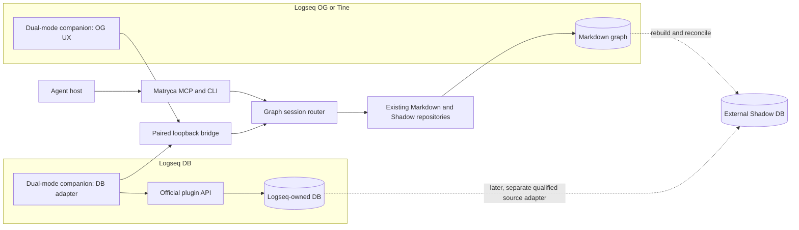

# Tine and Logseq ecosystem integration strategy

**Date:** 2026-08-12
**Decision status:** proposed, evidence-backed roadmap; no compatibility or release claim
**Scope:** Tine collaboration, Logseq OG companion, Logseq DB integration, and the smallest Matryca Plumber changes with the highest expected impact

## Executive decision

Matryca Plumber should pursue **one ecosystem strategy with two complementary paths**:

1. **Tine:** begin as a qualified external, read-only intelligence layer over the same
   Logseq-format graph. Collaborate through a design proposal and shared compatibility
   evidence, not through an ordinary Tine plugin or an unsolicited code patch.
2. **Logseq:** build **one Matryca-maintained dual-mode companion plugin**, not separate
   OG and DB plugins. In OG mode it is a thin discovery, pairing, status, and context
   surface over Matryca's existing Markdown runtime. In DB mode it becomes Matryca's
   in-app read adapter and, only after separate concurrency qualification, the mutation
   authority. Marketplace distribution would make it an official Matryca integration,
   not a Logseq-owned plugin.

The first product claim should be deliberately narrow:

> Matryca Plumber can provide fast, local-first, block-granular search and agent memory
> while Tine or Logseq remains the human editing environment; graph mutation stays off
> until the active host's write protocol is proven safe.

This produces the best impact-to-effort ratio because it reuses Matryca's strongest
assets—block semantics, MCP, BM25, Shadow DB, Strict Read Only, and external cache
isolation—without duplicating an editor, importing another application's private
database, or generalizing the entire codebase before one vertical slice proves demand.

## Operational status

As of 2026-08-12, the maintainer-first Tine contact is complete: the proposal is
public in [Tine Discussion #334](https://github.com/martinkoutecky/tine/discussions/334).
The discussion asks for read-only coexistence first, Tine-closed mutation second, and
no concurrent-write claim without deterministic two-process evidence. Tine maintainer
feedback is pending and will govern any upstream-facing coordination primitive.

Work that does not require an upstream Tine change may proceed independently: publish
this roadmap, qualify the T0 read-only contract, freeze the Logseq companion protocol,
verify official Logseq OG/DB capabilities, and scaffold the Matryca-maintained Logseq
companion. No Tine code, plugin, CLI, MCP, or write-path change is implied by that work.

### Go and no-go summary

| Direction | Decision | Reason |
| --- | --- | --- |
| Tine + Matryca Strict Read Only | **GO to qualification** | Both can use the same Logseq-format files while Matryca keeps derived state outside the graph. |
| Matryca writes while Tine is closed | **GO after compatibility tests** | The independent writers are serialized operationally, and Tine can validate the resulting graph when reopened. |
| Concurrent Tine and Matryca writes | **NO-GO today** | The two applications do not share locks, revision tokens, dirty-editor state, or a transaction coordinator. |
| Ordinary Tine plugin as the Matryca runtime | **NO-GO** | Tine API 0.2 intentionally denies filesystem, process, network, arbitrary-graph, and custom-UI authority. |
| One Logseq companion for OG and DB | **GO to contract spike** | The official marketplace exposes `supportsDB` and `supportsDBOnly`; one package avoids split discovery and duplicated UX. |
| Logseq DB read-only bridge | **Conditional GO** | Official plugin APIs expose graph-mode detection, page/block reads, queries, and DB change hooks. Exact semantics still require a spike. |
| Logseq DB writes | **NO-GO until CAS evidence** | A read-before-write check is insufficient unless the official host provides atomic conditional mutation or equivalent conflict semantics. |
| Direct access to Logseq `db.sqlite` | **Permanent NO-GO** | It bypasses the official application contract, validation, undo/redo, and future schema compatibility. |
| DB-to-Shadow synchronization in the first slice | **NO-GO** | Current Shadow freshness is filesystem-based; a DB source needs its own revision, event, rebuild, and reconciliation contract. |
| Built-in Logseq DB MCP as the only backend | **Not yet** | It is useful and authenticated, but its documented TODOs still include child blocks and general property values. |

## Method and evidence policy

This study separates four kinds of statement:

- **Verified current fact:** supported by a pinned repository revision, current issue,
  or current Matryca source.
- **Documented upstream direction:** an open issue or roadmap, not shipped behavior.
- **Proposal:** a recommended design that still requires implementation and tests.
- **Uncertainty:** a contract that must be resolved by a focused spike before coding.

Repository source and official upstream documentation are authoritative. Code-graph
analysis was used only for orientation because the local index referred to another
Matryca worktree. Direct source inspection at the exact Matryca baseline was used for
every material conclusion. No Tine, Logseq, GitHub, release, or package state was
modified during the study.

### Frozen evidence baseline

| Surface | Revision observed on 2026-08-12 | Primary evidence |
| --- | --- | --- |
| Matryca Plumber | `4f82e12e737335f54fabfb7979b1b83026148663` | [system overview](../knowledge/architecture/system-overview.md), [graph plane](../knowledge/architecture/graph-plane.md), [Shadow DB](../knowledge/architecture/shadow-db.md), current `src/` |
| Tine | [`61ba2b4f255e54a0349ebc9af91958d72624277a`](https://github.com/martinkoutecky/tine/tree/61ba2b4f255e54a0349ebc9af91958d72624277a) | [README](https://github.com/martinkoutecky/tine/blob/61ba2b4f255e54a0349ebc9af91958d72624277a/README.md), [contributing contract](https://github.com/martinkoutecky/tine/blob/61ba2b4f255e54a0349ebc9af91958d72624277a/CONTRIBUTING.md), ADRs and plugin docs |
| Logseq OG | [`6e7afa8eb040686ff057156ee877193b581dd369`](https://github.com/logseq/og/tree/6e7afa8eb040686ff057156ee877193b581dd369) | [official OG repository](https://github.com/logseq/og/blob/6e7afa8eb040686ff057156ee877193b581dd369/README.md) |
| Logseq DB application | [`d3d6afa37b646dda90928c2a5f8a1e27dbcc5814`](https://github.com/logseq/logseq/tree/d3d6afa37b646dda90928c2a5f8a1e27dbcc5814) | [DB status](https://github.com/logseq/logseq/blob/d3d6afa37b646dda90928c2a5f8a1e27dbcc5814/README.md#database-version), [plugin type contracts](https://github.com/logseq/logseq/blob/d3d6afa37b646dda90928c2a5f8a1e27dbcc5814/libs/src/LSPlugin.ts) |
| Logseq DB documentation | [`08f855f24d66e4509b7ea808554c13b4649e6ee1`](https://github.com/logseq/docs/tree/08f855f24d66e4509b7ea808554c13b4649e6ee1) | [DB features and MCP](https://github.com/logseq/docs/blob/08f855f24d66e4509b7ea808554c13b4649e6ee1/db-version.md), [differences from file graphs](https://github.com/logseq/docs/blob/08f855f24d66e4509b7ea808554c13b4649e6ee1/db-version-changes.md) |
| Logseq marketplace | [`ddd03508f56e11b4efe08f7c006282ddec647276`](https://github.com/logseq/marketplace/tree/ddd03508f56e11b4efe08f7c006282ddec647276) | [submission contract](https://github.com/logseq/marketplace/blob/ddd03508f56e11b4efe08f7c006282ddec647276/README.md) |

All upstream claims must be rechecked before implementation because Tine's plugin API
is experimental and Logseq DB is explicitly in beta with possible data loss.

## Current Matryca Plumber leverage and constraints

Matryca already contains most of the expensive product value needed by both paths:

- a block-aware parser and addressable `id::` semantics;
- one shared dispatch plane for CLI and MCP reads, searches, and guarded mutations;
- fast generational BM25 plus optional external Shadow FTS5 and subtree reads;
- Strict Read Only that blocks graph-local mutations while allowing validated external
  derived-cache maintenance;
- watcher reconciliation for external Markdown edits;
- OCC, page locks, path confinement, and atomic file replacement for OG writes;
- a local-first stdio MCP surface with eight tools;
- a loopback operator UI with health, configuration, and runtime controls.

The same source also defines the limits of a small implementation:

- [`GraphReadPort`](../../src/graph/ports/read.py) exposes only subtree Markdown and
  spatial-page Markdown methods and requires a filesystem `Path`.
- Only the subtree handler currently selects between Markdown and Shadow repositories;
  page reads and BM25 follow separate routes.
- Mutation handlers remain filesystem-specific and there is no mutation port.
- [`sync_page_to_shadow`](../../src/shadow/sync.py) stores file path, mtime, and size;
  Shadow freshness is therefore an OG filesystem contract, not a generic graph-source
  contract.
- Matryca's public MCP is stdio. The loopback UI API is a control plane, not a graph
  bridge.
- The current UI token must not be reused for a companion: the unauthenticated loopback
  session endpoint can issue it to local clients by design, so it is not a narrow,
  graph-bound integration credential.

The first integration should therefore add a narrow vertical seam rather than rename
or generalize every existing graph function.

## Tine collaboration analysis

### Why the projects fit

Tine and Matryca share an unusually strong philosophical and technical foundation:

- Tine operates directly on the standard Logseq graph layout and treats byte-faithful
  Logseq OG round-tripping as a hard constraint ([ADR 0004](https://github.com/martinkoutecky/tine/blob/61ba2b4f255e54a0349ebc9af91958d72624277a/docs/adr/0004-operate-on-the-logseq-format-og-parity.md)).
- Matryca treats the same human-readable graph as authoritative and keeps Shadow as a
  disposable derived cache.
- Tine is primarily an interactive editor; Matryca is primarily a background memory,
  retrieval, agent, and gardening plane. Their strengths are complementary rather than
  duplicative.
- Both treat silent lost updates as unacceptable and use conflict checks plus atomic
  persistence.

The immediate user value is compelling: a Tine user could gain block-granular BM25,
agent MCP access, external Shadow acceleration, and optional knowledge gardening
without migrating the graph or making Matryca the editor.

### The concurrency boundary

Tine's accepted [save/watch/edit protocol](https://github.com/martinkoutecky/tine/blob/61ba2b4f255e54a0349ebc9af91958d72624277a/docs/adr/0012-save-watch-edit-coherency-protocol.md)
has one writer path, per-page serial saves, `baseRev`, dirty-page reload protection,
last-moment conflict checks, atomic replacement, self-write markers, and graph-generation
leases. Matryca has its own mtime OCC, page lock sidecars, re-read checks, and atomic
replacement.

These are both good protocols, but they are **independent protocols**. Atomic writes
prevent torn bytes; they do not prevent this race:

```text
Tine checks revision A ────────────── writes Tine result B
Matryca checks mtime A ───────────── writes Matryca result C
                                      final bytes depend on order
```

Neither process can currently see the other's dirty editor, lock, revision token, or
self-write marker. Consequently, compatibility must be described in levels:

| Level | Contract | Current position |
| --- | --- | --- |
| T0 | Matryca Strict Read Only; Tine may edit; Matryca may update only its external cache | Candidate for immediate qualification |
| T1 | Tine closed; Matryca may perform reviewed, OCC-protected mutations | Candidate after round-trip and reopen tests |
| T2 | Both may mutate different pages | Unsupported until deterministic convergence tests pass |
| T3 | Both may target the same page | Unsupported until one writer provably rejects or a shared coordinator exists |

### Why an ordinary Tine plugin is not the answer

Tine plugin API 0.2 runs small WebAssembly guests with versioned events and inert,
host-validated effects. It intentionally provides no filesystem, network, process,
DOM, Tauri, arbitrary graph path, or ambient authority
([plugin API](https://github.com/martinkoutecky/tine/blob/61ba2b4f255e54a0349ebc9af91958d72624277a/docs/plugins/README.md),
[threat model](https://github.com/martinkoutecky/tine/blob/61ba2b4f255e54a0349ebc9af91958d72624277a/docs/plugins/threat-model.md)).

Matryca needs a long-running Python process, graph-wide reads, external caches, and
optionally model access. Asking Tine to weaken its sandbox would harm Tine and still
duplicate the real integration problem. The correct first seam is the shared on-disk
format. A future Tine plugin should be considered only for a bounded host-owned status,
command, or navigation contribution after user demand exists.

If a useful behavior remains impossible, follow Tine's
[porting policy](https://github.com/martinkoutecky/tine/blob/61ba2b4f255e54a0349ebc9af91958d72624277a/docs/plugins/porting-logseq-obsidian.md):
describe the smallest reusable semantic host operation in `port-gap.json`; do not ask
for broad compatibility or smuggle authority through another surface.

### How Matryca can help Tine's open work

| Tine issue | Upstream direction | Matryca contribution |
| --- | --- | --- |
| [#108 — stable CLI](https://github.com/martinkoutecky/tine/issues/108) | Use-case-first automation; writes must share Tine locking, base revision, conflict, and atomic save | Supply concrete agent/search use cases, versioned output fixtures, and a read-only external consumer. Later prefer Tine CLI for host-authoritative mutations. |
| [#109 — MCP](https://github.com/martinkoutecky/tine/issues/109) | Semantic pages/blocks/properties/tasks; begin read-only; decide transport, graph selection, permissions, privacy, schemas | Offer Matryca's existing agent-facing operations and bounded-output experience as design evidence. Do not replace Tine's native MCP or define its internals accidentally. |
| [#201 — official Wiki](https://github.com/martinkoutecky/tine/issues/201) | Tutorial, reference, and durable product memory maintained from issues, decisions, tests, and releases | Demonstrate a reviewed source-to-Logseq knowledge workflow and block-level retrieval over the documentation corpus. Repository documentation remains authoritative; Matryca's graph is a derived working memory, not an auto-publishing source. |

The strongest collaboration artifact is not code. It is a small shared compatibility
corpus and state-transition matrix that both maintainers can review.

### Proposed Tine qualification matrix

| Gate | Scenario | Pass condition |
| --- | --- | --- |
| TINE-Q0 | Pinned, provenance-recorded Markdown fixtures; Org recorded as unsupported | No unapproved byte or structural drift after Tine and Matryca parse/no-op paths |
| TINE-Q1 | Tine edits while Matryca runs in Strict Read Only | Zero graph-local Matryca writes; Shadow/search converges; diagnostics remain content-free |
| TINE-Q2 | Tine closed; each Matryca mutation class; Tine reopened | Tine parses the result; blocks, IDs, properties, links, namespaces, and fences remain valid |
| TINE-Q3 | Dirty Tine page and Matryca target the same page | One operation rejects explicitly; no silent overwrite |
| TINE-Q4 | Different-page create/modify/delete/rename load | Both watchers and indexes converge without stale or resurrected records |
| TINE-Q5 | Kill either process at commit and watcher boundaries | Disk contains complete old or new bytes; recovery is explicit and repeatable |
| TINE-Q6 | External sync interleavings | No duplicate, resurrected, or silently lost blocks |
| TINE-Q7 | Privacy inventory | No credentials, paths, queries, or note text in public diagnostics; endpoint behavior is disclosed |
| TINE-Q8 | Linux, macOS, Windows | Exact platform receipts; no portability claim inferred from source alone |
| TINE-Q9 | Fixture and license provenance | No Tine application code copied into Apache-2.0 artifacts without review |

Passing TINE-Q2 does not qualify concurrent writes. TINE-Q3 is the minimum gate for
any same-page concurrency claim.

Tine also supports Org files, but this roadmap does **not** infer Org interoperability
from that fact. Matryca's current shared-format path is Markdown-oriented. The first
qualification corpus must therefore use Markdown fixtures; Org must appear as an
explicit unsupported capability until a separate parser, round-trip, and safety study
proves otherwise.

### Maintainer-first collaboration proposal

Tine is a single-maintainer project whose contribution policy is "propose, don't
patch" for application code
([CONTRIBUTING](https://github.com/martinkoutecky/tine/blob/61ba2b4f255e54a0349ebc9af91958d72624277a/CONTRIBUTING.md)).
The first contact should therefore be short, use-case-led, and explicit about security.

```markdown
Title: Proposal: qualify Matryca Plumber as an external Logseq-format collaborator

Matryca Plumber and Tine both operate on Logseq-compatible graphs, but each owns an
independent save, watcher, and conflict protocol. I would like to establish the
smallest safe interoperability claim without adding ambient plugin authority or a
second Tine write path.

Proposed sequence:

1. qualify read-only Matryca coexistence while Tine edits;
2. qualify Matryca mutations only while Tine is closed;
3. keep concurrent mutation unsupported until deterministic two-process tests prove
   explicit conflict behavior;
4. share a small provenance-recorded Logseq compatibility corpus and test matrix.

This may also provide concrete consumer evidence for #108 and #109. Matryca would not
replace Tine's future CLI or MCP; once those surfaces exist, they could become the
host-authoritative route for writes.

Would read-only coexistence be a useful first target? If coordination becomes useful,
which reusable primitive would fit Tine best: a revision query, dirty-page refusal, or
an external-writer lease?

No implementation or API expansion is requested at this stage.
```

## One dual-mode Logseq companion

### Why one plugin

The Logseq marketplace manifest distinguishes `supportsDB` from `supportsDBOnly` and
recommends keeping `@logseq/libs` current. It also discourages `effect` unless the
built-in API cannot express a required behavior and applies stricter review when it is
enabled ([marketplace contract](https://github.com/logseq/marketplace/blob/ddd03508f56e11b4efe08f7c006282ddec647276/README.md)).

The recommended package is therefore:

```json
{
  "supportsDB": true,
  "supportsDBOnly": false,
  "effect": false
}
```

The exact manifest and minimum Logseq version must be frozen during the contract spike.
One package gives users one name, one install path, one pairing model, and one adoption
funnel. Internally it selects behavior with `logseq.App.checkCurrentIsDbGraph()`.

### OG mode: thin companion, existing runtime

Logseq OG remains a file graph. Matryca already owns the expensive graph scanning,
parsing, caching, search, MCP, and guarded mutation work. The plugin should not embed
Python, a model, another index, or a second parser.

The smallest useful OG experience is:

1. toolbar and command-palette entry;
2. discover or start the local Matryca UI;
3. explicit one-time pairing with a narrow companion credential;
4. show Matryca health, Strict Read Only, Shadow readiness, and active graph match;
5. "Search this page/block with Matryca" and "Open in Matryca" commands;
6. mutation controls hidden unless the operator enables them in Matryca.

OG graph authority remains exactly where it is today: Markdown, Matryca's parser, OCC,
locks, and atomic writes. The plugin is a UX and active-context adapter, not a writer.

### DB mode: official adapter, read-only first

Logseq DB is not a file-format variation. Its official documentation says graph data
lives in `db.sqlite`, the `logseq/` directory no longer exists, blocks and pages are
unified as nodes, properties have typed values, and namespace behavior changes
([DB changes](https://github.com/logseq/docs/blob/08f855f24d66e4509b7ea808554c13b4649e6ee1/db-version-changes.md)).

Matryca must never open that SQLite file directly. The dual-mode companion should use
official APIs to normalize host objects into a small versioned Matryca contract. The
pinned SDK exposes:

- `App.checkCurrentIsDbGraph()`;
- `Editor.getPage`, `getBlock`, `getPageBlocksTree`, `insertBlock`, `updateBlock`, and
  property operations;
- `DB.onChanged`, `DB.onBlockChanged`, `DB.q`, and `DB.datascriptQuery`.

The initial DB surface should include only:

- graph identity and capability handshake;
- one page read;
- one block-subtree read;
- bounded search or query only after its result shape is frozen;
- change notification that carries IDs/cursors and causes a bounded re-read;
- no Shadow ingestion and no mutation.

### Official DB MCP: valuable second adapter

Logseq now documents an optional authenticated MCP server at
`http://127.0.0.1:12315/mcp`. It uses a bearer token, supports search, pages, tags,
properties, top-level blocks, batch creation/editing, pretend mode, app validation,
and undo/redo. Its documented TODOs include child blocks, properties associated with
arbitrary node types, namespaces, and property values
([official MCP documentation](https://github.com/logseq/docs/blob/08f855f24d66e4509b7ea808554c13b4649e6ee1/db-version.md#L411-L440)).

| Criterion | Companion SDK adapter | Built-in DB MCP adapter |
| --- | --- | --- |
| Active graph/session ownership | Directly tied to the running plugin | Current graph or CLI-selected graph; exact lifecycle must be probed |
| Marketplace UX and discovery | Yes | No Matryca-specific UX |
| Child-tree completeness | SDK exposes page/block tree reads | Documented as a current MCP TODO |
| Change events | SDK exposes DB hooks | Subscription/event contract not documented in the cited MCP section |
| Host-authoritative writes | Official Editor API | Official MCP validates and supports undo/redo, but exact stale-write semantics remain unknown |
| Authentication | Matryca-defined narrow pairing | Existing Logseq bearer token |
| Maintenance burden | Plugin must normalize SDK drift | Matryca must normalize MCP schema/capability drift |
| Best first role | Primary DB read bridge | Optional capability-probed read adapter and future simplification path |

The architecture should keep the transport replaceable. If Logseq's MCP later covers
the complete block tree, events, and safe conditional mutation, Matryca can add an MCP
adapter without changing its agent-facing tools.

## Proposed integration architecture



### Ownership rules

The companion owns:

- active Logseq graph and `og`/`db` mode detection;
- DB reads, events, and eventual mutations through official APIs;
- mapping host entities to versioned vendor-neutral DTOs;
- graph-switch detection and session invalidation;
- the in-Logseq status and context UX.

Matryca owns:

- pairing, scopes, revocation, limits, and audit-safe diagnostics;
- graph-session routing above current filesystem repositories;
- stable CLI and MCP behavior;
- OG parsing, OCC, locks, atomic writes, and Shadow behavior unchanged;
- DB capability gates and bounded error mapping;
- any later DB-source cache as a separate adapter and qualification campaign.

## Minimum versioned bridge contract

The bridge should use one closed envelope and reject unsupported major versions,
unknown kinds, excessive payloads, foreign graph bindings, and stale sessions.

```json
{
  "protocol": "matryca.logseq-companion",
  "version": 1,
  "kind": "hello|request|response|event",
  "request_id": "optional-uuid",
  "graph": {
    "binding_id": "opaque",
    "session_epoch": "opaque",
    "mode": "og|db"
  },
  "payload": {}
}
```

Required v1 capabilities:

```json
{
  "capabilities": ["page.read", "block.subtree.read", "graph.events"],
  "event_cursor": "opaque-or-null"
}
```

Minimal entity contracts:

```text
PageDTO
  id: opaque string
  title: string
  properties: JSON object
  revision: opaque string or null

BlockDTO
  id: opaque string
  page_id: opaque string
  parent_id: opaque string or null
  order: non-negative integer
  content: string
  properties: JSON object
  revision: opaque string or null

GraphChangedEvent
  cursor: opaque string
  change_id: opaque string
  entity_kind: page | block | graph
  entity_ids: bounded list of opaque strings
  revision: opaque string or null
  origin_mutation_id: opaque string or null
```

Events carry identifiers, not entire graph content. A cursor gap, duplicate beyond the
deduplication window, unknown cursor, graph switch, or changed session epoch forces a
bounded resynchronization. Revisions remain opaque; Matryca must not synthesize them
from titles or interpret them as timestamps.

The future mutation contract should be designed now but remain disabled:

```text
MutationRequest
  mutation_id: idempotency key
  operation: block.append | block.property.set
  target_id
  expected_revision
  arguments

MutationResult
  status: applied | conflict | rejected | indeterminate
  target_id
  resulting_revision
  event_cursor
  error_code: conflict | not_found | capability_missing |
              graph_switched | unauthorized | invalid | indeterminate
```

No v1 mutation batching. Replaying a completed `mutation_id` returns the original
result. A transport timeout never proves failure or success; reconcile by mutation ID
and post-read. Never attempt an automatic inverse write after an ambiguous result.

## Security, privacy, and resilience contract

Loopback is a transport boundary, not an identity boundary. Other local processes,
malicious web pages, browser extensions, stale plugins, and accidental cross-graph
reuse are in scope.

The companion bridge must:

- use a new credential audience; never reuse `MATRYCA_UI_TOKEN`;
- begin with `graph.read` and `graph.events`; make `graph.mutate` a separate opt-in;
- pair through a short-lived single-use code and nonce displayed by Matryca;
- exchange the code through authenticated connection setup or `POST`, never an
  unauthenticated token-returning `GET`;
- issue a long random credential bound to graph, session epoch, protocol, capabilities,
  and scopes;
- keep credentials out of URLs, query strings, events, errors, and logs;
- validate `Host` and exact `Origin` when Logseq provides a stable origin, while
  treating CORS as defense in depth rather than authentication;
- rate-limit pairing and authentication, remember used nonces, support rotation,
  revoke/unpair, and reject a stale graph session immediately;
- cap body bytes, entity counts, recursion depth, response bytes, request duration,
  concurrent requests, and reconnect rate;
- keep public diagnostics content-free and opt-in telemetry free of titles, text,
  properties, queries, paths, tokens, stable graph IDs, and mutation payloads;
- fail closed on malformed, future-version, foreign-binding, or capability-mismatched
  messages;
- keep DB mutation disabled until official concurrency semantics are proven.

An official-SDK spike must verify whether the plugin runtime offers secure credential
storage and a stable origin. Until then, credential persistence is an explicit
uncertainty, not an implementation assumption.

## Minimum high-impact implementation backlog

Effort is a relative planning estimate: **XS** under one focused PR, **S** one small PR,
**M** several focused PRs, **L** a cross-surface feature, and **XL** an independent
programme. Impact describes expected ecosystem leverage, not measured adoption.

| Priority | Slice | Expected impact | Effort | Why now |
| ---: | --- | --- | --- | --- |
| 1 | Publish Tine coexistence levels and qualification runbook | High | XS | Creates an honest collaboration artifact and immediate read-only pilot without runtime risk. |
| 2 | Freeze `matryca.logseq-companion/v1` envelopes, limits, negative fixtures, and capability vocabulary | Very high | S | Prevents the plugin, Matryca bridge, and future MCP adapter from inventing incompatible contracts. |
| 3 | Add a separate paired loopback bridge with read/event scopes and content-free health | Very high | M | Unlocks one marketplace-distributed Matryca companion while isolating it from broad UI authority. |
| 4 | Release one dual-mode companion shell: mode detection, pairing, health, open/search-current-context commands | Very high | M | Maximizes discoverability and gives OG users value before DB backend completeness. |
| 5 | Add a small `GraphSession` selector and DB read adapter for one page and one subtree | Very high | M | Proves the architecture without changing every filesystem signature or touching Shadow. |
| 6 | Add DB event cursor, deduplication, graph-switch invalidation, and bounded re-read | High | M | Makes long-running read results converge safely. |
| 7 | Create a Tine/OG differential compatibility corpus and deterministic race harness | High | M | Converts coexistence from an assumption into shared evidence. |
| 8 | Add optional Logseq DB MCP read adapter behind capability detection | Medium-high | M | May reduce plugin dependence as official MCP coverage matures. |
| 9 | Qualify one DB mutation, preferably append, with idempotency and host conflict evidence | Very high | L | Enables Safe-Sync only after the read path and security boundary are stable. |
| 10 | Design DB snapshot/event ingestion into an external Shadow cache | Very high | XL | Valuable for speed, but requires a new source-revision and reconciliation programme. |

### What not to generalize yet

- Do not replace every `Path` parameter with an abstract graph object.
- Do not retrofit DB events into `sync_page_to_shadow()`.
- Do not build a second plugin repository for DB-only users.
- Do not proxy every existing Matryca tool through the first bridge.
- Do not add a general plugin framework inside Matryca.
- Do not duplicate Logseq's model, query engine, or UI.

The first end-to-end proof is enough: pair → detect mode → read active page/subtree →
search through Matryca → return bounded results → invalidate on graph switch.

## Delivery phases and gates

### Phase A — collaboration and contract freeze

Deliverables:

- this strategy accepted or amended;
- Tine proposal opened in [Discussion #334](https://github.com/martinkoutecky/tine/discussions/334); maintainer response and any upstream primitive remain pending;
- generated, provenance-recorded compatibility fixtures;
- bridge v1 schema, limits, negative corpus, and threat model;
- official Logseq SDK/MCP spike with exact version receipts.

Exit gate: all uncertain SDK, origin, credential-storage, revision, and marketplace
claims are resolved or explicitly deferred. No runtime compatibility claim yet.

### Phase B — paired companion shell

Deliverables:

- narrow loopback bridge;
- single-use pairing, read/event scopes, revoke/unpair;
- dual-mode plugin package with `effect: false`;
- health, graph-match, Strict Read Only, and Shadow status;
- OG open/search-current-context commands.

Exit gate: security negative tests pass; no note content or credential appears in logs;
OG behavior and existing UI authentication remain unchanged.

### Phase C — Logseq DB read vertical

Deliverables:

- `GraphSession` mode descriptor;
- one page and one block-subtree read through the companion;
- bounded DTO validation and error vocabulary;
- graph-switch and disconnect fail-closed behavior;
- no DB file access, no Shadow, no mutation.

Exit gate: OG parity is unchanged; DB reads match official app-visible content on a
frozen corpus; unavailable bridge returns an explicit capability error rather than a
false Markdown fallback.

### Phase D — event convergence

Deliverables:

- cursor, deduplication window, reconnect, gap detection, and bounded resync;
- current graph/session epoch invalidation;
- content-free convergence metrics.

Exit gate: duplicate, reordered, missing, and replayed events converge deterministically
without serving a foreign or stale graph.

### Phase E — host-authoritative mutation

Deliverables:

- proof of official conditional/transaction semantics or an explicit alternative;
- one operation with expected revision and idempotency;
- operator opt-in and separate `graph.mutate` scope;
- app-visible undo/redo and conflict UX;
- timeout reconciliation and zero automatic rollback.

Exit gate: every stale-write and duplicate-application fixture rejects correctly. If
atomic conflict rejection cannot be proven, the product remains read-only.

### Phase F — Tine and DB acceleration expansion

Independent follow-ups:

- Tine cross-process race campaign and possible host-owned coordination proposal;
- optional Tine CLI/MCP adapter when #108/#109 produce stable contracts;
- optional Logseq built-in MCP adapter;
- DB-source Shadow bootstrap, generation, freshness, rebuild, and reconciliation;
- expanded searches, tasks, properties, namespaces, and reviewed gardening actions.

## Logseq acceptance matrix

| Gate | Required proof |
| --- | --- |
| LOGSEQ-C1 Contract | Known v1 plus malformed, future-version, unknown-capability, foreign-binding, and changed-session fixtures |
| LOGSEQ-C2 Bounds | Maximum body, entity, depth, response, timeout, concurrency, and reconnect cases fail closed |
| LOGSEQ-S1 Pairing | Wrong, expired, replayed, revoked, brute-forced, foreign-graph, and stale-epoch credentials reject |
| LOGSEQ-S2 Browser boundary | Cross-origin and DNS-rebinding-style Host/Origin cases reject; no ambient cookie auth |
| LOGSEQ-S3 Least privilege | Read token cannot mutate; UI token cannot become bridge authority; mutation needs a new operator grant |
| LOGSEQ-P1 Privacy | No token, path, title, text, property, query, graph ID, or payload in public telemetry and errors |
| LOGSEQ-O1 OG parity | Companion never invokes DB APIs; existing Markdown/OCC and Shadow behavior remain byte-compatible |
| LOGSEQ-D1 DB confinement | No direct `db.sqlite` read/write; all graph operations pass through official APIs |
| LOGSEQ-D2 Read parity | Page, block order, parentage, content, and typed properties match the app-visible source |
| LOGSEQ-D3 Events | Duplicates, reordering, gaps, reconnects, and graph switches converge through bounded resync |
| LOGSEQ-D4 Mutation | Human edit, move, delete, timeout, replay, and graph switch cause conflict/rejection or one proven application |
| LOGSEQ-R1 Resilience | Plugin, Matryca, and Logseq restart independently without credential leakage or cross-graph reuse |
| LOGSEQ-M1 Marketplace | Exact manifest and package pass current marketplace review with `effect: false` |

## Adoption plan and success metrics

The companion is the adoption surface; Matryca remains the product engine. The launch
message should lead with user outcomes:

- install once for both Logseq generations;
- begin read-only;
- keep the human editor and authoritative data model;
- gain fast block-level context and agent memory;
- enable gardening only after explicit review.

Suggested launch sequence:

1. private Tine and Logseq OG read-only pilots;
2. public companion shell for OG with DB compatibility marked experimental;
3. DB read beta after SDK and event gates;
4. marketplace submission;
5. public interoperability report with exact commits and limitations;
6. mutation beta only after conflict evidence.

Content-free, opt-in measures:

| Outcome | Metric |
| --- | --- |
| Discovery | marketplace views, installs, documentation visits |
| Activation | pairing success and median time to bridge-ready |
| Reliability | connected read success, reconnects, event gaps, explicit capability failures |
| Performance | p50/p95 direct read, search, and event-convergence latency |
| Safety | unauthorized requests rejected, conflicts detected, duplicate mutations prevented |
| Retention | privacy-preserving 7-day and 30-day active companion counts |
| Value | share of active users invoking current-page/block search and agent MCP workflows |
| Trust | Strict Read Only retention, mutation opt-in, revoke/unpair rate, support incidents |

Initial performance targets such as p95 event convergence below 500 ms or direct reads
below 100 ms are hypotheses. Freeze them only after the SDK spike establishes realistic
local baselines.

## Risks and mitigations

| Risk | Mitigation |
| --- | --- |
| Independent writers silently overwrite | Read-only default; Tine-closed mutation level; shared race matrix; no concurrency claim before proof |
| Logseq DB API changes during beta | Version/capability handshake, exact SDK pin, contract fixtures, explicit unsupported state |
| Loopback credential theft | Separate audience/scopes, single-use pairing, Host/Origin checks, no token-returning GET, rotation and revocation |
| Event loss or reordering | Cursor, change ID, deduplication, bounded replay/resync, graph epoch invalidation |
| Graph identity changes | Opaque binding and session epoch; never bind by title or raw path alone |
| Stale DB mutation | Required expected revision plus official atomic semantics; otherwise remain read-only |
| Shadow serves stale DB content | Do not use Shadow until a DB-specific generation/freshness contract exists |
| Excessive initial sync | Start with active page/subtree; bounded pagination; later snapshot design with progress and cancellation |
| Privacy leakage | Local-first disclosure, explicit endpoint inventory, content-free diagnostics, no content telemetry |
| Tine AGPL / Matryca Apache boundary | Keep process and protocol boundaries; use generated fixtures; maintain provenance; obtain legal review for code combination |
| Maintainer burden | Proposal-first Tine contact, one Logseq plugin, small PRs, stable contracts, evidence before features |
| Mobile assumptions | Make no mobile declaration until exact host/plugin tests pass |

This is architectural risk analysis, not legal advice.

## Explicit non-goals

- Replacing Tine's future native CLI or MCP.
- Weakening Tine's ordinary plugin sandbox.
- Making Matryca a Logseq DB system of record.
- Reading or writing Logseq's internal SQLite directly.
- Shipping DB graph mutations in the first release.
- Treating a Markdown mirror as automatically authoritative.
- Embedding Matryca's Python runtime or an LLM inside the Logseq plugin.
- Reimplementing Logseq queries, properties, undo/redo, or synchronization.
- Claiming Tine concurrent-write, Logseq DB, mobile, or Shadow compatibility without
  exact-version qualification.
- Collecting graph content or stable user/graph identity for adoption analytics.

## Recommended public issue decomposition

Open issues only after this roadmap is accepted and current duplicates are checked:

1. **RFC: versioned Logseq companion protocol and security boundary**
2. **Companion bridge: pairing, scopes, revocation, and health**
3. **Matryca-maintained dual-mode Logseq companion shell**
4. **Logseq DB read adapter: page and subtree vertical slice**
5. **Logseq DB event cursor and bounded resynchronization**
6. **Tine read-only coexistence qualification corpus**
7. **Optional Logseq DB MCP adapter discovery spike**
8. **Logseq DB mutation precondition research**
9. **Logseq DB external Shadow source architecture**

Each issue should state exact upstream commits, exclusions, threat boundary, tests,
success evidence, and what it does **not** authorize.

## Final recommendation

The highest-leverage next move is not a broad backend abstraction. It is a sequence of
three small, compounding investments:

1. publish and run the Tine read-only coexistence qualification;
2. freeze a secure, versioned companion protocol;
3. ship one dual-mode Logseq companion with OG value first and one DB read vertical
   slice second.

That sequence can make Matryca Plumber visible to Tine users, current Logseq OG users,
and emerging Logseq DB users while preserving the project's defining advantage:
human-owned, block-granular knowledge with fast derived reads and explicit write
authority.

## Source index

### Tine

- [Repository at the reviewed commit](https://github.com/martinkoutecky/tine/tree/61ba2b4f255e54a0349ebc9af91958d72624277a)
- [Contribution model](https://github.com/martinkoutecky/tine/blob/61ba2b4f255e54a0349ebc9af91958d72624277a/CONTRIBUTING.md)
- [ADR 0004: Logseq OG parity](https://github.com/martinkoutecky/tine/blob/61ba2b4f255e54a0349ebc9af91958d72624277a/docs/adr/0004-operate-on-the-logseq-format-og-parity.md)
- [ADR 0012: save/watch/edit coherency](https://github.com/martinkoutecky/tine/blob/61ba2b4f255e54a0349ebc9af91958d72624277a/docs/adr/0012-save-watch-edit-coherency-protocol.md)
- [Plugin API 0.2](https://github.com/martinkoutecky/tine/blob/61ba2b4f255e54a0349ebc9af91958d72624277a/docs/plugins/README.md)
- [Plugin threat model](https://github.com/martinkoutecky/tine/blob/61ba2b4f255e54a0349ebc9af91958d72624277a/docs/plugins/threat-model.md)
- [Porting policy](https://github.com/martinkoutecky/tine/blob/61ba2b4f255e54a0349ebc9af91958d72624277a/docs/plugins/porting-logseq-obsidian.md)
- [Issue #108: stable CLI](https://github.com/martinkoutecky/tine/issues/108)
- [Issue #109: MCP](https://github.com/martinkoutecky/tine/issues/109)
- [Issue #201: durable Wiki/product memory](https://github.com/martinkoutecky/tine/issues/201)
- [Discussion #334: Matryca interoperability proposal](https://github.com/martinkoutecky/tine/discussions/334)

### Logseq

- [Logseq OG at the reviewed commit](https://github.com/logseq/og/tree/6e7afa8eb040686ff057156ee877193b581dd369)
- [Logseq DB at the reviewed commit](https://github.com/logseq/logseq/tree/d3d6afa37b646dda90928c2a5f8a1e27dbcc5814)
- [DB beta status](https://github.com/logseq/logseq/blob/d3d6afa37b646dda90928c2a5f8a1e27dbcc5814/README.md#database-version)
- [DB functionality and built-in MCP](https://github.com/logseq/docs/blob/08f855f24d66e4509b7ea808554c13b4649e6ee1/db-version.md)
- [DB changes and graph-directory contract](https://github.com/logseq/docs/blob/08f855f24d66e4509b7ea808554c13b4649e6ee1/db-version-changes.md)
- [Pinned plugin API types](https://github.com/logseq/logseq/blob/d3d6afa37b646dda90928c2a5f8a1e27dbcc5814/libs/src/LSPlugin.ts)
- [Marketplace submission contract](https://github.com/logseq/marketplace/blob/ddd03508f56e11b4efe08f7c006282ddec647276/README.md)

### Matryca Plumber

- [System overview](../knowledge/architecture/system-overview.md)
- [Graph plane](../knowledge/architecture/graph-plane.md)
- [Shadow DB read architecture](../knowledge/architecture/shadow-db.md)
- [v2 preparation roadmap](ROADMAP_V2_PREPARATION.md)
- [Security sandbox](../openspec/security-sandbox.md)
